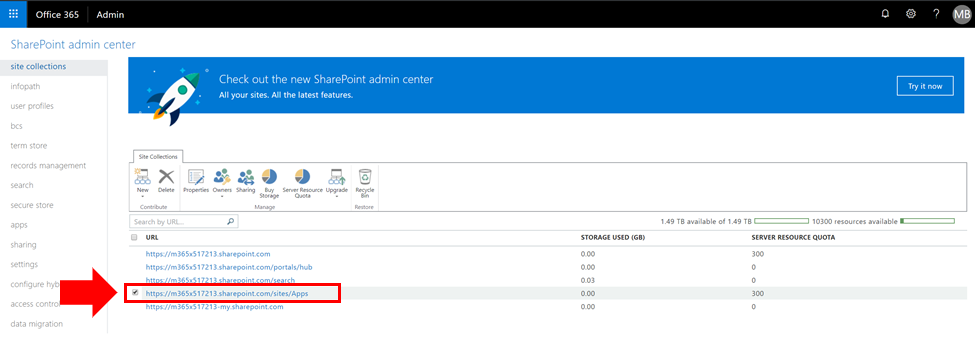
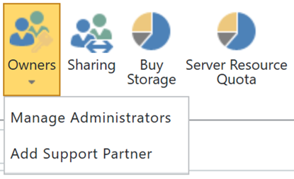

# 查看 SharePoint Online 应用程序目录或向其添加管理员

若要成功安装 CLO365, 需要将执行解决方案设置的人员列为租户应用程序目录的管理员。

1. 从 Office 365 管理门户转到 SharePoint Online 管理中心
1. **** 从 "网站集" 列表
1. 确认 CLO365 安装程序作为应用程序目录管理员之一列出。

如果你的用户名已列出, 你可以返回到设置自定义学习网站。  如果未完成后续步骤。 

## 添加管理员

1. 在 SharePoint 管理中心中, 选中应用程序目录 URL 旁边的复选框, 然后选择 "所有者" 下拉框。

1. 从下拉菜单中选择 "管理管理员" 
1. 将正确的个人添加为网站集管理员, 然后单击 "确定" 以保存所做的更改。

### 后续步骤-[网站预配](installsitepackage.md)
