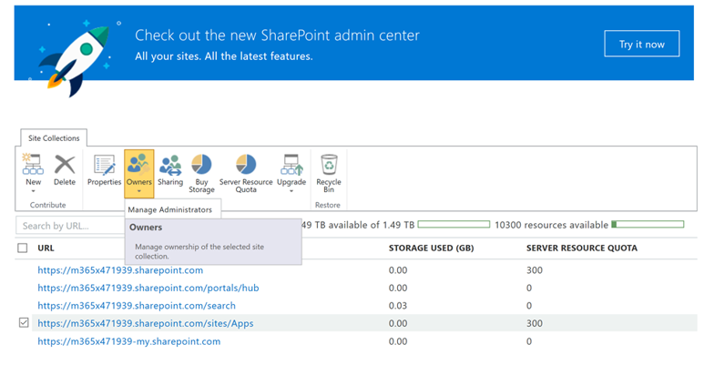

# 查看或管理员添加到 SharePoint Online 应用程序目录

若要成功安装 CLO365，执行资源调配的解决方案需要被列为租户应用程序目录的管理员。

1. 从 Office 365 管理门户转到 SharePoint Online 管理中心
1. **选择**网站集列表中的应用程序目录 URL 
1. 确认 CLO365 安装程序作为一个应用程序目录管理员列出。

如果未列出您的用户名，您可以返回到设置自定义学习网站。 如果未完成接下来的步骤。 

## 添加管理员

1. 从 SharePoint 管理中心中，选择应用程序目录 URL 旁边的复选框并选择所有者下拉列表框。
1. 从下拉菜单中选择管理管理员
1. 添加作为网站集管理员的正确的个人，然后单击确定以保存所做的更改。

### 后续步骤的[网站设置](installsitepackage.md)
