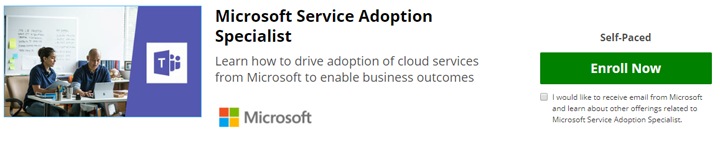

# 验证您的技能-成为服务采用专家

如果服务采用是您角色的一部分，或者您希望更深入地了解本主题的正式培训，您可以在我们的合作伙伴网站（EdX.org）上注册 Microsoft 提供的联机课程。 

此 [服务采用专家在线课程](https://aka.ms/AdoptionCert) 是 **免费审核**的。  如果你想要接收 EdX 证书以完成，费用为 $99.00 的费用是必需的。  本课程由 Microsoft 团队工程部门创作， [Karuana gatimu 进行](https://linkedin.com/in/karuanagatimu) 的 Microsoft 团队工程人员使用来自多个 microsoft MVP 和 microsoft IT 专家的输入。  中包含的最佳实践已从观察行业为整体并对正式的组织变更管理教育进行了免费收集。  

本课程中包含的实践指南、工具和其他内容将允许您在此重要的业务功能中验证您的 skils。  

有关本课程发布的详细信息，请参阅我们的 [通知](https://aka.ms/AdoptionCertAnnouncement) 。 

加入我们在线社区的商业用户和 IT 专业人员学习采用 https://aka.ms/DriveAdoption 。 