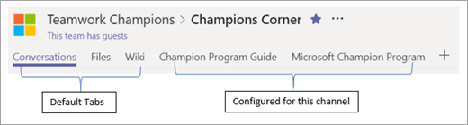

# 查找你的拥护者 

你可能已经知道你的拥护者是谁，即使你当前没有正式计划也是如此。  这些人：

通常会看到，可帮助其他人使用现有技术体验和学习有关新技术的 vocal。若要尝试新的解决方案，甚至在其他同事

> [!NOTE]
> 拥护者不同于那些喜欢为技术单独测试新软件的人。 支持者在不考虑上下文的情况 **帮助其他人** 发展。 

## 启动小而增长

如果您的组织没有当前的拥护者计划，或者您想要 reinvigorate 您已向一小组已知的已知人员发送邀请，则会向其发送邀请。  收集并讨论新计划的目标，并获取它们的反馈。 真正的拥护者希望自己听到语音，并感觉它们是创建东西的一部分。  

## 提供结构

成功的拥护者计划的领导者和定期计划可满足并讨论当前问题。  每月会议最少是在社区中创建积极文化和促进发展的重要部分。  

您还可以使用 Microsoft 团队为团队成员冠军的计划创建一个中心。  可在 [本文](https://docs.microsoft.com/MicrosoftTeams/teams-adoption-your-first-teams)中找到该团队结构的示例。

