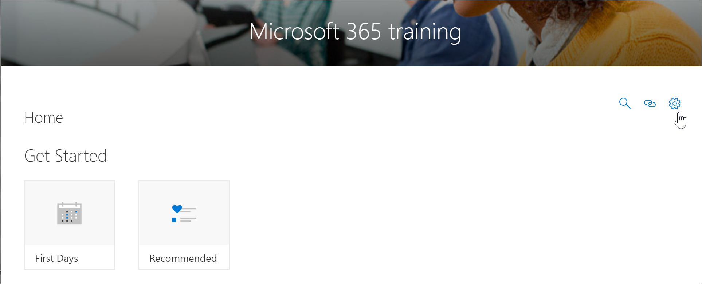
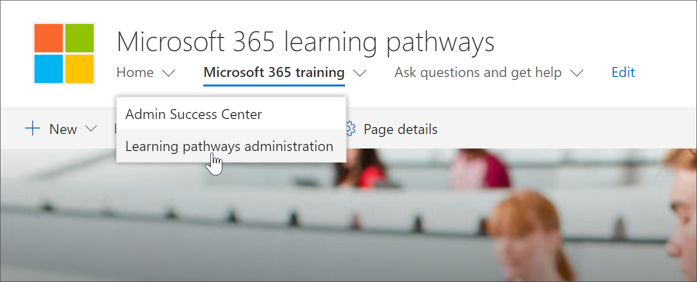

# 访问 "自定义学习管理" 页Access the Custom Learning Administration page

"自定义学习管理" 页面是用于管理自定义学习 web 部件的中心控制点。"自定义学习管理" 页仅适用于 SharePoint 管理员。拥有访问此网站的成员权限的用户将不会看到 "**管理播放列表**" 选项。此外, 只有管理员能够从 SharePoint**主页**菜单项打开自定义学习管理页。The Custom Learning Administration page is the central controlling point for administration of the Custom Learning web part. The Custom Learning Administration page is only available to SharePoint Administrators. Users with member privileges visiting the site will not see the **Administer Playlist** option. In addition, only Administrators will have the ability to open the Custom Learning Administration page from the SharePoint **Home** menu item.  

> [!IMPORTANT]
> 在自定义学习管理页上所做的更改 (如隐藏产品子类别或播放列表) 将在 Web 部件的所有实例中反映出来。此外, 建议一次仅有一个管理员在自定义学习管理员页面上进行更改, 因为如果多人同时使用自定义学习管理, 自定义学习不会提供冲突检测。Changes made on the Custom Learning Administration page, such as hiding a product subcategory or playlist, will be reflected in all instances of the Web part. In addition, it’s recommended that only one administrator at time make changes on the Custom Learning Administrator page, since Custom Learning does not provide collision detection if multiple people are using the Custom Learning Administration at the same time.  

## 从自定义学习 Web 部件首选方法访问Access from the Custom Learning Web part - preferred method
正如我们将在此示例中介绍的那样, 从 web 部件打开 "自定义学习管理" 页面是首选方法, 因为它在新的浏览器窗口中打开管理页面。使用此方法, 可以在选项卡式页面之间来回翻转以检查或修改您的工作。As we'll show you in this example, opening the Custom Learning Administration page from the web part is the preferred method since it opens the Admin page in a new browser window. With this method, it's easy to flip back and forth between the tabbed pages to check or modify your work.  

1. 从自定义学习主页中, 单击 " **Office 365" 培训**磁贴。From the Custom Learning Home page, click the **Office 365 training** tile.
2. 单击 "**自定义学习系统**" 菜单, 然后单击 "**管理播放列表**"。Click the **Custom Learning System** menu, then click **Administer Playlist**. 

## 从自定义学习菜单项访问Access from the Custom Learning menu item
管理员可以从 SharePoint**主页**菜单项访问自定义学习管理页面, 而不是导航到包含 Web 部件的页面。Rather than navigate to a page with a Web part, administrators can access the Custom Learning Adminstration page from the SharePoint **Home** menu item. 

- 从自定义学习主页中, 单击 "**主页**" 菜单, 然后单击 "**自定义学习管理**"。From the Custom Learning Home page, click the **Home** menu, then click **Custom Learning Administration**.

