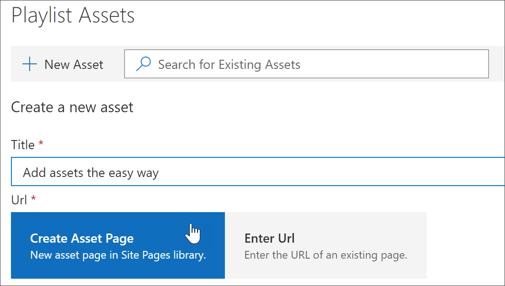
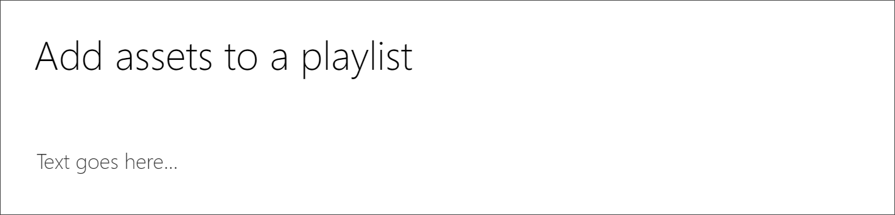
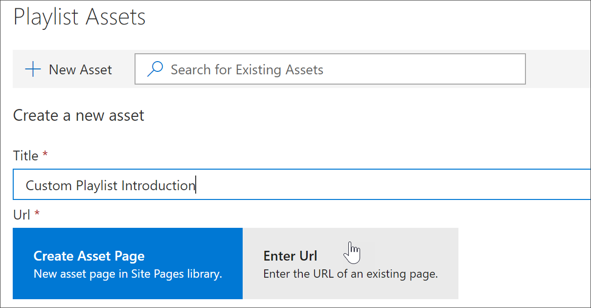
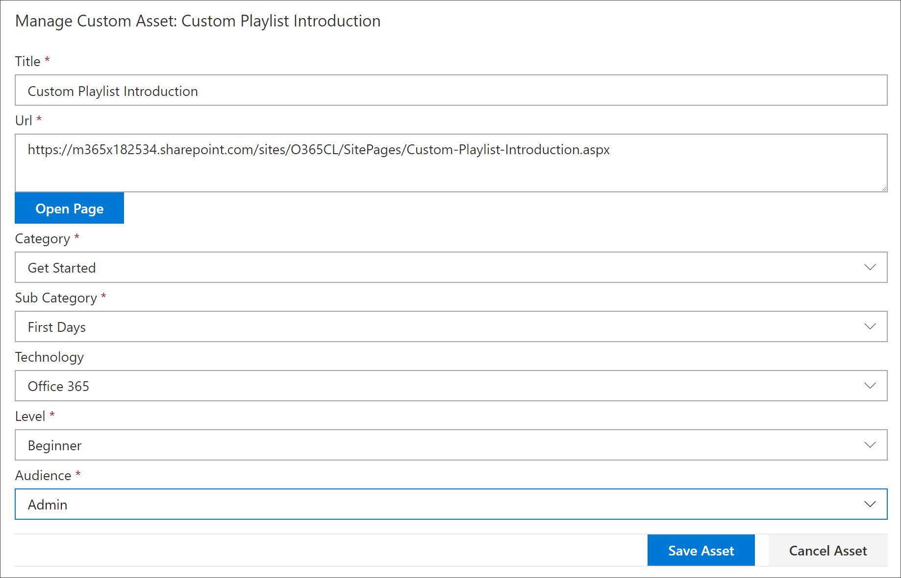
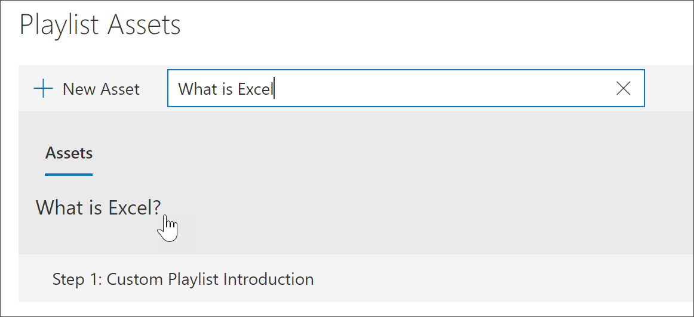
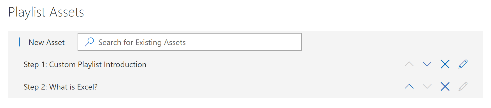
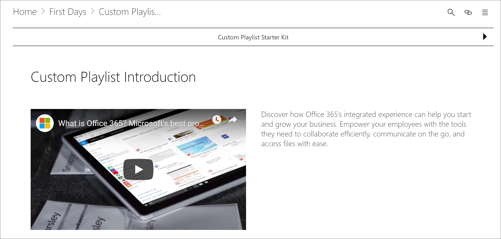

# 将资产添加到自定义播放列表Add Assets to a Custom Playlist

通过自定义学习, 可以向播放列表中添加以下资源:With Custom Learning, you can add the following assets to a playlist:

- **现有自定义学习资产**-这些资产是你的组织已添加到自定义学习的 Microsoft online 目录或资产的一部分的资产。**Existing Custom Learning assets** - these are assets that are part of the Microsoft online catalog or assets that your organization has already added to Custom Learning.
- **新资产**-这些资产是您添加到自定义学习的资产, 这些资源是从您创建的 sharepoint 页面生成的, 也可以是您组织中的 sharepoint 网站上已有的 sharepoint 资产。**New assets** - these are assets that you add to Custom Learning that are built from SharePoint pages that you create or SharePoint assets that are already available on a SharePoint site in your organization. 

> [!TIP]
> 如果 Microsoft 播放列表资产不符合您的需求, 请创建一个新的播放列表, 然后将 Microsoft 资产和所有新创建的资源添加到播放列表, 以生成所需的体验。If a Microsoft playlist asset doesn't meet your needs, create a new playlist and then add the Microsoft assets and any newly created assets to the playlist to build the experience you want. 您不能修改 Microsoft 提供的自定义学习播放列表, 但可以将自定义的学习资源添加到自定义播放列表中。You can't modify Custom Learning playlists supplied by Microsoft, but you can add Custom Learning-supplied assets to a custom playlist.   

## 为播放列表创建新的资产Create a new asset for a playlist

有两种方法可用于将新资源添加到播放列表。There are two options for adding a new asset to a playlist.

- **创建资产页面**-使用此选项时, 自定义学习将为您生成一个新的空白 SharePoint 页面, 并将其添加到播放列表中。**Create Asset Page** - with this option, Custom Learning will generate a new,  blank SharePoint page for you and add it to the playlist. 然后, 您可以将内容添加到页面并保存它。You can then add content to the page and save it.  
- **输入 URL** -使用此选项, 可以提前生成页面, 也可以使用页面, 并指定将页面添加到播放列表的 URL。**Enter the URL** - with this option, you build the page in advance or you already have the page available and you specify the URL to add the page to the playlist.

### 创建资产页面Create Asset Page 
使用 "**创建资产" 页面**选项, 您可以为资产提供一个标题, 然后单击 "创建资产页面" 以创建并打开一个新的 SharePoint 页面以进行编辑。With the **Create Asset Page** option, you provide a title for the Asset, then click Create Asset page to create and open a new SharePoint page for editing. 

1.  如果播放列表尚未打开进行编辑, 请在 "**自定义学习管理**" 页上, 单击要编辑的播放列表。If the playlist isn't already open for editing, from the **Custom Learning Administration** page, click the playlist you wish to edit. 
2. 若要将新资产添加到播放列表, 请单击 "**新建资产**"。To add a new asset to a playlist, click **New Asset**. 
3. 输入标题。Enter a title. 在此示例中, 输入 "将资产添加到播放列表", 然后单击 "**创建资产页面**"。In this example enter “Add Assets to a Playlist”, and then click **Create Asset Page**.

4. 单击 "**打开页面**"。Click **Open Page**.
5. 单击 "**编辑**" 图标, 然后单击 "标题" 区域中的 "**编辑 Web 部件**"。Click the **Edit** icon, and then click **Edit Web part** in the Title area.
6. 在 "**布局**" 下, 单击 "**纯**"。Under **Layout**, click **Plain**. 
7. 添加一个新的单列部分, 然后将一些示例文本添加到页面, 如下例所示。Add a new one-column section, and then add some sample text to the page so it looks like the following example. 

7. 单击“发布”\*\*\*\*。Click **Publish**.
8. 返回到 "**自定义学习管理**" 页。Return to the **Custom Learning Administration** page. 
9. 填写资产的其余属性, 然后单击 "**保存资产"。**Fill out the remainder of the properties for the asset, and then click **Save Asset.**

### 输入 URLEnter the URL
使用 "**输入 url** " 选项, 您可以为资产提供标题, 然后单击 **"输入 URL** " 以指定要添加到播放列表中的 SharePoint 页面。With the **Enter the URL** option, you provide a title for the Asset, then click **Enter the URL** to specify the SharePoint page you want to add to the playlist. 

1.  如果播放列表未打开以供编辑, 请在 "**自定义学习管理**" 页上, 单击要编辑的播放列表。If the playlist isn't open for editing, from the **Custom Learning Administration** page, click the playlist you wish to edit. 
2. 若要将新资产添加到播放列表, 请单击 "**新建资产**"。To add a new asset to a playlist, click **New Asset**. 
3. 输入标题。Enter a title. 在此示例中, 输入 "自定义播放列表简介", 然后单击 "**输入 URL**"。In this example, enter “Custom Playlist Introduction”, and then click **Enter URL**. 

4. 在 "[创建自定义播放列表](custom_createnewpage.md)的前一个 sharepoint 页" 部分中, 输入您创建的 SharePoint 页面的 URL, 然后填写这些字段的其余部分, 如下图所示。Enter the URL of the SharePoint page you created in a previous [Create SharePoint pages for custom playlists ](custom_createnewpage.md) section, and then fill out the remainder of the fields, as shown in the following illustration.

5. 单击 "**保存资产**"。Click **Save Asset**. 

## 将现有资源添加到播放列表Add an existing asset to a playlist

现有资产包括 Microsoft 提供的自定义学习资产或资产, 这些资产已添加到组织的自定义学习中。Existing assets consist of Microsoft-provided Custom Learning assets or assets that have already been added to Custom Learning by your organization. 

- 在**搜索**框中, 输入搜索短语, 然后从搜索结果中选择一个资产。In the **Search** box, enter a Search phrase, and then select an asset from the Search results. 在此示例中, 输入 "什么是 Excel？"。In this example, enter “What is Excel?” 向播放列表中添加 Excel 简介主题。to add an Excel intro topic to the playlist.

## 编辑、移动和删除资产Edit, move, and delete assets
您可以编辑您创建的自定义资产, 但不能编辑 Microsoft 的资产。You can edit custom assets that you create, but not assets from Microsoft. 不过, 您可以从播放列表中删除所有资产并更改订单资产。However, you can remove all assets from a playlist and change the order assets. 

### 编辑资产Edit an asset
- 单击资产的 "编辑" 按钮, 修改资产, 然后单击 "保存资产"。Click the Edit button for an asset, modify the asset, and then click Save Asset. 

### 移动播放列表中的资源Move an asset in a playlist
- 单击资产右侧的向上或向下箭头以移动播放列表中的资产订单Click the up or down arrow to the right of the asset to move the asset order in the playlist

### 从播放列表中删除资产Remove an asset from a playlist
- 单击资产的 "从播放列表中删除 X" 图标。Click the Remove from Playlist X icon for the asset. 

## 在操作中查看播放列表View the playlist in Action
现在, 你已将资产添加到播放列表, 让我们关闭播放列表并查看它是否在操作中。Now that you've added assets to a playlist, let's close the playlist and see it in action. 

1. 单击 "**关闭播放列表**"。Click **Close Playlist**.
2. 单击 " **Office 365 培训**" 页面的选项卡。Click the tab with the **Office 365 training** page.
3. 刷新页面, 然后单击 "**开始\*\*\*\*前的第一天**"。Refresh the page, and then click **First Days** under **Get Started**.
4. 单击 "**自定义学习初学者工具包**" 以查看您在操作中的第一个播放列表。Click **Custom Learning Starter Kit** to view your first playlist in action. 

