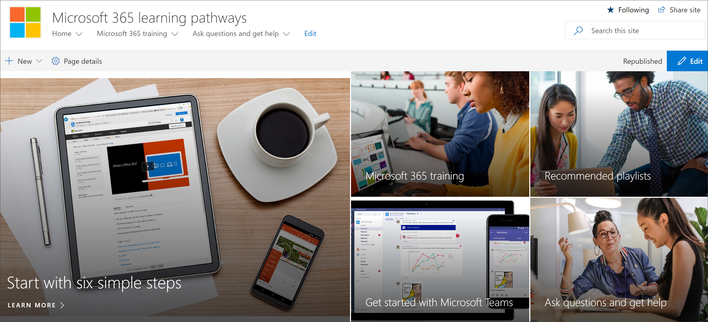
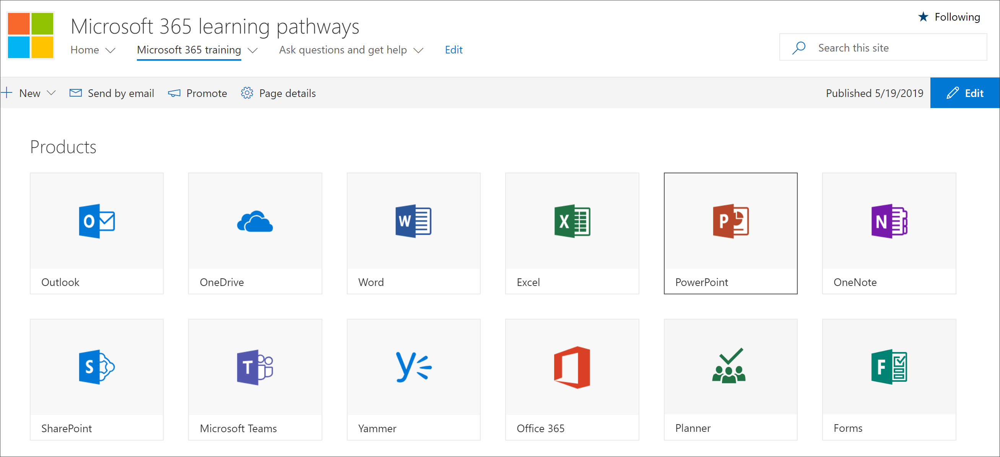

# 添加所有者自定义学习网站Add Owners Custom Learning site

自定义学习 for office 365 网站托管在 office 365 租户中, 因此, 如果您尚未登录到网站, 则需要登录 office 365 (如果尚未登录)。The Custom Learning for Office 365 site is hosted in your Office 365 tenant, so you'll need to sign in to Office 365, if you're not already signed in, to get to the site. 

## 登录 Office 365Sign in to Office 365 

1.  打开 Web 浏览器并导航到 office.com 或您组织的登录位置。Open your Web browser and navigate to office.com or your organization’s sign-in location. 
2.  使用您的用户名和密码登录。Sign in with your user name and password.
3.  导航到网站的位置。Navigate to the location of the site. 如果没有可用的, 则可以在从 PnP 设置服务收到的邮件中找到它。If you don't have it available, you can find it in the mail you recieved from the PnP Provisioning Service. 从 office 365 主页中选择 "SharePoint", 然后选择 " **office 365 的自定义学习**" 网站。Select SharePoint from the Office 365 Home page, and then select the **Custom Learning for Office 365** site. 您可能已将其命名为不同的。You may have named it different. 
5. 单击 " **Office 365 培训**" 图块, 查看在自定义学习中可用的整套培训播放列表, 并验证自定义学习是否按预期正常工作。Click the **Office 365 training** tile to see the full suite of training playlist available with Custom Learning and to verify Custom Learning is working as expected. 

## 查看所有自定义学习内容View all the Custom Learning content
Office 365 培训页面承载配置为显示可用于自定义学习的所有培训的自定义学习 Web 部件。The Office 365 training page hosts the Custom Learning Web part configured to show all the training available for Custom Learning. 

1. 向下滚动页面以查看所有类别和子类别。Scroll down the page to view all the categories and subcategories.
2. 一位启动橡胶轮。Kick the tires a bit. 单击几个子类别, 然后单击几个播放列表, 以了解如何组织自定义学习内容。Click a few subcategories, and then click a few playlists to get a feel for how Custom Learning content is organized. 

## 将所有者添加到网站Add Owners to Site
作为租户管理员, 您不太可能是自定义网站的人员, 因此您需要向网站分配一些所有者。As the Tenant Admin, it's unlikely you'll be the person customizing the site, so you'll need to assign a few owners to the site. 所有者具有对网站的管理权限, 以便他们可以修改网站页面并 rebrand 网站。Owners have administrative privileges on the site so they can modify site pages and rebrand the site. 他们还能够隐藏和显示通过自定义学习 Web 部件传递的内容。They also have the ability to hide and show content delivered through the Custom Learning Web part. 他们还能够构建自定义播放列表并将其分配给自定义子类别。They'll also have the ability to build custom playlist and assign them to custom subcategories.  

1. 从 "SharePoint**设置**" 菜单中, 单击 "**网站权限**"。From the SharePoint **Settings** menu, click **Site Permissions**.
2. 单击 "**高级权限设置**"。Click **Advanced Permission Settings**.
3. 单击 "**自定义学习 for Office 365 所有者**"。Click **Custom learning for Office 365 Owners**.
4. 单击 "**新建** > 向**此组添加用户**", 添加您希望成为所有者的人员, 然后单击 "**共享**"。Click **New** > **Add Users to this group**, add the people you want to be Owners, and then click **Share**.

