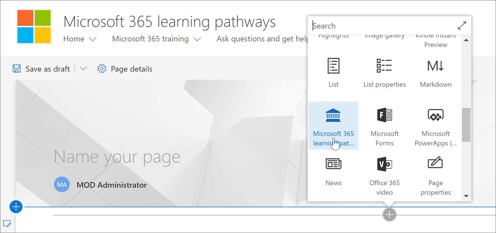
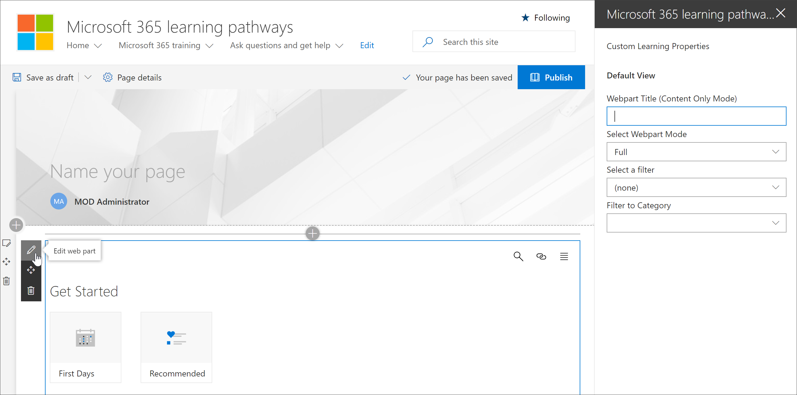
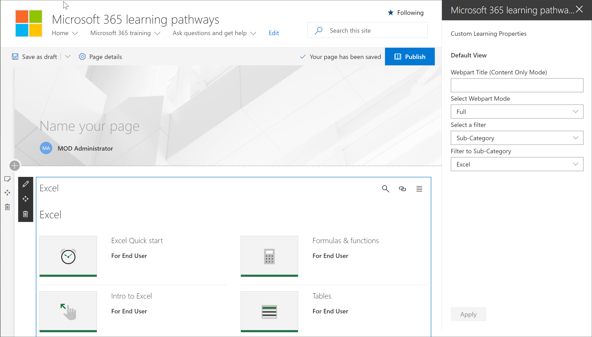

# 添加和编辑 Microsoft 365 学习路径 Web 部件

Microsoft 365 学习路径使你可以灵活地将 Microsoft 365 学习路径 Web 部件添加到 SharePoint 页面，然后筛选 Web 部件的内容以满足该页面的学习目标。 例如，你可以创建"切换到 OneDrive"页面，然后添加 Web 部件并对其进行配置以显示为组织创建的自定义 OneDrive 迁移播放列表。

1.  单击"SharePoint 齿轮"图标，然后单击"**添加页面"。**
2.  单击 **页面左侧的" (+) "，** 然后单击"一 **列"。**
3.  单击 **+** ，然后选择 **Microsoft 365 学习路径** Web 部件。 

## 编辑自定义学习 Web 部件
你可以编辑 Microsoft 365 学习路径 Web 部件，以显示所有可用的自定义学习内容或特定类别、子类别、播放列表或资产。 

1.  单击“编辑 Web 部件”。

2. 在"自定义学习属性"窗格中，针对以下内容筛选 Web 部件。 

- Web 部件模式：完全
- 筛选器：子类别
- 子类别：Excel

3. 现在，您的页面应如下所示： 

## 添加标题并发布页面
1. 在页面的标题区域中，键入"创建你自己的体验"。
2. 单击"**标题"区域中的**"编辑 Web 部件"图标，选择"布局 **"下的"****纯** 色"，然后关闭"属性 **"** 窗格。
3. 单击“**发布**”。
