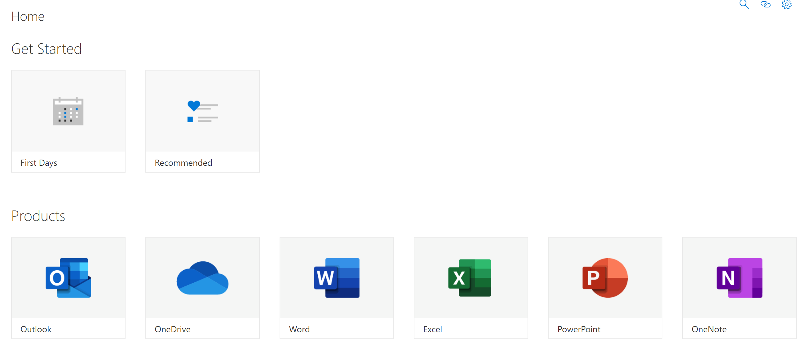

# 了解 SharePoint 应用程序页面Get to know the SharePoint Application pages

自定义学习提供了两个 SharePoint 应用程序页, 您应了解作为自定义学习的管理员。Custom Learning provides two SharePoint Application pages that you should know about as an administrator of Custom Learning. 这两个页面是非可编辑的。These two pages are non-editable. 

- CustomLearningAdminCustomLearningAdmin.aspx
- CustomLearningViewerCustomLearningViewer.aspx

## CustomLearningAdminCustomLearningAdmin.aspx

CustomLearningAdmin 页提供了用于自定义学习的管理功能, 包括隐藏和显示内容以及创建和编辑子类别和播放列表。The CustomLearningAdmin.aspx page provides Administrative features for Custom Learning, including hiding and showing content and creating and editing subcategories and playlists. 我们将在后面的部分中详细介绍此页面及其功能。We’ll cover this page and its functionality in more detail in later sections.

### 查看 CustomLearningAdminView CustomLearningAdmin.aspx

1. 单击 "SharePoint**设置**" 图标, 然后单击 "**网站内容**"。Click the SharePoint **Settings** icon, and then click **Site Contents**. 
2. 单击 " **CustomLearningAdmin**"。Click **CustomLearningAdmin.aspx**. 

## CustomLearningViewerCustomLearningViewer.aspx
CustomLearningViewer 页提供了用于在 web 部件中显示自定义学习内容的查看器。The CustomLearningViewer.aspx page provides a viewer for displaying Custom Learning contents in the web part. 例如, 如果您复制了一个播放列表链接, 并将其与一个同事共享, 单击此链接将使用户进入查看器页面并显示链接的内容。For example, if you copy a Playlist link and share it with a co-worker, the link, when clicked, takes the user to the Viewer page and displays the linked content. 我们将在后面的主题中详细介绍此页面及其功能。We’ll cover this page and its functionality in more detail in later topics.

### 查看 CustomLearningViewerView CustomLearningViewer.aspx

1. 单击 "SharePoint**设置**" 图标, 然后单击 "**网站内容**"。Click the SharePoint **Settings** icon, and then click **Site Contents**. 
2. 单击 " **CustomLearningViewer**"。Click **CustomLearningViewer.aspx**. 

