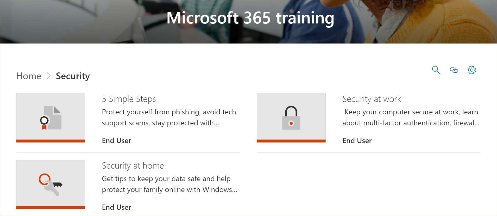
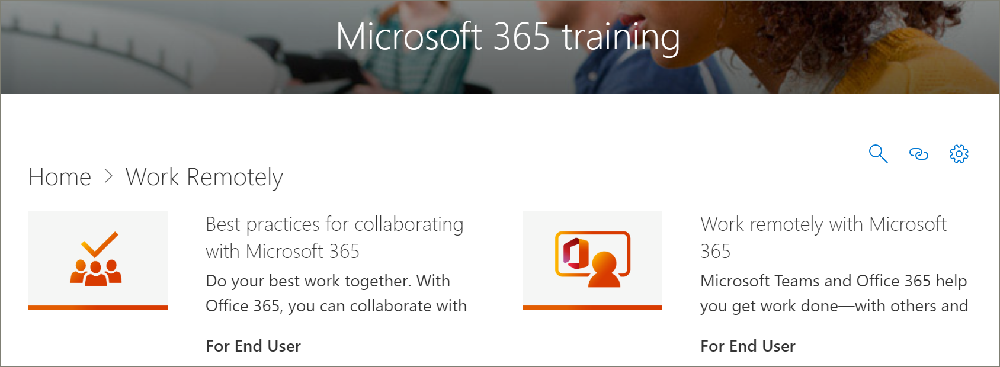

# Microsoft 365 学习路径内容更新
学习路径努力遵守季度内容更新周期。 若要了解有关如何应用内容更新以及如何管理内容更新的信息，请参阅["管理内容更新"。](custom_contentupdatesmanage.md) 

## 2021 年 3 月内容更新
下面列出了 2021 年 3 月的内容更新。 

### 混合工作区
为了帮助组织过渡到员工在家办公和在办公室工作的混合工作场所，我们提供了播放列表，以帮助用户运行更有效的会议、创建非独占会议环境、以非独占方式协作，以及通过实时事件覆盖大量受众。 混合工作区子类别包括以下播放列表和资产。

#### 运行有效会议
- 运行有效会议
- 混合会议
- 混合会议空间注意事项
- 混合会议之前、期间和之后要执行哪些工作
- 安排有效会议
- 计划和领导有效会议
- 在混合会议之前、期间和之后吸引受众
- 会议清单
- 减少会议疲劳

#### 创建非独占会议环境
- 创建非独占会议环境
- 使会议和相关内容可供所有用户访问
- 限制会议中干扰
- 跨时区建立理解

#### 异步协作和共同创作
- 使用异步协作减少或替换会议
- 协作和共同创作共享内容
- Microsoft 365 中协作的最佳实践
- 共同创作 Microsoft 365 文件
- 文档协作和共同创作
- 与 SharePoint、Teams 和 OneDrive 协作
- 在 Teams 中协作
- 在 SharePoint 中使用文档库
- 常见共同创作错误疑难解答

#### 通过实时事件覆盖大型受众
- 使用实时事件覆盖大量受众
- 开始使用 Microsoft Teams 进行实时事件
- 在 Teams 中计划和安排实时事件
- 甚至组织实时

### Microsoft Teams
Microsoft Teams 已更新为以下内容。

#### 管理会议播放列表
管理会议播放列表具有以下新资产。
- Teams 会议的提示

#### 团队在外播放播放列表
已使用以下新资产更新了"上一场"播放列表中的 Teams。
- 在离开时启动频道
- 在离开时创建频道
- 在离开时管理通知

#### 使用班次管理团队计划
带 Shifts 播放列表的管理团队计划已添加为以下资产。
- 什么是 Shifts
- 经理轮班
- 创建班次计划
- 管理班次计划
- 一线工作人员轮班

#### Walkie Talkie、Tasks 和 Praise
Walkie Talkie、Tasks 和 Playlist 播放列表已与以下资源一起添加。
- 对讲机
- 在 Teams 中使用任务应用
- 经理的任务
- 一线工作人员的任务
- 沟通和赞叹

#### 创建审批
"创建审批播放列表"已添加为以下资源。
- 什么是审批？
- 创建审批
- 从聊天创建审批

### 列表
新的列表子类别和播放列表已添加到学习路径中。

#### 列表入门
"列表入门"播放列表具有以下新资源。
- 从"列表"应用创建列表
- 在 Teams 频道中创建列表
- 添加或编辑列表项
- 创建或更改列表视图
- 编辑列表视图
- 查找和管理列表
- 共享列表或列表项
- 跟踪业务信息

### Forms
已使用以下新资源更新了"创建表单和查看结果播放列表"。

#### 创建表单并查看结果
- 创建新的表单或测验
- 共享表单以获取响应
- 查看表单的结果
- 在表单中使用分支逻辑
- 向调查或调查表添加部分

### Excel
学习路径中的 Excel 已更新为以下内容。

#### Excel 简介
Excel 播放列表简介具有以下新资产。
- 创建下拉列表

#### 链接的数据类型
新的链接数据类型播放列表已添加到具有以下资产的学习路径中。 
- 将文本转换为组织数据类型
- 使用数据选择器指定组织数据类型
- 查看和插入来自组织组织数据类型

#### 公式和函数
两个新资源已添加到"公式"和"函数"播放列表。
- XLOOKUP 函数
- MATCH 函数

### SharePoint
所有 SharePoint 播放列表和资产已更新。 更新的播放列表包括：
- SharePoint Online Quick Start
- SharePoint Online 简介
- 创建网站、帖子和列表
- 与 SharePoint 共享和同步

## 2020 年 9 月内容更新
下面列出了 2020 年 9 月的内容更新。 

### 安全性
添加了一个新的安全子类别以及播放列表和资产，可帮助用户在办公室和在家更安全地工作。 

#### "五个简单的步骤"播放列表
- 保护自己免受网络钓鱼攻击
- 避免技术支持欺诈
- 更安全地在家工作
- 使电脑保持最新
- 使用 Windows 安全性保持受保护

#### "家庭安全"播放列表
- 确保数据安全的提示
- 确保计算机在家安全
- 使用 Windows 安全性帮助保护你的家庭联机   

#### "工作安全性"播放列表
- 使计算机在工作时保持安全
- 什么是多重身份验证？
- Windows 安全中的防火墙和网络保护
- 使用防篡改保护阻止安全设置的更改

### "Teams 入门"播放列表
新的"Teams 入门"播放列表已添加到"开始使用/第一天"子类别，以帮助用户开始使用和运行 Teams。 播放列表包括：
- 欢迎使用 Microsoft Teams  
- 使团队启动并运行
- 在频道中工作  
- 上载和共享文件 
- 开始和固定聊天  
- 加入 Teams 会议 
- 管理会议 
 
### Microsoft 365 基础知识
在"产品"类别中，"Office 365 基础知识"子类别已更新为"Microsoft 365 基础知识"类别。 如果已添加到自定义播放列表，则"Office 365 基础知识"类别中的已停用资产仍然可用。

#### "入门"播放列表
- 什么是 Microsoft 365？
- 登录
- Office.com

#### "创建和保存"播放列表
- 使用桌面应用
- 使用Office.com应用
- 将文件保存到云
- 使用 OneDrive 按需同步文件

#### "共享和协作"播放列表
- 在 Microsoft 365 中共享文件
- 共同创作者
- 使用@mentions
- 跟进

#### "使用 Microsoft Teams"播放列表
- 欢迎使用 Microsoft Teams
- 团队和频道概述
- 创建帖子并设置文章格式
- 开始和固定聊天
- 拨打电话
- 加入 Teams 会议
- 有关更佳会议的提示

#### "从 Windows 获取最大功能"播放列表
- 使用搜索查找文档、应用等
- Microsoft Edge
- Microsoft 必应搜索

#### "随时随地工作"播放列表
- OneDrive 移动应用
- Outlook 移动应用

#### "Cool Microsoft 365 功能"播放列表
- PowerPoint 设计器
- 在 Excel 中的想法
- Word 中的编辑器
- 使内容可访问

### Access 中的"创建图表"播放列表
"创建图表播放列表"已添加到"Products\Access"子类别。  
- 创建柱形图
- 创建条形图
- 创建线形图
- 创建饼图
- 创建组合图

### Teams 更新
"Product\Microsoft Teams"子类别已更新为以下资源。 

#### "管理会议"播放列表
- 加入 Teams 会议
#### "使用帖子和消息"播放列表
- 创建帖子并设置文章格式

### Planner 
以下资源已添加到"Products\Planner"中的"使用 Planner"播放列表中。
#### 使用 Planner 播放列表
- To Do vs Planner
- 查看 Planner 任务
- 在 Teams 中使用任务应用

### Word
以下资源已在"使用 Word 共享和共同创作"播放列表中进行了更新。

#### "使用 Word 共享和共同创作"播放列表
- "使用实时共同创作协作处理 Word 文档"资产已更新。 

### Office 网页版
以下资产已在"Office for the Web： Word for the web"播放列表中进行了更新。

#### "Office for the web： Word for the web" 播放列表
- 转录录制内容

### PowerPoint (新更新) 
以下资源已更新或添加到 Products\PowerPoint 播放列表。 

#### "文本& PowerPoint 的表格"播放列表
- 将手写墨迹更改为 PowerPoint 中的形状、文本或数学 (新) 

#### 显示幻灯片播放列表
- 记录更新 (演示文稿) 

### Office 快速入门指南 (更新) 
已更新所有 Office 产品的 Office 快速入门指南。 

## 2020 年 4 月内容更新
 为了响应当前事件，2020 年 4 月内容更新提供了旨在启用组织中远程工作的学习播放列表和资源。 我们添加了一组新的远程工作播放列表，并更新了 Microsoft Teams 内容，尤其是 Teams 会议。 我们还为 Web 播放列表添加了一组新的 Office，并添加了新的 Microsoft Forms 资产。 我们还为管理员提供了远程工作资源列表。  
 
 若要了解有关如何应用内容更新以及如何管理内容更新的信息，请参阅["管理内容更新"。](custom_contentupdatesmanage.md) 下面列出了 2020 年 4 月 Microsoft 365 学习路径内容更新。 

### Office 365 已重新品牌为 Microsoft 365
Office 365 已重新成为 Microsoft 365 品牌。 名称更改在整个 Microsoft 365 学习路径内容中反映出来。 

### 新的或更新的播放列表
已添加或更新以下播放列表。  

#### 远程处理 (2 个新播放列表/11 个新) 
向学习路径添加了一个新的远程工作子类别，该路径具有以下播放列表和资产： 

##### 远程工作 (五个新的资产) 
- 远程使用 Office 365
- 开始Office.com
- 沟通或开会
- 存储工作文件
- 高级替代项
##### 与 Office 365 协作的最佳实践 (6 个新资产) 
- 入门
- 共享
- 共同创作者
- 在文件中聊天
- Meet
- 移动版

### Teams (9 个新的资产/6 个更新) 
对 Teams 内容进行了各种更新。 
#### 在团队和渠道中协作 (一个新的/一个更新的资产) 
- 创建和使用私人频道 (新) 
- 显示或隐藏更新 (频道) 
#### 启动聊天和通话 (两个新的/一个更新) 
- 启动和固定聊天 (新) 
- 隐藏聊天，删除新 (的消息) 
- 在更新 (呼叫) 
#### 浏览应用和工具 (一个新) 
- 使用应用 (新) 
#### 使用帖子和消息
- 将邮件发送到多个频道 (新) 
#### 管理三 (/四个更新资产的会议) 
- 加入 Teams 会议 (新) 
- 使用更新的"立即开会" (即时) 
- 在频道中 (新) 
- 管理会议 (新) 
- 在更新会议期间显示 (屏幕) 
- 显示 PowerPoint 幻灯片 (更新) 
- 在 Teams 会议期间四处移动 (更新) 
#### 使用一个新的 (帖子和) 
- 将邮件发送到多个频道 (新) 

### Office 网页版
Office 网页应用提供了一组播放列表，用于用户想要创建、共享 Office 和与 Office 网页协作的方案。 这组内容对于从 Google G Suite 切换到 Microsoft 365 的组织也十分有价值。
#### 开始 (五个新的资产) 
- 入门
- 通过搜索找到它
- 创建新文档
- 返回工作
- 推荐文件
#### Outlook 网页
- 了解 Outlook 网页
- 创建电子邮件回复
- 组织收件箱
- 创建签名和自动答复
- 安排约会或会议
- 创建编辑联系人
- 搜索电子邮件、联系人和事件
#### Word 网页版
- 了解 Word 网页
- 更改文档布局
- 插入表格和图片
- 联机协作
- Word 网页中的酷炫内容
#### Excel 网页版
- 了解 Excel 网页
- 创建公式
- 插入数据透视表
- 通过想法获取见解
- 协作
- 使用快速填充节省时间
- 使用条件格式绘制图片
#### PowerPoint 网页版
- 了解 PowerPoint 网页
- 插入图片、形状等
- 动画和过渡
- 创建其他人的演示文稿
- 准备好呈现时
- 设计幻灯片
#### 共享文档
- 共享文档
- 创建可共享链接
- 仅向特定人员保护文档
- 与组织外部人员共享 

### Microsoft Forms 
根据请求，还有一些新的 Forms 资产。 
#### 表单 (四个新的资产)  
- 创建表单 
- 共享表单 
- 查看表单的结果 
- 有关 Microsoft Forms 的常见问题 

### 用于支持远程员工的资源
可以使用学习路径在学习路径网站中构建登录页面，以支持远程工作者。 或者，您可以将学习路径 Web 部件添加到学习路径网站上的现有支持页面，并筛选 Web 部件以显示"远程工作"播放列表。 下面是 Microsoft 用于支持组织中远程工作的一些顶级资源的列表。 
- [如何部署 Microsoft Teams](https://docs.microsoft.com/microsoftteams/how-to-roll-out-teams)
- [Microsoft Teams 中的会议](https://docs.microsoft.com/microsoftteams/deploy-meetings-microsoft-teams-landing-page)
- [使用 Microsoft Teams 支持远程工作者](https://docs.microsoft.com/microsoftteams/support-remote-work-with-teams)
- [常见问题解答：支持远程工作人员](https://docs.microsoft.com/microsoftteams/faq-support-remote-workforce)
- [Microsoft IT 为员工启用远程工作的前 9 种方式](https://www.microsoft.com/microsoft-365/blog/2020/03/12/top-9-ways-microsoft-it-enabling-remote-work-employees/)
- [Microsoft Teams 培训](https://docs.microsoft.com/microsoftteams/training-microsoft-teams-landing-page)
- [教育：Microsoft 教育中心](https://education.microsoft.com) 
- [教育：远程学习入门](https://education.microsoft.com/resource/4c0c02c0)

若要详细了解如何自定义学习路径，请参阅"[自定义学习路径"。](custom_overview.md) 

## 2019 年 11 月内容更新
欢迎使用 Microsoft 365 学习路径内容更新。 从 2019 年 11 月更新开始，我们将每季度提供学习路径目录的更新清单。 对于 2019 年 11 月更新，以下新内容子类别和播放列表已添加到学习路径目录中。 若要了解有关如何应用内容更新以及如何管理内容更新的信息，请参阅["管理内容更新"。](custom_contentupdatesmanage.md)    

### Teams
多个新播放列表已添加到 Teams 子类别。
- 使用四个资产 (帖子和) 
- 上传并查找两 (中的文件) 
- 设置和参加四个资产 (活动) 
- 管理两个资产 (活动源) 
- 团队在外 (两个) 

### Microsoft 365 成功中心
我们已向学习路径体验添加了 Microsoft 365 学习路径成功中心子类别。 成功中心提供以下播放列表。
- 新增功能，更改了三 (资源) 
- 规划学习内容 (两个资源) 
- 自定义八 (学习路径？) 
- 推动学习路径的采用 (一个资产) 
- 测量学习路径对一个 (的影响) 

### Outlook
以下播放列表已添加到 Outlook 子类别。 
- Outlook 移动版：管理收件箱 (八个) 
- Outlook 移动版：五个 (用户和) 
- Outlook 移动版：搜索和共享 (四个) 

### OneDrive
为 OneDrive 添加了以下视频资源。 
- 设置 iPhone 或 iPad 已添加到 OneDrive 播放列表简介
- 打开 OneDrive 备份已添加到"使用 OneDrive 播放列表管理文件"

### Planner
以下播放列表和资产已添加到目录中。  
- Planner 快速入门 (六个) 
- 使用 Planner (八个资源) 

### 辅助功能
内容的辅助功能子类别已与以下播放列表一起添加。 
- Microsoft 365 辅助功能概述和资源 (三个) 
- 在 Outlook 和三个资产 (更易于访问) 
- 创建具有八个资源 (更易于访问的 Word 文档) 
- 创建更易于访问的 Excel 工作簿， (三个) 
- 在 PowerPoint 中创建更易于访问的幻灯片 (五个) 

### Sway
内容的 Sway 子类别已与以下播放列表一起添加。 
- Sway 快速入门 (四个) 
- 共享和访问 Sway (五个) 
- 将内容添加到 Sway (11 个资产) 
- 自定义 Sway (五个资产) 

### Access
- 访问四个 (快速入门) 
- Access 的三 (简介) 
- 创建两个资源 (Access 数据库) 
- 将表 (两个资源) 
- 使用关系 (五个资产) 
- 在两个 (中添加和编辑) 
- 使用查询管理数据 (五个资产) 
- 为一个 (创建表单) 
- 创建两个 (的报告) 
- 保护数据库 (一个资产) 

