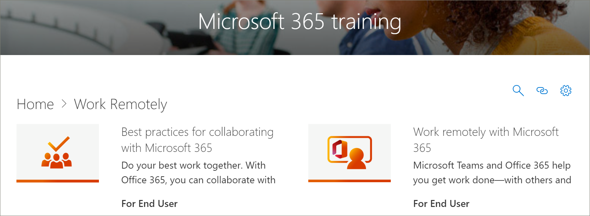

# Microsoft 3654 月的学习路径内容更新Microsoft 365 Learning Pathways Content Updates for April
学习路径努力遵守每季度内容更新周期。Learning pathways strives to adhere to a quarterly content update cycle. 下面列出了 2020 年 4 月的内容更新。The following list the content updates for April 2020.

## 2020 年 4 月内容更新April 2020 Content Updates
 为了响应当前事件，2020 年 4 月内容更新提供了旨在支持组织中远程工作的学习播放列表和资源。In response to current events, the April 2020 Content Update provides learning playlists and resources designed to enable remote work in your organization. 我们添加了一组新的远程工作播放列表，显著更新了 Microsoft Teams 内容，特别是针对 Teams 会议，为 Web 播放列表添加了一组新的 Office，并添加了新的 Microsoft Forms 资产。We’ve added a new set of Work remotely playlists, significantly updated the Microsoft Teams content, especially for Teams meetings, added a new set of Office for the web playlists, and added new Microsoft Forms assets. 作为更新的一部分，我们还为管理员提供了远程工作资源列表。As part of the update, we've also provided a list of Remote Work resources for administrators.  
 
 若要了解有关如何应用内容更新以及如何管理内容更新的信息，请参阅管理 [内容更新](custom_contentupdatesmanage.md)。To learn more about how content updates are applied, and how to manage content updates, see [Manage Content Updates](custom_contentupdatesmanage.md). 下面列出了 2020 年 4 月Microsoft 365学习路径内容更新。The following lists the April 2020 Microsoft 365 learning pathways content updates. 

### Office 365品牌重新Microsoft 365Office 365 was rebranded to Microsoft 365
Office 365已重新品牌Microsoft 365。Office 365 has been rebranded to Microsoft 365. 在整个学习路径内容中Microsoft 365名称更改。The name change is reflected throughout the Microsoft 365 learning pathways content. 

### 新的或更新的播放列表New or Updated Playlists
以下播放列表已添加或更新。The following playlists have been added or updated.  

#### 远程工作 (2 个新播放列表/11 个新的资产) Work remotely (2 new playlists/11 new assets)
向学习路径添加了一个新的"远程工作"子类别，该路径具有以下播放列表和资产：A new Work remotely subcategory was added to learning pathways that features the following playlists and assets: 

##### 远程工作 (5 个新的资产) Work remotely (5 new assets)
- 远程处理Office 365Work remotely with Office 365
- 在 Office.com 上开始操作Get started at Office.com
- 沟通或会面Communicate or meet
- 存储你的工作文件Store your work files
- 高级替代方案Advanced alternatives
##### 与 6 种新资产Office 365 (最佳协作) Best practices for collaborating with Office 365 (6 new assets)
- 开始行动Get started
- 共享Share
- 共同创作者Co-author
- 在文件中聊天Chat in files
- MeetMeet
- 移动版Mobile

### Teams (9 个新资产/6 个更新) Teams (9 new assets/6 updated assets)
对内容进行了各种更新Teams更新。A variety of updates have been made to Teams content. 
#### 在团队和频道中协作 (1/1 新增资产) Collaborate in teams and channels (1 new/1 updated asset)
- 创建新频道并使用私人 (频道) Create and use private channels (new)
- 显示或隐藏更新 (频道) Show or hide channels (updated)
#### 在 2016 年 2 (1 日更新后开始聊天和) Start chats and calls (2 new/1 updated)
- 启动和固定聊天 (新) Start and pin chats (new)
- 隐藏聊天、删除 (消息) Hide chats, delete messages (new)
- 在更新 (呼叫) Make calls (updated)
#### 浏览第 1 (个应用和工具) Explore apps and tools (1 new)
- 使用应用 (新) Use apps (new)
#### 使用帖子和消息Work with posts and messages
- 向多个频道发布消息 (新) Post a message to multiple channels (new)
#### 管理会议 (3/4 更新后的资产) Manage meetings (3 new/4 updated assets)
- 加入Teams会议 (新) Join a Teams meeting (new)
- 使用更新后的"立即开会" (即时) Create instant meetings with Meet now (updated)
- 在频道中 (新) Meet in a channel (new)
- 管理会议 (新) Manage meetings (new)
- 在更新的会议过程中显示 (屏幕) Show your screen during a meeting (updated)
- 显示PowerPoint更新 (幻灯片) Show PowerPoint slides (updated)
- 在更新了会议Teams期间 (四) Move around during a Teams meeting (updated)
#### 使用 1 个新的 (帖子和) Work with post and messages (1 new)
- 向多个频道发布消息 (新) Post a message to multiple channels (new)

### Office 网页版Office for the web
Office为用户想要创建、共享和协作的场景提供一组播放列表Office web 版。Office for the web provides a set of playlists for scenarios where users want to create, share, and collaborate with Office on the web. 对于正在从 Google G Suite 切换到 Microsoft 365 的组织，这组内容也Microsoft 365。This set of content is also valuable for organizations that are making the switch from Google G Suite to Microsoft 365.
#### 开始 (5 个新资产) Get started (5 new assets)
- 开始行动Get started
- 通过搜索找到它Find it with Search
- 创建新文档Create new documents
- 返回工作Get back to work
- 推荐文件Recommended files
#### Outlook网页Outlook for the web
- 了解Outlook网站的信息Get to know Outlook for the Web
- 创建电子邮件回复Create an reply to email
- 组织收件箱Organize your Inbox
- 创建签名和自动答复Create a signature and automatic reply
- 安排约会或会议Schedule an appointment or meeting
- 创建编辑联系人Create an edit a contact
- 搜索电子邮件、联系人和事件Search for email, contacts, and events
#### Word 网页版Word for the web
- 了解 Word 网页Get to know Word for the Web
- 更改文档布局Change document layout
- 插入表格和图片Insert tables and pictures
- 联机协作Collaborate online
- Word 网页中的超酷内容Cool things in Word for the Web
#### Excel 网页版Excel for the web
- 了解Excel的信息Get to know Excel for the Web
- 创建公式Create formulas
- 插入数据透视表Insert a PivotTable
- 通过想法获取见解Get insight with ideas
- 协作Collaborate
- 使用快速填充节省时间Save time with Flash Fill
- 画图条件格式创建图片Paint a picture with Conditional Formatting
#### PowerPoint 网页版PowerPoint for the web
- 了解PowerPoint的信息Get to know PowerPoint for the Web
- 插入图片、形状等Insert pictures, shapes, and more
- 动画和过渡Animation and transitions
- 创建一个其他人的演示文稿Create a presentation with others
- 准备好呈现时When you’re ready to present
- 设计幻灯片Designing slides
#### 共享文档Share your documents
- 共享文档Share your documents
- 创建可共享链接Create a shareable link
- 仅保护文档给特定人员Secure your docs only to specific people
- 与组织外部人员共享Share with someone outside your organization 

### Microsoft FormsMicrosoft Forms 
根据请求，还有一些新的 Forms 资产。By request, there are also some new Forms assets. 
#### 表单 (4 个新资产) Forms (4 new assets) 
- 创建表单Create a form 
- 共享表单Share a form 
- 查看表单的结果View results of a form 
- 有关 Microsoft Forms 的常见问题Frequently Asked Questions about Microsoft Forms 

### 用于支持远程员工的资源Resources for supporting your remote workforce
可以使用学习路径在学习路径网站中构建登录页面，以支持远程工作者。You can use learning pathways to build a landing page in your learning pathways site for supporting remote workers. 或者，可以将学习路径 Web 部件添加到学习路径网站上的现有支持页面，并筛选 Web 部件以显示"远程工作"播放列表。Or you can add the learning pathways web part to an existing support page on your learning pathways site and filter the web part to show the Work Remotely playlists. 下面是 Microsoft 在组织中支持远程工作的一些顶级资源的列表。Here’s a list of some of the top resources from Microsoft for supporting remote work in your organization. 
- [如何部署 Microsoft TeamsHow to roll out Microsoft Teams](/microsoftteams/how-to-roll-out-teams)
- [Microsoft Teams 中的会议和电话会议Meetings and conferencing in Microsoft Teams](/microsoftteams/deploy-meetings-microsoft-teams-landing-page)
- [支持远程工作者Microsoft TeamsSupport Remote Workers using Microsoft Teams](/microsoftteams/support-remote-work-with-teams)
- [常见问题解答：支持远程工作人员FAQ: Support your remote workforce](/microsoftteams/faq-support-remote-workforce)
- [Microsoft IT 为员工启用远程工作的前 9 种方法The top 9 ways Microsoft IT is enabling remote work for its employees](https://www.microsoft.com/microsoft-365/blog/2020/03/12/top-9-ways-microsoft-it-enabling-remote-work-employees/)
- [Microsoft Teams培训Microsoft Teams Training](/microsoftteams/training-microsoft-teams-landing-page)
- [教育：Microsoft 教育中心Education: Microsoft Education Center](https://education.microsoft.com) 
- [教育：远程学习入门Education: Getting started with remote learning](https://education.microsoft.com/resource/4c0c02c0)

若要详细了解如何自定义学习路径，请参阅 [自定义学习路径](custom_overview.md)。For more information about how to customize Learning Pathways, see [Customize learning pathways](custom_overview.md). 

## 2019 年 11 月内容更新November 2019 Content Updates
欢迎使用Microsoft 365路径内容更新。Welcome to the Microsoft 365 learning pathways content update. 从 2019 年 11 月更新开始，我们将每季度提供学习路径目录的更新清单。Starting with our November 2019 update, we'll provide an updated inventory of the learning pathways catalog on a quarterly basis. 对于 2019 年 11 月更新，以下新内容子类别和播放列表已添加到学习路径目录中。For the November 2019 update, the following new content subcategories and playlists have been added to the learning pathways catalog. 若要了解有关如何应用内容更新以及如何管理内容更新的信息，请参阅管理 [内容更新](custom_contentupdatesmanage.md)。To learn more about how content updates are applied, and how to manage content updates, see [Manage Content Updates](custom_contentupdatesmanage.md).    

### TeamsTeams
多个新播放列表已添加到Teams子类别。Several new playlist have been added to the Teams subcategory.
- 使用 3 种资产 (帖子) Work with posts and messages (3 assets)
- Upload 2 个资源 (和查找) Upload and find files (2 assets)
- 设置 4 个资产 (并参与实时) Set up and attend live events (4 assets)
- 管理活动源 (2 个) Manage your activity feed (2 assets)
- Teams 2 个资产 (上) Teams on the go (2 assets)

### Microsoft 365成功中心Microsoft 365 Success Center
我们已将学习路径Microsoft 365成功中心子类别添加到学习路径体验中。We've added a Microsoft 365 learning pathways Success Center subcategory to the learning pathways experience. 成功中心提供以下播放列表。The Success Center provides the following playlists.
- 新增功能，3 资产 (更改) What’s New, What Changed (3 asset)
- 规划学习内容 (2 个) Plan your learning content (2 assets)
- 自定义 8 个 (学习路径？) Customize learning pathways (8 assets?)
- 推动采用学习路径 (1 资产) Drive Adoption of learning pathways (1 asset)
- 测量学习路径对 1 资产 (的影响) Measure impact of learning pathways (1 asset)

### OutlookOutlook
以下播放列表已添加到Outlook子类别。The following playlists has been added to the Outlook subcategory. 
- Outlook移动设备：管理收件箱 (4 个) Outlook mobile: Manage your inbox (4 assets)
- Outlook移动版：管理 (8 个资产) Outlook mobile: Manage your time (8 assets)
- Outlook移动：5 种资产 (和) Outlook mobile: People and connections (5 assets)
- Outlook移动版：搜索和共享 (4 个) Outlook mobile: Search and share (4 assets)

### OneDriveOneDrive
以下视频资源已添加OneDrive。The following video assets have been added for OneDrive. 
- 设置你的iPhone或iPad已添加到"简介"OneDrive播放列表Set up your iPhone or iPad has been added to the Intro to OneDrive playlist
- 打开OneDrive备份已添加到使用你的播放列表管理OneDrive文件Turn on OneDrive Backup has been added to the Manage your files with OneDrive playlist

### PlannerPlanner
以下播放列表和资产已添加到目录中。The following playlists and assets have been added to the catalog.  
- Planner 快速入门 (6 个) Planner Quick Start (6 assets)
- 使用 Planner (8 个) Use Planner (8 assets)

### 辅助功能Accessibility
内容的辅助功能子类别已与以下播放列表一起添加。The Accessibility subcategory of content has been added with the following playlists. 
- Microsoft 365辅助功能概述和资源 (3 个) Microsoft 365 Accessibility Overview and Resources (3 assets)
- 在 3 种资产Outlook (更易于访问) Create more accessible email messages in Outlook (3 assets)
- 创建更易于访问的 Word 文档 (8 个) Create more accessible Word documents (8 assets)
- 创建更易于访问Excel 3 (的工作簿) Create more accessible Excel workbooks (3 assets)
- 在 5 种资产PowerPoint (更多辅助) Create more accessible slides in PowerPoint (5 assets)

### OneDriveOneDrive
注意：需要在此处添加更改...。NOTE: Changes need to be added here.....

### SwaySway
内容的 Sway 子类别已与以下播放列表一起添加。The Sway subcategory of content has been added with the following playlists. 
- Sway 快速入门 (4 个) Sway Quick Start (4 assets)
- 共享和访问 Sway (5 个) Share and access Sway (5 assets)
- 将内容添加到 Sway (11 资源) Add content to Sway (11 assets)
- 自定义 Sway (5 个) Customize Sway (5 assets)

### AccessAccess
- 访问快速入门 (4 个) Access Quick Start (4 assets)
- Access 3 (资源简介) Intro to Access (3 assets)
- 创建包含 2 个 (Access 数据库) Create an Access database (2 assets)
- 向 2 (添加表) Add tables (2 assets)
- 将关系 (5 个资源) Use relationships (5 assets)
- 添加和编辑数据 (2 个资源) Add and edit data (2 assets)
- 使用 5 种资产 (查询管理) Manage data with queries (5 assets)
- 创建表单 (1 资产) Create forms (1 asset)
- 创建报告 (2 个) Create reports (2 assets)
- 保护数据库 (1 资产) Protect databases (1 asset)