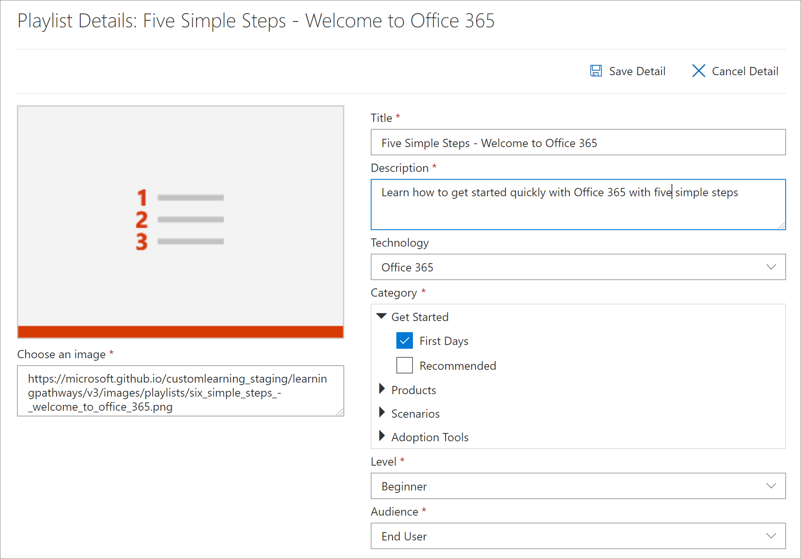

# 复制播放列表
通常情况下，组织需要通过删除或替换包含组织创建的资产的资产来修改 Microsoft 提供的播放列表。 例如，您可能希望从 "开始" 中删除六个简单步骤播放列表中的某个步骤。 现在，您可以使用学习路径复制播放列表功能轻松复制六个简单的步骤播放列表，只需删除资产、更换资产或添加新资产即可。 

## 复制播放列表

1. 在 Microsoft 365 学习途径**主页**中，单击**Office 365 培训**。
2. 单击 "**管理**" 图标。
3. 在 "**第一天**" 下，单击**六个简单步骤-欢迎使用 Office 365**播放列表，然后单击 "**复制播放列表**"。 
4. 单击 "**编辑详细信息**"，然后填写 "**标题**" 和 "**说明**" 字段（如以下示例中所示），然后单击 "**保存详细信息**"。  
 

## 在播放列表中添加或删除资产
使用自定义播放列表，可以执行以下操作：
- 添加和删除 Microsoft 资产，但不编辑 Microsoft 的资产
- 添加、删除和编辑您的组织或您创建的 SharePoint 资产中的自定义现有 SharePoint 资产。 

### 从播放列表中删除资产
- 向下滚动 "**管理**" 页，然后在 "**播放列表资源**" 下单击**步骤5的 "删除" 图标。设置移动应用**。 

## 验证是否已从播放列表中删除资产
1. 返回到使用**Microsoft 365 培训**页面的选项卡。
2. 单击 "**第一天**"，然后单击**五个简单的步骤-"欢迎使用 Office 365**播放列表"。 
3. 单击播放列表以验证资产是否已删除。

