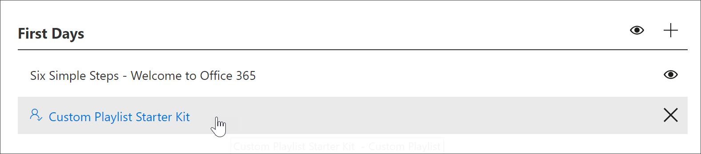

# 创建自定义播放列表

创建播放列表时，首先使用播放列表详细信息创建播放列表，然后将资源添加到播放列表。 您可以将播放列表添加到任何子类别。 例如，可以将播放列表添加到 "**第一天**" 子类别或像**Excel**这样的**产品**子类别。 在本节中，我们将介绍如何创建播放列表，然后将资源添加到下一节中的播放列表中，[将资源添加到自定义播放列表](custom_addassets.md)。

## 创建播放列表 

1. 在 Microsoft 365 学习途径**主页**中，单击 " **Office 365 培训**"，从 Web 部件中选择 "系统" 菜单，然后选择 "**管理播放列表**"。 
2. 选择一个子类别。 在此示例中，选择 "**第一天**"。  
3. 单击 "+" 图标。  

4.  填写播放列表中的字段，如下面的示例所示。 您可以保留此示例的默认图标。 

5.  完成后，选择 "**保存详细信息**"。 

## 编辑播放列表

- 在 "**自定义学习管理**" 页上，单击播放列表，然后单击 "**编辑详细信息**"。  

### 删除播放列表

- 在 "自定义学习管理" 页上，单击播放列表的 "**删除**" 图标。  

