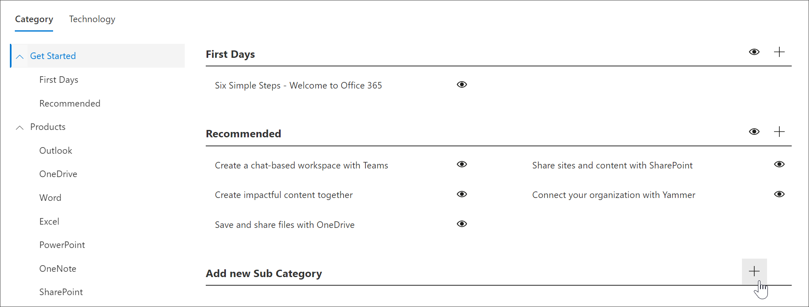

# 创建子类别Create a Subcategory 
在某些情况下, 您需要创建一个新的子类别。In some cases, you’ll want to create a new Subcategory. 例如, 如果 "第一天" 子类别不适用于您的组织, 则可以创建一个新的子类别, 然后向其添加播放列表以满足组织的需求。For example, if the First Days subcategory doesn’t work for you organization, you can create a new subcategory and then add playlists to it to meet the needs of your organization. 

1. 从自定义学习**主页**中, 单击 " **Office 365 培训**", 再单击 "Web 部件" 中的 "**系统**" 菜单, 然后单击 "**管理播放列表**"。From the Custom Learning **Home** page, click **Office 365 training**, click the **System** menu from the Web part, and then click **Administer Playlist**. 
2. 选择一个**类别**。Select a **Category**. 在此示例中, 选择 "**开始**"。In this example, select **Get Started**.  
3. 向下滚动页面,Scroll down the page, 
3. 单击 "**添加新的子类别 +** 图标"。Click the **Add new Subcategory +** icon.  

> [!TIP]
> Microsoft 提供的子类别可以隐藏, 但不能编辑或删除。Microsoft-provided subcategories can be hidden, but not edited or deleted. 

## 编辑子类别Edit a subcategory
- 选择子类别的 "**编辑**" 图标, 对子类别标题进行编辑, 然后单击 "**保存**"。Select the **Edit** icon for subcategory, make edits to the Subcategory title, and then click **Save**.

## 隐藏子类别Hide a subcategory
- 选择要隐藏的子类别的 eyeball。Select the eyeball for subcategory to hide it. 

## 删除子类别Delete a subcategory
- 选择子类别的 "**编辑**" 图标, 然后选择 "**删除"。**Select the **Edit** icon for subcategory, then select **Delete.** 
