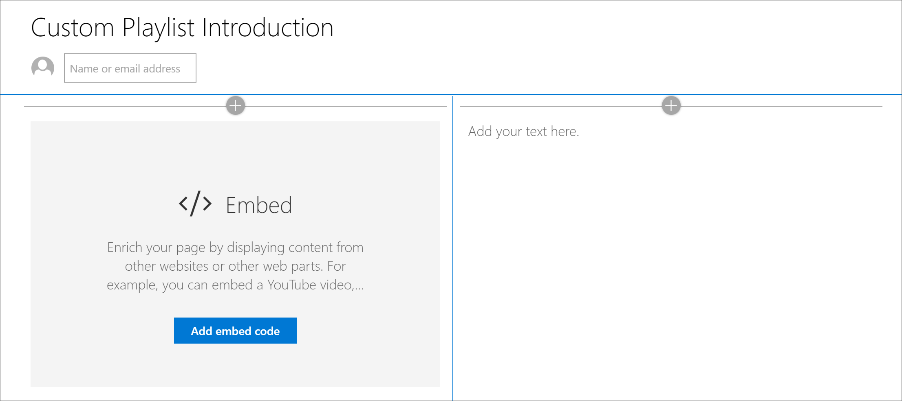
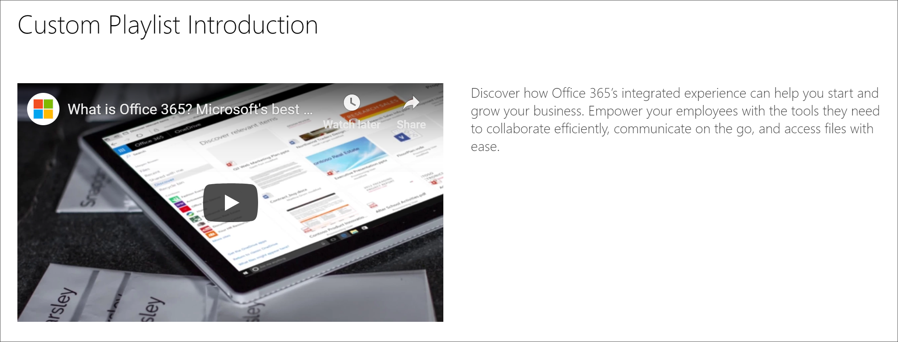

# 为SharePoint播放列表创建页面

学习路径的独特功能之一是，能够创建从 Microsoft 资产和所创建资产SharePoint集合的播放列表。 本示例中，我们将先创建一个SharePoint页面，然后创建播放列表。 从页面生成播放列表SharePoint提供了使用 Microsoft 或组织提供的 Web 部件生成页面的各种机会。 例如，播放列表可以包括一个SharePoint YouTube 中的嵌入式视频的页面、一个从 Office 365 Forms 构建的表单或一个嵌入式 Power BI 报表。 本示例将展示如何使用嵌入 Web 部件和文本 Web 部件生成页面。  

## 为自定义SharePoint创建一个自定义播放列表页面

1. 单击"SharePoint **齿轮"图标**，然后单击"**添加页面"。**
2. 单击 **页面左侧的**" (+) "，然后单击"两列"作为该节布局。 
3. 在左侧列中，单击"+"，然后单击" **嵌入** Web 部件"。 
4. 在右侧列中，单击"+"，然后单击"文本 **"Web** 部件。 你的页面应如下所示。

### 从 YouTube 添加视频和文本

1. 在浏览器中，转到 YouTube。 对于此示例，搜索"什么是Office 365 – Microsoft 的最佳生产力应用"。
2. 单击视频以播放它，然后暂停它，然后右键单击它。 
3. 单击 **"复制嵌入代码**"，然后返回到SharePoint页。 
4. 单击 **"在嵌入** Web **部件中添加** 嵌入代码"，然后从 YouTube 视频添加代码。
5. 返回到 YouTube 页面并复制 **视频的说明** 文本。 
6. 返回到"SharePoint"页，选择"**文本**"Web 部件，然后从 YouTube 视频复制文本。
7. 选择页面标题 **区域中** 的"编辑 Web SharePoint图标，然后将页面命名为"自定义播放列表简介"。 
8. 对于 **"布局"，****选择"纯**"，然后关闭 **"标题区域** 属性"窗格。 现在，页面应如下所示。 

### 发布页面

- 选择" **发布"** 按钮。 现在，你已准备好将此SharePoint添加到你的自定义播放列表。 