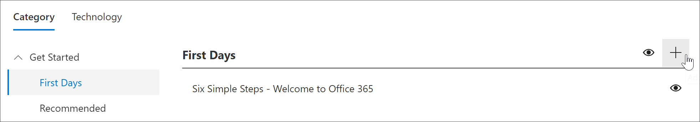
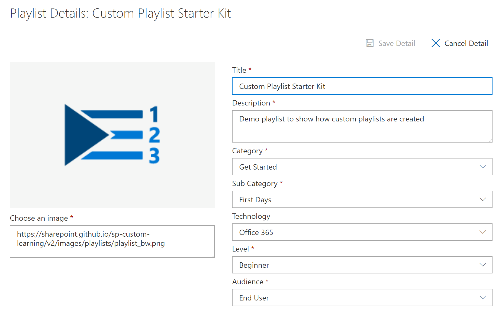
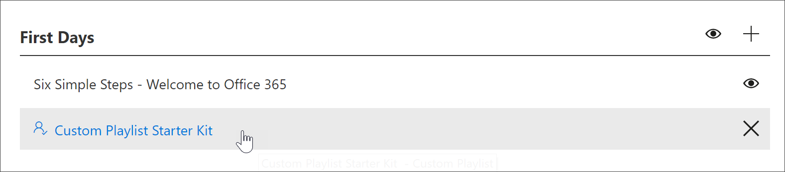
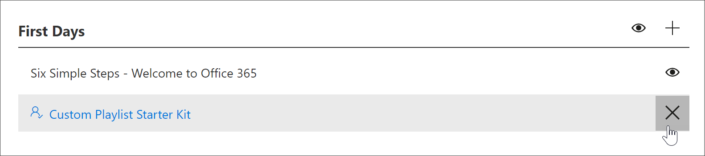

# 创建自定义播放列表Create a Custom Playlist

使用 Microsoft 365 学习路径，您可以从头开始创建自定义播放列表，以根据组织的独特需求进行定制。With Microsoft 365 learning pathways, you can create custom playlists from scratch that are tailored to the unique needs of your organization. 例如，创建一个播放列表，用于将新员工加入 Microsoft 团队。For example, create a playlist for onboarding new hires to Microsoft Teams. 或为具有适合其独特角色的信息的执行管理员创建播放列表。Or create playlists for executive administrators with information suited to their unique role. 或为 Microsoft 365 播放列表创建第一天，其中包含三个简单的步骤，而不是6个。Or create a First Day for Microsoft 365 playlist that has three simple steps instead of six. 您可以将自定义播放列表添加到任何子类别。You can add a custom playlist to any subcategory. 例如，**第一天**是**Excel**之类的**产品**子类别，甚至是您创建的子类别。For example, **First Days**, a **Product** subcategory like **Excel**, or even a subcategory that you create. 在本节中，我们将介绍如何创建播放列表，然后将资源添加到下一节中的播放列表中，[将资源添加到自定义播放列表](custom_addassets.md)。In this section, we’ll cover how to create a playlist, and then cover adding assets to a playlist in the following section, [Add assets to a custom playlist](custom_addassets.md).

## 创建播放列表Create a playlist 

1. 在 Microsoft 365 学习途径**主页**中，单击 " **Office 365 培训**"，然后从 Web 部件中选择 "**管理**" 图标。From the Microsoft 365 learning pathways **Home** page, click **Office 365 training**, and then select the **Administer** icon from the Web part. 
2. 选择 "**管理**" 图标子类别。Select the **Administer**" icon  subcategory. 在此示例中，选择 "**第一天**"。In this example, select **First Days**.  
3. 单击 "+" 图标。Click the + icon.  

4.  填写播放列表中的字段，如下面的示例所示。Fill out the fields in the playlist as shown in the following example. 您可以保留此示例的默认图标。You can leave the default icon for this example. 

5.  完成后，选择 "**保存详细信息**"。When you are done, select **Save Detail**. 

## 编辑播放列表Edit a playlist

- 在 "**自定义学习管理**" 页上，单击播放列表，然后单击 "**编辑详细信息**"。From the **Custom Learning Administration** page, click the playlist, and then click **Edit Detail**.  

### 删除播放列表Delete a playlist

- 在 "自定义学习管理" 页上，单击播放列表的 "**删除**" 图标。From the Custom Learning Administration page, click the **Delete** icon for the playlist.  

