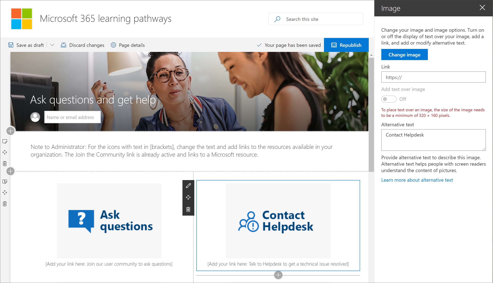

# 自定义网站Customize the site

自定义学习网站基于 SharePoint 通信模板, 因此很容易修改网站以满足组织的需求。您可以更改网站名称、徽标、菜单项和页面上的内容。The Custom Learning site is based on a SharePoint communication template, so it's easy to modify the site to meet the needs of your organization. You can change the site name, logo, menu items, and the content on the pages. 

> [!TIP]
> 收集来自你的员工的反馈并定期完成其他自定义设置。 将播放列表、目标网页添加到特定角色, 或在启动新服务时打开新的培训内容。Gather feedback from your employees and periodically complete additional customizations.  Add playlists, target webpages to specific roles or turn on new training content when launching new services. 

## 自定义网页Customize web pages

自定义学习网站可完全自定义。如果您不熟悉在新式 SharePoint Online 网站中创建页面, 我们建议您查看 support.office.com 上的 "[自定义 SharePoint 网站](https://support.office.com/en-us/article/customize-your-sharepoint-site-320b43e5-b047-4fda-8381-f61e8ac7f59b)" 文章。The Custom Learning site is fully customizable. If you are not familiar with creating pages within modern SharePoint Online sites, we suggest you review the [Customize your SharePoint site](https://support.office.com/en-us/article/customize-your-sharepoint-site-320b43e5-b047-4fda-8381-f61e8ac7f59b) article on support.office.com. 

### 自定义提问和获取帮助Customize Ask questions and get help

作为自定义学习网站的管理员, 您想要做的一件事就是将 "**获取帮助和支持**" 页上的链接更改为指向组织中的资源。As an administrator of the Custom Learning site, one of the things you’ll want to do is change the links on the **Get Help and Support** page to point to resources in your organization. 

1.  从自定义学习主页中, 单击 "**提问" 和 "获取帮助**" 菜单项。From the Custom Learning Home page, click the **Ask questions and get help** menu item.
2.  单击 "**编辑**" 按钮。Click the **Edit** button.
3.  将鼠标悬停在 "帮助" 选项图像上, 然后单击 "**编辑 web 部件**"。Hover over a Help option image, then click **Edit web part**.

4.  在 "**链接**" 框中, 输入内部资源的 URL。In the **Link** box, enter the URL for the internal resource. 
5.  对未链接的其他两个图像重复步骤3和4。Repeat steps 3 and 4 for the other two images that aren’t linked.

### 更改页面上的文本Change the text on the page

1. 将鼠标悬停在文本区域上, 然后编辑页面的文本。Hover over the text area, then edit the text for the page. 
2. 完成后单击 "**发布**" 按钮Click the **Publish** button when you’re done

## 其他自定义选项Other customization options
您可能需要考虑编辑的其他页面包括:Other pages you might want to consider editing are:

- 培训活动的日历 .aspxTraining events calendar.aspx
- 主页上的英雄 web 部件The Hero web part on Home.aspx

