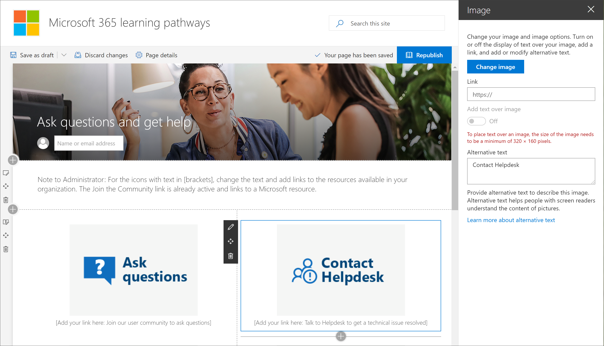
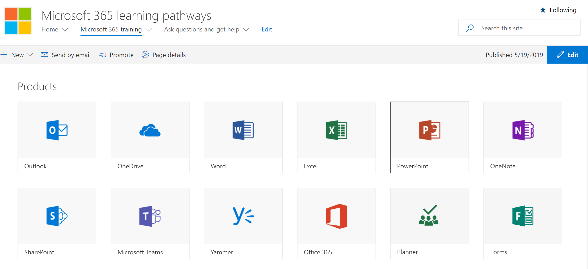

# 浏览 "学习路径" 网站Explore the learning pathways site

> 注意：若要浏览学习路径网站及其管理功能，将需要网站集管理员、所有者或成员对网站的权限。Note: To explore the learning pathways site and it's administrative features, you'll need Site Collection Admin, Owner, or Member permissions to the site. 如果您没有 neccesary 权限，请与网站管理员联系。If you don't have the neccesary permissions, contact the Site Administrator for the site. "学习路径" 网站托管在 Office 365 租户中，因此您需要登录 Office 365 才能访问网站。The learning pathways site is hosted in your Office 365 tenant, so you'll need to sign in to Office 365 to get to the site. 如果还未登录 Office 365，请立即登录。If you haven’t already signed into Office 365, sign in now. 

## 登录 Office 365Sign in to Office 365 

1.  打开 Web 浏览器并导航到 office.com 或您组织的登录位置。Open your Web browser and navigate to office.com or your organization’s sign-in location. 
2.  使用您的用户名和密码登录。Sign in with your user name and password.
3.  使用租户管理员提供的 URL 导航到网站的位置，或从 Office 365 主页中选择 "SharePoint"，然后选择 "网站"。Navigate to the location of the site using the URL supplied by your tenant administrator or select SharePoint from the Office 365 Home page, and then select the site. 

## 浏览 "学习路径" 网站Explore the learning pathways site

学习路径网站基于 SharePoint 通信模板，因此很容易修改网站以满足组织的需求。The learning pathways site is based on a SharePoint communication template, so it's easy to modify the site to meet the needs of your organization. 您可以更改网站名称、徽标、菜单项和页面上的内容。You can change the site name, logo, menu items, and the content on the pages. 您要对组织进行修改的页面之一是提问和获取帮助页面。One of the pages you'll want to modify for your organization is the Ask questions and get help page. 我们来看一下。Let's take a look.

### 查看提出问题和获取帮助页View the Ask questions and get help page

学习路径网站提供了可帮助您开始构建您的培训和支持门户的默认内容。The learning pathways site provides default content to help you get starting building your training and support portal. 作为网站的 admininstrator 或所有者，您想要做的一件事就是更改提问的链接 **，并获取帮助页**指向组织中的资源。As an admininstrator or owner of the site, one of the things you’ll want to do is change the links on the **Ask question and get help page** point to resources in your organization. 

1.  在 Microsoft 365 学习路径主页中，单击 "**提问" 和 "获取帮助**" 菜单项。From the Microsoft 365 learning pathways Home page, click the **Ask questions and get help** menu item.
2.  Click the **Edit** button.Click the **Edit** button.
3.  将鼠标悬停在 "帮助" 选项图像上，然后单击 "**编辑 web 部件**"。Hover over a Help option image, then click **Edit web part**.

有关自定义网站页面的说明，请参阅[自定义网站](custom_edithelp.md)。For instructions on customizing site pages, see [Customize the site](custom_edithelp.md).

### 查看 web 部件中的学习路径内容View the learning pathways content in the web part
Microsoft 365 培训页面承载配置为显示可用于学习路径的所有培训的 "学习路径" Web 部件。The Microsoft 365 training page hosts the learning pathways Web part configured to show all the training available for learning pathways. 

1. 向下滚动页面以查看所有类别和子类别。Scroll down the page to view all the categories and subcategories.
2. 一位启动橡胶轮。Kick the tires a bit. 单击几个子类别，然后单击几个播放列表，了解如何组织学习通道内容。Click a few subcategories, and then click a few playlists to get a feel for how learning pathways content is organized. 

有关自定义 "学习路径" web 部件的说明，请参阅[自定义学习体验](custom_overview.md)。For instructions on customizing the learning pathways web part, see [Customize the Learning Experience](custom_overview.md).

### 获取完整的网站漫游和自定义指南Get a complete site tour and customization guidance
若要详细了解学习路径、incuding 网站、web 部件、管理功能和有关如何为您的环境构建独特的学习体验的指导，请参阅[自定义学习体验](custom_overview.md)For a detailed look at learning pathways, incuding the site, the web part, administrative features, and guidance on how to build unique learning experiences for your environment, see [Customize the Learning Experience](custom_overview.md)

## 后续步骤Next Steps
- [自定义学习体验Customize the Learning Experience](custom_overview.md)
- [推动采用Drive adoption](driveadoption.md) 
