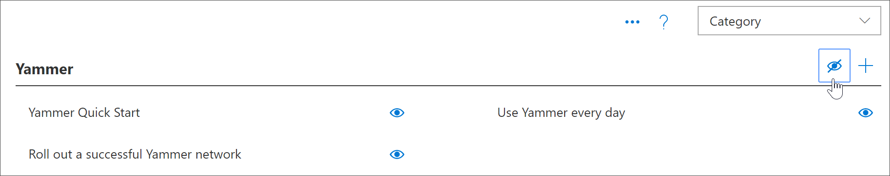

# 2019年11月版本3.0 功能更新November 2019 Version 3.0 Feature Updates
根据客户反馈，已将以下新功能添加到学习路径版本3.0。Based on customer feedback, the following new features have been added to Learning Pathways version 3.0.

## 内容更新和编辑日历Content Updates and Editorial Calendar
学习路径的承诺之一是最新内容。One of the promises of learning pathways is up-to-date content. 为此，我们提供了第一季度内容更新。To this end, we've provided our first quarterly content update. 内容更新反映了我们的内容更新文章，这些文章将逐个季度进行更新。The content update is reflected our Content Update article which will be updated on a quarterly basis. 有关内容更新，请参阅[学习路径内容更新](custom_contentupdates.md)For content updates, see [Learning pathways Content Updates](custom_contentupdates.md)

## Microsoft 365 成功中心Microsoft 365 Success Center
我们已添加 Microsoft 365 学习路径成功中心，以帮助管理员和网站集所有者获取学习途径。We've added a Microsoft 365 learning pathways Success Center to help Admins and Site Collection Owners get the most out of learning pathways. 成功中心提供了规划和采用资源的链接，并提供了有关规划、自定义、促进采用和衡量学习途径的影响的指南。The Success Center provides links to planning and adoption resources and offers guidance on planning, customizing, driving adoption,and measuring impact of learning pathways. 有关详细信息，请参阅[学习路径管理员成功中心](custom_successcenter.md)For more information, see [Learning pathways Admin Success Center](custom_successcenter.md)

## 播放列表导航Playlist navigation
根据客户反馈，我们使导航更明显地了解下一个和上一个按钮。Based on customer feedback, we've made navigation more obvious with Next and Previous buttons. 我们还在导航区域中添加了一个目录，使用户能够轻松地查看播放列表中的项目的完整列表，并直接导航到播放列表中的某个资产。We've also added a table of contents within the navigation area to enable users to easily see the full list of items in a playlist and to navigate directly to an asset in a playlist. 

## 复制播放列表Copy a Playlist
许多客户都只需在 Microsoft 提供的播放列表中修改几个简单的内容，而无需创建全新的播放列表。Many customers have expressed the need to modify just a few simple things in a Microsoft-supplied playlist, without the need to create a completely new playlist. 例如，常见的请求是从 "开始" 中删除六个简单步骤播放列表中的一个步骤。For example,a common request is to remove a step from the Start with Six Simple Steps playlist. 现在，您可以从现有的播放列表中复制播放列表，包括 Microsoft 目录中的播放列表，然后修改该播放列表。Now you can copy a playlist from an existing playlist, including a playlist from the Microsoft catalog,and then modify that playlist. 例如，现在可以复制六个简单的步骤，删除3个步骤，然后将播放列表转换为3个简单步骤。For example, you can now copy six simple steps, delete 3 steps, and turn the playlist into 3 simple steps. 有关详细信息，请参阅[复制播放列表](custom_copyplaylist.md)For more information, see [Copy a playlist](custom_copyplaylist.md)

## 改进了搜索功能Improved Search capabilities 
改进了从管理页面生成播放列表时的搜索功能。Search capabilities when building a playlist from the Administration page have been improved. 搜索结果提供了其他详细信息来区分搜索返回中的重复名称。Search results provide additional details to distinguish duplicate names in Search returns. 您还可以单击 "搜索结果" 项目以预览资产。You can also click on a Search results item to preview the asset. 有关详细信息，请参阅[创建自定义播放列表](custom_copyplaylist.md)For more information, see [Create a custom playlist](custom_copyplaylist.md)

