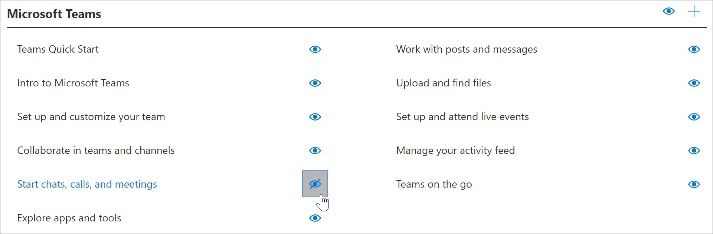
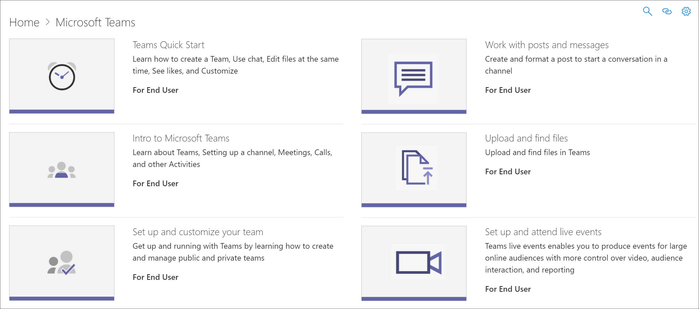

# 隐藏和显示播放列表

若要为您的环境定制学习路径，您可能需要隐藏由 Microsoft 提供的播放列表，并将其替换为您为组织创建的播放列表。 例如，常见的客户用例是从 Microsoft 隐藏六个简单的步骤播放列表，并将其替换为您为组织或用户组创建的播放列表。 

## 隐藏播放列表

1. 从 "学习路径"**主页**中，单击 " **Office 365" 培训**磁贴。
2. 从 "学习路径" web 部件中，选择 "**系统**" 菜单，然后选择 "**管理播放列表**"。 现在，您应该打开两个选项卡：一个使用 "**学习路径管理**" 页面;和一个使用**Office 365 培训**页面的。 
3. 从 "**自定义学习管理**" 页的 "**类别**" 下，选择一个子类别，然后选择 "eyeball" 作为播放列表以将其隐藏。 对于此示例，请单击 "**第一天**" 子类别，然后隐藏**六个简单步骤**的播放列表。  

### 验证是否隐藏了播放列表
- 若要验证是否隐藏了播放列表，请在加载 " **Office 365 入门**" 页上选择 "浏览器" 选项卡，然后刷新页面。 您现在应该会看到 "**第一天**" 子类别和**六个简单步骤**处于隐藏状态。 在这种情况下，子类别中只有一个播放列表且隐藏了一个播放列表，因此学习路径也会隐藏子类别，而不是显示空子类别。 

## 取消隐藏播放列表

- 从 "**自定义学习管理**" 页的 "**类别**" 下，选择一个子类别，选择一个播放列表，然后选择隐藏的播放列表的 eyeball 以将其取消隐藏。 对于此示例，请隐藏 "**第一天**" 子类别下的**六个简单步骤**播放列表。  

