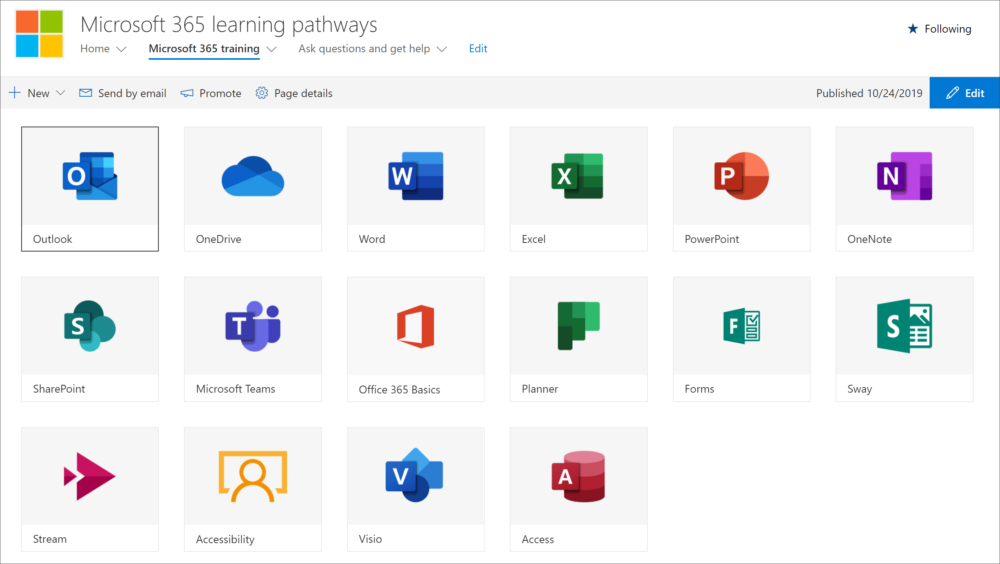

# 隐藏和显示子类别

使用 "学习路径管理" 页，可以隐藏和显示内容的子类别。 例如，未推出 Yammer 的公司可以隐藏 Yammer 子类别，因此 Yammer 内容对用户不可见。 这样可以防止来自用户的不必要的支持呼叫，他们可能会看到与组织中不可用的服务相关的信息。

## 隐藏子类别 

1. 在 Microsoft 365 学习路径主页中，单击 "Microsoft 365 培训" 磁贴。
2. 在 "Microsoft 365 学习路径" Web 部件中，单击 "管理" 图标。 
3. 在页面的左窗格中，选择一个子类别，然后选择子类别的 eyeball 以将其隐藏。 对于此示例，隐藏**Yammer**子类别。  

### 验证子类别是否处于隐藏状态
- 若要验证子类别是否处于隐藏状态，请在 "**已开始使用 Microsoft 365** " 页上选择 "浏览器" 选项卡，然后刷新页面。 您现在应该会看到 "产品" 类别中隐藏了 "Yammer" 子类别。 

## 取消隐藏子类别 

- 从 "**管理**" 页中，选择一个子类别，然后为隐藏子类别选择 "eyeball" 以将其取消隐藏。 对于此示例，请取消隐藏 Yammer 子类别。