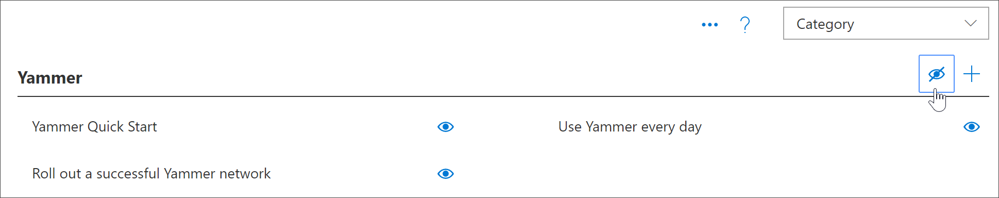

# 隐藏和显示子类别

通过学习路径管理页，您可以隐藏和显示内容的子类别。 例如，不推出 Yammer 的公司可以隐藏 Yammer 子类别，因此 Yammer 内容对用户不可见。 这可以防止来自用户（这些用户可能会看到与组织中不可用的服务有关的信息）的不需要的支持呼叫。

## 隐藏子类别 

1. 从 Microsoft 365 学习路径主页中，单击 Microsoft 365 培训磁贴。
2. 从 Microsoft 365 学习路径 Web 部件中，单击"管理"图标。 
3. 在页面的左侧窗格中，选择一个子类别，然后为子类别选择一个目视球来隐藏它。 对于此示例，隐藏 **Yammer** 子类别。  

### 验证子类别是否隐藏
- 若要验证子类别是否隐藏，请选择加载了 **"Microsoft 365** 入门"页面的浏览器选项卡，然后刷新该页面。 现在应该会看到 Yammer 子类别在"产品"类别中隐藏。 

## 取消隐藏子类别 

- 从" **管理** "页中，选择一个子类别，然后选择隐藏的子类别以将其取消隐藏。 对于此示例，取消隐藏 Yammer 子类别。