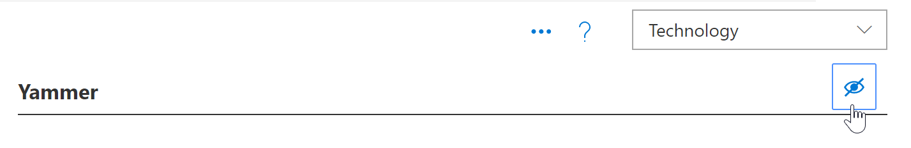
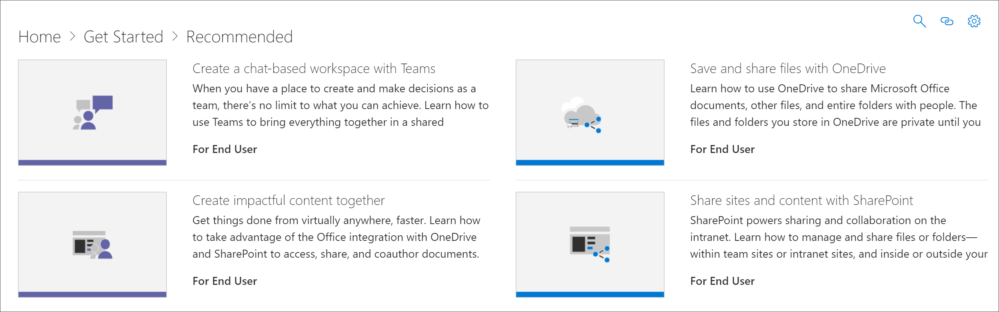

# 隐藏和显示技术Hide and show Technology

在某些情况下, 您可能希望隐藏组织中不支持的技术的内容。隐藏技术功能旨在防止在整个 Web 部件中显示技术。它提供了一个更广泛的隐藏和显示内容的方法, 而不是通过子类别或播放列表隐藏内容。例如, 可以隐藏 yammer 子类别, 但 yammer 可能仍显示在某些方案播放列表中, 例如 "使用 Yammer 连接组织"。若要确保不会向最终用户公开特定技术, 可以通过技术隐藏它。In some cases, you’ll want to hide content for a technology that’s not supported in your organization. The Hide Technology feature is designed to prevent technology from appearing throughout the Web part. It offers a broader way to hide and show content than hiding it by subcategory or playlist. For example, you can hide a Yammer subcategory, but Yammer may still show up in certain scenario playlists such as "Connect your organization with Yammer". To ensure a specific technology is not exposed to end users, you can hide it by Technology. 

## 隐藏技术Hide a Technology

1. 从自定义学习**主页**中, 单击 " **Office 365" 培训**磁贴。From the Custom Learning **Home** page, click the **Office 365 training** tile.
2. 从自定义学习 Web 部件中, 选择 "**系统**" 菜单, 然后选择 "**管理播放列表**"。现在, 您应该打开两个选项卡。一个使用**自定义学习管理**页面, 另一个使用**Office 365 培训**页面。From the Custom Learning Web part, select the **System** menu, then select **Administer Playlist**. You should now have two tabs open. One with the **Custom Learning Administration** page, and one with the **Office 365 training** page. 
3. 在 "**自定义学习管理**" 页上, 单击某一**技术**, 然后选择该技术要隐藏的 eyeball。在此示例中, 单击**Yammer**技术, 然后将其隐藏。From the **Custom Learning Administration** page, click a **Technology**, and then select the eyeball for the Technology to hide it. For this example, click the **Yammer** technology, and then hide it.  

### 验证是否隐藏了播放列表Verify the playlist is hidden
1. 若要验证**Yammer**技术是否处于隐藏状态, 请在加载了**Office 365 培训**页的情况下选择 "浏览器" 选项卡, 然后刷新页面。您现在应该会看到 "Yammer" 子类别处于隐藏状态。To verify **Yammer** technology is hidden, select the browser tab with the **Office 365 training** page loaded, and then refresh the page. You should now see the Yammer subcategory is hidden. 
2. 单击**推荐**的子类别。您会注意到, "使用 Yammer 连接组织" 播放列表处于隐藏状态。Click the **Recommended** subcategory. You'll notice that the Connect your organization with Yammer playlist is hidden. 

## 取消隐藏技术Unhide a Technology

- 从 "**自定义学习管理**" 页面的 "**技术**" 下, 选择一种技术, 然后选择 "eyeball" 作为隐藏的技术以将其取消隐藏。对于此示例, 请隐藏**Yammer**技术。From the **Custom Learning Administration** page, under **Technology**, select a technology, then select the eyeball for the hidden technology to unhide it. For this example, unhide the **Yammer** technology. 