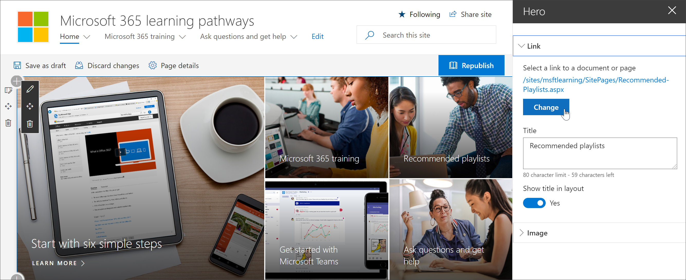
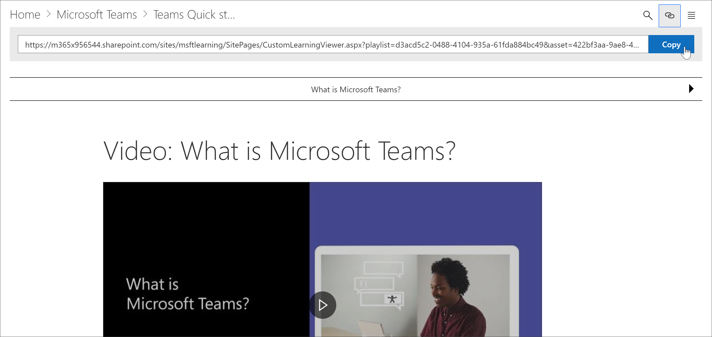
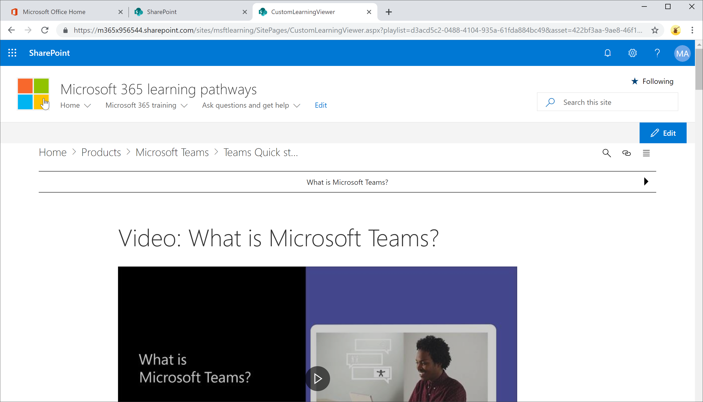

# 学习路径内容的链接Link to learning pathways content

通过学习路径，可以通过两种方式链接到内容：With learning pathways, there are two ways to link to content:

- 指向托管 Web 部件的页面的链接，该 Web 部件将针对要显示的内容进行筛选Link to the page that host the Web part filtered for the content you want to display 
- 直接指向 Web 部件实例的链接Link directly to an instance of the Web part

## 链接到页面Link to a page

如果你在 Microsoft 365 学习路径 web 部件中创建了新的页面和学习体验，则可以链接到该 Web 部件已配置为显示要显示的内容的页面。If you've created new pages and learning experiences with the Microsoft 365 learning pathways web part, you can link to the page with the Web part configured to show the content you want to display. 在上一节中，我们介绍了如何在页面上显示 Excel 播放列表。In the previous section, we covered how to display Excel playlists on a page. 现在，您可以编辑主页以链接到页面。You could now edit the Home page to link to the page. 

1. 在主页中，单击 " **编辑**"。From the Home page, click **Edit**.
2. 单击其中一个主页磁贴中的 " **编辑详细信息** "。Click **Edit details** in one of the Home page tiles. 在此示例中，我们编辑 **推荐的播放列表** 磁贴。In this example, we edit the **Recommended playlists** tiles.
3. 在 " **链接**" 下，单击 " **更改**"。Under **Link**, click **Change**.

4. 依次单击 " **网站**"、" **网站页面**" 和要链接到的页面，然后单击 " **打开**"。Click **Site**, then **Site Pages**, click the page you want to link to, and then click **Open**. 在此示例中，我们将链接到上一节中介绍的 **Create-your-own-experience** 页。In this example, we link to the **Create-your-own-experience.aspx** page covered in the previous section.
5. 关闭 "英雄属性" 窗格，单击 " **发布**"，然后测试该链接。Close the Hero properties pane, click **Publish**, and then test the link. 

## 链接到 Microsoft 365 学习路径 web 部件Link to the Microsoft 365 learning pathways web part
通过学习路径，管理员或最终用户可以链接到独立于包含 Web 部件的页面的 Web 部件的实例。Learning pathways gives you, the administrator, or an end-user, the ability to link to an instance of the Web part independent of the page that contains the Web part. 您可以将复制的链接或链接从其他页面共享。You can share the copied link or link to it from other pages. 单击复制的链接时，将在 CustomLLearningViewer 页中显示 Microsoft 365 学习路径 web 部件实例。The copied link, when clicked, shows the Microsoft 365 learning pathways web part instance in the CustomLLearningViewer.aspx page. 来看一个示例。Let's look at an example. 

1. 在主页中，单击 " **Microsoft365 培训**"。From the Home page, click **Microsoft365 training**.
2. 单击 " **microsoft**团队"，然后单击 " **microsoft 团队简介**"。Click **Microsoft Teams**, and then click **Intro to Microsoft Teams**.
3. 单击 " **复制** " 图标。Click the **Copy** icon.

4. 单击 "Microsoft 365 学习路径" 网站菜单中的 "主页"。Click Home from the Microsoft 365 learning pathways site menu.
5. 将复制的 URL 粘贴到浏览器的地址栏中，然后按 ENTER。Paste the copied URL in the address bar of the browser and press ENTER. 

如下图所示，链接转到 CustomLearningViewer 页，并根据复制的链接中的参数显示内容。As shown in the following illustration, the link goes to the CustomLearningViewer.aspx page and displays the content based on the parameters in the copied link. 

