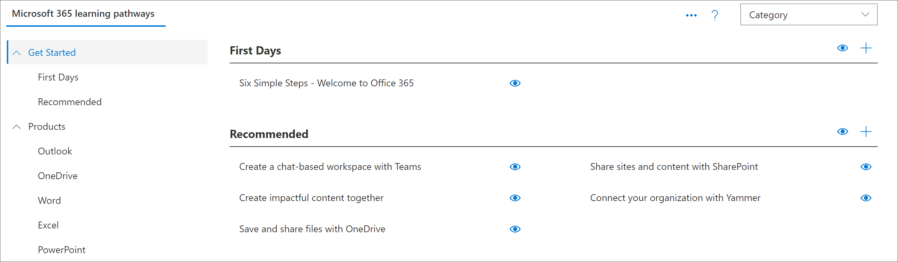

# 了解多语言手动设置的学习路径Learning pathways manual setup for multilingual

Microsoft 365 学习通道为需要支持下列方案之一的组织提供手动设置：Microsoft 365 learning pathways offers a manual setup for organizations that need support for one of the following scenarios:

- 您的组织具有专用于培训的 SharePoint Online 新式通信网站，您想要添加到该网站的学习途径。Your organization has an established SharePoint Online modern communication site dedicated to training and you want to add learning pathways to that site. 在这种情况下，尚未在网站上设置 "学习路径" web 部件。In this scenario, the learning pathways web part hasn't been set up on the site.

- 您想要在某个组织的 SharePoint 通信网站中安装多语言支持的学习路径。You want to install learning pathways for multilingual support in one of your organization's SharePoint Communication sites. 该网站具有或将具有非英语的默认语言，并且是学习路径支持的语言之一。The site has, or will have, a default language that isn't English and is one of the languages supported by learning pathways. 以下是学习途径支持的语言：Here are the languages supported by learning pathways:

- 英语English
- 中文(简体)Chinese (Simplified)
- 法语French
- 德语German
- 意大利语（意大利）Italian (Italy)
- 日语（日本）Japanese (Japan)
- 葡萄牙语（巴西）Portuguese (Brazilian)
- 俄语 (俄语) Russian (Russian)
- 西班牙语Spanish

手动设置学习路径需要使用 Windows PowerShell 和 SharePoint Online 命令行管理程序。Manual setup of learning pathways requires experience working with Windows PowerShell and the SharePoint Online Management Shell. 下面概述了手动设置学习路径的步骤：Here's an overview of the steps for the manual setup of learning pathways: 

- 验证是否已满足所有先决条件。Validate that you have met all the prerequisites.
- 检查网站的默认语言设置。Check the default language settings for your site. 如果确定，请继续手动安装。If OK, continue with manual install. 如果需要不同的默认语言设置，则需要创建新网站。If you need a different default language setting, you'll need to create a new site. 
- 在您的 SharePoint 租户应用程序目录中安装 customlearning 文件。Install the customlearning.sppkg file in your SharePoint Tenant App Catalog.
- 设置/确定要充当 Microsoft 365 学习路径主网站的新式通信网站。Provision/identify a modern communication site to act as your Microsoft 365 learning pathways home site.
- 执行 PowerShell 脚本，将您的租户配置为学习路径所依赖的项目。Execute a PowerShell script that will configure your tenant with the artifacts that learning pathways depends on.
- 导航到 CustomLearningAdmin 网站页面，以加载管理 web 部件以初始化自定义内容配置。Navigate to the CustomLearningAdmin.aspx site page to load the admin web part to initialize the custom-content configuration.

## 先决条件Prerequisites
为确保成功手动设置学习路径 web 部件，必须满足以下先决条件。To ensure a successful manual setup of the learning pathways web part, the following prerequisites must be met. 

- 您必须已设置和配置租户范围内的应用程序目录。You must have set up and configured the tenant-wide App Catalog. 请参阅 [设置 Office 365 租户](https://docs.microsoft.com/sharepoint/dev/spfx/set-up-your-developer-tenant#create-app-catalog-site) 和跟踪 "创建应用程序目录" 网站部分。See [Set up your Office 365 tenant](https://docs.microsoft.com/sharepoint/dev/spfx/set-up-your-developer-tenant#create-app-catalog-site) and follow the "Create App Catalog" site section. 
- 如果你的租户范围内的应用程序目录已预配，你将需要访问有权将程序包上载到其中的帐户。If your tenant-wide App Catalog has already been provisioned, you'll need access to an account that has rights to upload a package to it. 通常，此帐户具有 SharePoint 管理员角色。Generally this account has a SharePoint administrator role. 
- 如果具有该角色的帐户不起作用，请转到 SharePoint 管理中心，并查找应用程序目录网站集的网站集管理员，然后以网站集管理员身份登录，或添加 SharePoint 管理员帐户，以使网站集管理员失败。If an account with that role doesn't work, go to the SharePoint admin center and find the Site Collection Administrators for the App Catalog site collection and either login as one of the Site Collection Administrators, or add the SharePoint administrator account that failed to the Site Collection Administrators. 
- 你还需要具有对 SharePoint 租户管理员帐户的访问权限。You'll also need access to an account that is a SharePoint Tenant Admin.

## 第1步-检查您的语言设置Step 1 - Check your language settings
作为手动安装过程的第一步，请检查您的网站语言设置。As the first step of the manual install process, check your site language settings. 以下是可能的选项：Here are the possible options:

### 选项 1-不需要多语言支持Option 1 - You don't want multilingual support
如果您不希望对网站进行多语言支持，请确保已将其关闭。If you don't want multilingual support for your site, ensure it's turned off.
1.  在 SharePoint 通信网站中，选择 "**设置**  >  **网站信息**"  >  **查看 "所有网站设置**  >  **语言设置**"。From the SharePoint communication site, select **Settings** > **Site information** > **View all site settings** > **Language settings**. 
2.  将 " **允许将页面和新闻转换为多种语言** " 开关设置为 " **关闭**"。Set the **Enable pages and news to be translated into multiple languages** switch to **Off**.
3.  单击“**保存**”。Click **Save**. 
4.  继续执行步骤2。Continue to Step 2.

## 选项 2-您需要多语言支持，并且您可以使用默认语言Option 2 - You want multilingual support and you're OK with the default language
SharePoint 通信网站具有默认语言。A SharePoint communication site has a default language. 默认语言确定查看学习路径的语言，包括 "学习路径管理" 页面。The default language determines the language in which you view learning pathways, including the learning pathways Administration page. 默认语言设置是在首次创建网站时设置的，不能在此后更改。The default language setting is set when the site is first created and cannot be changed afterward. 在使用手动设置 Continueing 之前，请确保您是目标网站的默认语言的 "正常"。Before Continueing with the manual setup, ensure you're OK with default language of the target site.

1.  在 SharePoint 通信网站中，选择 "**设置**  >  **网站信息**"  >  **查看 "所有网站设置**  >  **语言设置**"。From the SharePoint communication site, select **Settings** > **Site information** > **View all site settings** > **Language settings**. 
2.  将 " **启用要转换为多种语言的页面和新闻** " 设置为 **"打开"**。Set the **Enable pages and news to be translated into multiple languages** switch to **On**.
    - 如果您使用 " **语言**" 下列表顶部显示的语言，则可以添加其他语言，然后单击 " **保存**"。If you're OK with the language that appears at the top of the list under **Language**, you can add additional languages, and then click **Save**. 继续执行步骤2。Continue to Step 2.
    - 如果您需要与为网站选择的默认语言不同的默认语言，则需要使用所需的语言创建新的 SharePoint 通信网站。If you want a different default language than what's been selected for the site, you'll need to create a new SharePoint Communication site with the language you want. 继续选择 "3"。Continue to Option 3. 

## 选项 #3-您需要多语言支持，但需要网站的不同默认语言Option #3 - You want multilingual support but want a different default language for the site
使用此选项，您可以使用所需的默认语言创建新的 SharePoint Online 通信网站，然后设置该网站的语言设置。With this option, you create a new SharePoint Online communication site with the default language you want, and then set the Language settings for the site. 
1.  若要创建新的 SharePoint 通信网站，请参阅 [在 SharePoint Online 中创建通信网站](https://support.microsoft.com/office/create-a-communication-site-in-sharepoint-online-7fb44b20-a72f-4d2c-9173-fc8f59ba50eb)。To create a new SharePoint communication site, see [Create a communication site in SharePoint Online](https://support.microsoft.com/office/create-a-communication-site-in-sharepoint-online-7fb44b20-a72f-4d2c-9173-fc8f59ba50eb). 创建网站时，请务必将语言设置为学习路径所需的默认语言。When creating the site, be sure to set the language to the default language you want for learning pathways. 
2. 在您创建的网站中，选择 "**设置**  >  **网站信息**"  >  **查看 "所有网站设置**  >  **语言设置**"。From the site you created, select **Settings** > **Site information** > **View all site settings** > **Language settings**. 
2.  将 " **启用要转换为多种语言的页面和新闻** " 设置为 **"打开"**。Set the **Enable pages and news to be translated into multiple languages** switch to **On**.
3. 如有必要，添加其他语言，然后单击 " **保存**"。Add additional languages, if necessary, and then click **Save**. 
4. 继续执行步骤2。Continue to Step 2. 

>!便笺如果需要将自定义内容从网站迁移到新创建的网站，请参阅本文档后面的 "迁移自定义内容" 一节。![Note] If you need to migrate custom content from a site to a newly created site, see the "Migrate Custom Content" section later in this document. 

## 第2步-获取 GitHub 中的 web 部件包和安装脚本Step 2 - Get the web part package and setup script from GitHub
作为安装过程的一部分，你将需要 Microsoft 365 学习路径 Web 部件包和 PowerShell 安装脚本。As part of the setup process, you'll need the Microsoft 365 learning pathways Web part package and the PowerShell Setup Script.

- 转到 " [学习路径 GitHub 存储库](https://github.com/pnp/custom-learning-office-365)"。Go the [learning pathways GitHub Repository](https://github.com/pnp/custom-learning-office-365).
- 单击 " **下载** " 将 web 部件包和脚本保存到本地驱动器。Click **Download** to save the web part package and script to a local drive. 您将在此过程的后续步骤中使用脚本和 web 部件包。You'll be using the script and the web part package in later steps of this process.

## 步骤 2-将 web 部件上传到租户应用程序目录Step 2 - Upload the web part to the Tenant App Catalog
若要设置 Microsoft 365 学习路径，请将 customlearning 文件上传到租户范围的应用程序目录并部署它。To set up Microsoft 365 learning pathways, you upload the customlearning.sppkg file to the tenant-wide App Catalog and deploy it. 有关如何将应用程序添加到应用程序目录的详细说明，请参阅 [使用应用程序目录为 SharePoint Online 环境提供自定义业务应用程序](https://docs.microsoft.com/sharepoint/use-app-catalog) 。See [Use the App Catalog to make custom business apps available for your SharePoint Online environment](https://docs.microsoft.com/sharepoint/use-app-catalog) for detailed instructions on how to add an app to the App Catalog.

## 第3步-设置/确定新式通信网站Step 3 - Provision/identify a modern communication site
请在 SharePoint Online 租户中标识现有的 SharePoint 通信网站或设置新的 SharePoint 通信网站。Either identify an existing SharePoint communication site or provision a new one in your SharePoint Online tenant. 有关如何设置通信网站的详细信息，请参阅 [在 SharePoint Online 中创建通信网站](https://support.office.com/article/create-a-communication-site-in-sharepoint-online-7fb44b20-a72f-4d2c-9173-fc8f59ba50eb) 和按照创建通信网站的步骤进行操作。For more information about how to provision a communication site see [Create a communication site in SharePoint Online](https://support.office.com/article/create-a-communication-site-in-sharepoint-online-7fb44b20-a72f-4d2c-9173-fc8f59ba50eb) and follow the steps to create a communication site.

## 步骤 4-向网站添加 Microsoft 365 学习路径应用程序Step 4 - Add the Microsoft 365 learning pathways app to the site

1. 在 SharePoint 网站中，单击 "系统" 菜单，然后单击 " **添加应用程序**"。From the SharePoint site, click the System menu, then click **Add an App**. 
2. 在 **您的应用程序**下，单击 **您的组织**，然后单击 " **了解 Office 365 的路径**"。Under **Your Apps**, click **From Your Organization**, and then click **learning pathways for Office 365**. 

## 步骤 5-设置网站的权限Step 5 - Set permissions for the site
确保为网站设置了以下权限：Ensure the following permissions are set for the site:
- **网站集管理员或所有者组的一部分** -初始化 CustomConfig 列表项以设置其首次使用的学习路径所需的权限。**Site Collection Administrator or part of the Owners group** - Permissions required to  initialize the CustomConfig list item that sets up learning pathways for its first use. 
- **Members 组** -管理学习路径所需的权限，包括隐藏和显示内容以及管理自定义播放列表**Members group** - permissions required to Administer learning pathways, including hiding and showing content, and administering custom playlists
- **访问者组** -查看网站内容所需的权限。**Visitors group** - permissions required to view site content. 

## 步骤 6-执行 PowerShell 配置脚本Step 6- Execute PowerShell Configuration Script
包含的 PowerShell 脚本 `CustomLearningConfiguration.ps1` 将需要执行，以创建解决方案使用的三个 [租户属性](https://docs.microsoft.com/sharepoint/dev/spfx/tenant-properties) 。A PowerShell script `CustomLearningConfiguration.ps1` is included that you will need to execute to create three [tenant properties](https://docs.microsoft.com/sharepoint/dev/spfx/tenant-properties) that the solution uses. 此外，该脚本将在网站页面库中创建两个 [单独的部件应用程序页面](https://docs.microsoft.com/sharepoint/dev/spfx/web-parts/single-part-app-pages) ，以在已知位置承载管理员和用户 web 部件。In addition, the script creates two [single part app pages](https://docs.microsoft.com/sharepoint/dev/spfx/web-parts/single-part-app-pages) in the site pages library to host the admin and user web parts at a known location.

1. 如果还未下载 SharePoint Online 命令行管理程序，请立即下载。If you haven't already downloaded the SharePoint Online Management Shell, download it now. 请参阅 [SharePoint Online 命令行管理程序下载](https://go.microsoft.com/fwlink/p/?LinkId=255251)。See [SharePoint Online Management Shell Download](https://go.microsoft.com/fwlink/p/?LinkId=255251).
2. 您可能需要设置 PowerShell 执行策略以运行脚本。You may need to set a PowerShell execution policy to run the script. 有关详细信息，请参阅 [关于执行策略](https://docs.microsoft.com/powershell/module/microsoft.powershell.core/about/about_execution_policies?view=powershell-6)。For more information, see [About Execution Policies](https://docs.microsoft.com/powershell/module/microsoft.powershell.core/about/about_execution_policies?view=powershell-6).
3. 执行 `CustomLearningConfiguration.ps1` 脚本。Execute the `CustomLearningConfiguration.ps1` script. 除了租户管理员凭据之外，该脚本还会提示你输入租户名称和站点名称。In addition to your Tenant Admin credentials, the script will prompt you for your tenant name and site name. 考虑网站 URL 的以下示例， `https://contoso.sharepoint.com/sites/O365CL` `contoso` 是租户名称，也 `O365CL` 是网站名称。Considering the following example for your site URL, `https://contoso.sharepoint.com/sites/O365CL`, `contoso` is the tenant name and `O365CL` is the site name. 

### 禁用遥测集合Disabling Telemetry Collection
此解决方案的一部分包括匿名遥测跟踪自愿加入，默认情况下设置为 "开"。Part of this solution includes anonymized telemetry tracking opt in, which by default is set to on. 如果要执行手动安装且要关闭遥测跟踪，请更改 `CustomlearningConfiguration.ps1` 脚本以将 $optInTelemetry 变量设置为 $false 并运行脚本。If you are doing a manual install and you would like to turn telemetry tracking off, change the `CustomlearningConfiguration.ps1` script to set the $optInTelemetry variable to $false and run the script.

## 验证设置是否成功并初始化 CustomConfig 列表Validate Provisioning Success and Initialize the CustomConfig List

在成功运行 PowerShell 脚本之后，您将导航到该网站，初始化 **CustomConfig** 列表项，该列表项将设置第一次使用的学习路径，并验证网站是否正常工作。After the PowerShell script is successfully run, you navigate to the site, initialize the **CustomConfig** list item that sets up learning pathways for its first use, and validate the site is working.

- 转到 `<YOUR-SITE-COLLECTION-URL>/SitePages/CustomLearningAdmin.aspx`。Go to `<YOUR-SITE-COLLECTION-URL>/SitePages/CustomLearningAdmin.aspx`. 打开 **CustomLearningAdmin.aspx** 会初始化 **CustomConfig** 列表项，以设置首次使用的学习路径。Opening **CustomLearningAdmin.aspx** initializes the **CustomConfig** list item that sets up learning pathways for first use. 您应该会看到如下所示的页面：You should see a page that looks like this:

## 将所有者添加到网站Add Owners to Site
作为租户管理员，您不太可能是自定义网站的人员，因此您需要向网站分配一些所有者。As the Tenant Admin, it's unlikely you'll be the person customizing the site, so you'll need to assign a few owners to the site. 所有者具有对网站的管理权限，以便他们可以修改网站页面并 rebrand 网站。Owners have administrative privileges on the site so they can modify site pages and rebrand the site. 他们还能够隐藏和显示通过 "学习路径" Web 部件传递的内容。They also have the ability to hide and show content delivered through the learning pathways Web part. 此外，他们还能够构建自定义播放列表并将其分配给自定义子类别。In addition, they'll have the ability to build custom playlist and assign them to custom subcategories.  

1. 从 "SharePoint **设置** " 菜单中，单击 " **网站权限**"。From the SharePoint **Settings** menu, click **Site Permissions**.
2. 单击 " **高级权限设置**"。Click **Advanced Permission Settings**.
3. 单击 " **Office 365 所有者的学习路径**"。Click **learning pathways for Office 365 Owners**.
4. 单击 "**新建**向  >  **此组添加用户**"，然后添加您希望成为所有者的人员。Click **New** > **Add Users to this group**, and then add the people you want to be Owners. 
5. 添加链接以在共享邮件中 [浏览网站](https://docs.microsoft.com/Office365/CustomLearning/custom_explore) ，然后单击 " **共享**"。Add a link to [Explore the Site](https://docs.microsoft.com/Office365/CustomLearning/custom_explore) in the Share message, and then click **Share**.

## 迁移自定义内容Migrate Custom Content
在您按照上述步骤重新建立学习路径网站后，您需要移动 **CustomPlaylists** 列表和 **CustomAssets** 列表的内容。After you reestablish your learning pathways site by following the steps above, you will need to move the contents of your **CustomPlaylists** list and your **CustomAssets** list. 此外，您还可以在现有的学习路径网站中，移动构成自定义资产的实际自定义页面，并且您的意图是将其删除。You can also, optionally, move the actual custom pages that make up your custom assets if they live in the existing learning pathways site, and your intent is to delete it. 任务可能很困难，因为对于 **CustomPlaylists** 列表中的所有项， **CustomAssets** 列表中的列表项的 ID 将隐藏在每个播放列表项的 JSONData 字段中。The task can be difficult because  for all the items in the **CustomPlaylists** list, the ID of the list item in the **CustomAssets** list is buried in the JSONData field of each playlist list item. 因此，只需将 **CustomPlaylists** 列表中的内容从一个网站移到另一个网站即可。So, simply moving the contents of the **CustomPlaylists** list from one site to the other will not be sufficient. 此外， **CustomAssets** 列表包含列表项的 JSONData 字段中自定义资产页面的绝对 URL。Further, the **CustomAssets** list contains the absolute URL to the custom asset's page in the JSONData field of the list item. 如果不移动资产，并且不会重命名该网站 (因此将绝对 URL 更改为资产的页面) ，则可以保留 **CustomAssets** 。If the assets aren't moved and the site isn't renamed (thus changing the absolute URL to the asset's page), then **CustomAssets** can remain. 但您需要手动更正这些条目。But you will need to manually correct the entries. 考虑到这种类型的迁移的复杂性，我们建议您考虑登记我们的一个学习路径合作伙伴，以帮助您进行此转换。Given the complexity of this type of migration we suggest you consider enlisting one of our learning pathways partners to assist you in making this transition. 

### 后续步骤Next Steps
- 请参阅 [自定义学习路径](custom_overview.md)。See [Customize learning pathways](custom_overview.md). 
- 请参阅 [翻译网站页面](custom_translate_page_ml.md)。See [Translate site pages](custom_translate_page_ml.md).

