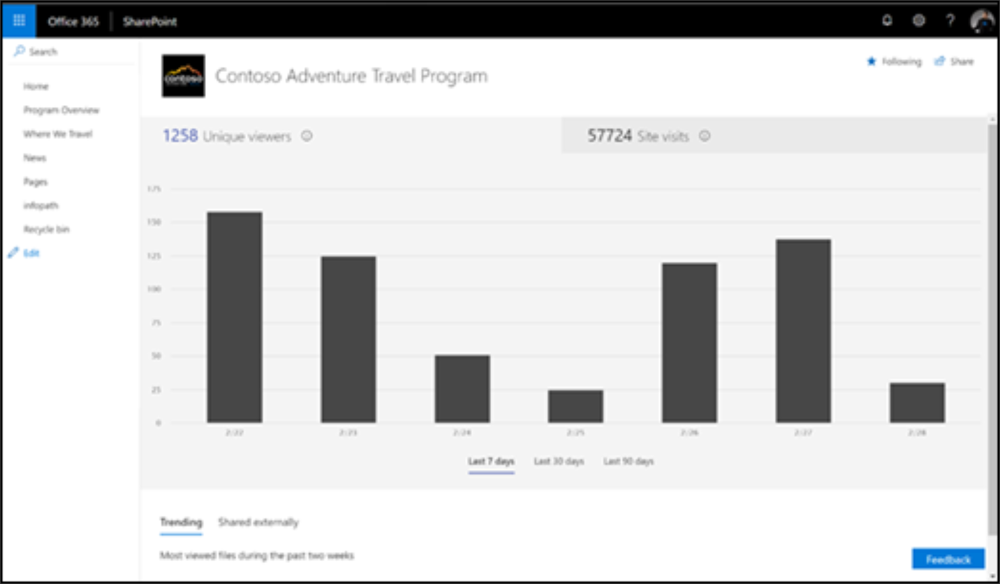

# 衡量 Microsoft 365 学习路径的影响

管理员应利用 SharePoint 的内置网站使用率报告功能衡量 Microsoft 365 学习路径的组织影响。 有两种主要方案用于衡量影响： 
- 网站级别影响 – 查看 Office 365 自定义学习特定网站的使用率数据 
- 组织级别影响 – 了解组织中所有其他网站的 Office 365 客户学习使用情况

## 网站级别影响

作为 SharePoint Online 网站所有者，您可以查看显示用户如何与您的网站交互的信息。 例如，你可以查看访问该网站的人数、访问该网站的次数以及获得最多观看次数的文件列表。 请参阅 [报告详细信息](https://support.office.com/article/view-usage-data-for-your-sharepoint-site-2fa8ddc2-c4b3-4268-8d26-a772dc55779e)。 

## 组织级别的影响
通过 Office 365 管理中心 SharePoint 网站使用情况报告，管理员可以获取从 Office 365 自定义学习网站获取的相对于所有其他 SharePoint 网站的值的高级别视图。 请参阅 [报告详细信息](/office365/admin/activity-reports/sharepoint-site-usage?view=o365-worldwide)。
 
按照引用的文章执行下列步骤： 
1. 了解如何访问 SharePoint 网站使用率报告 
2. 解释 SharePoint 网站使用率报告详细信息。 对"网站 URL"字段进行排序，以便更轻松地识别 Microsoft 365 学习路径网站。 
3. 利用报告导出功能进行更高级的数据分析，或者如果您的组织的网站超过 2，000 个。 

## 报告

截至目前，报告仅限于 SharePoint 网站级别。 将投票投到 [我们的用户语音](https://go.microsoft.com/fwlink/?linkid=2109552) 论坛，以帮助确定增强的报告功能请求的优先级。