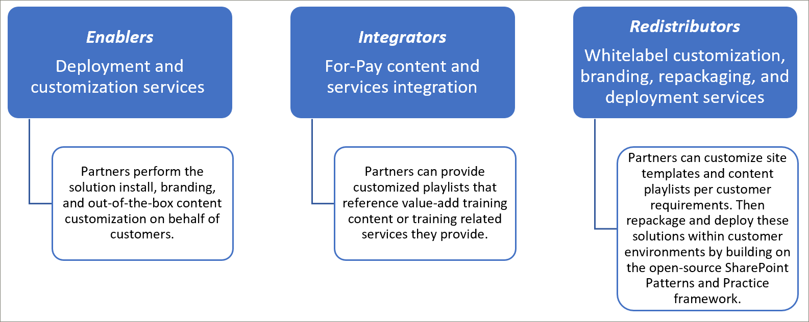
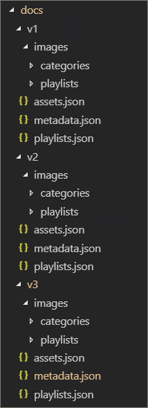
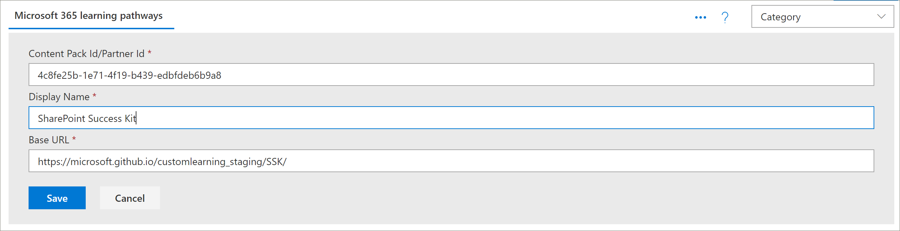
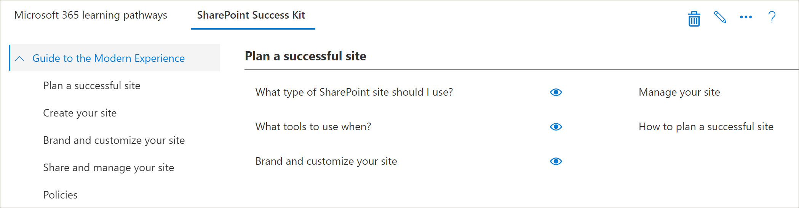
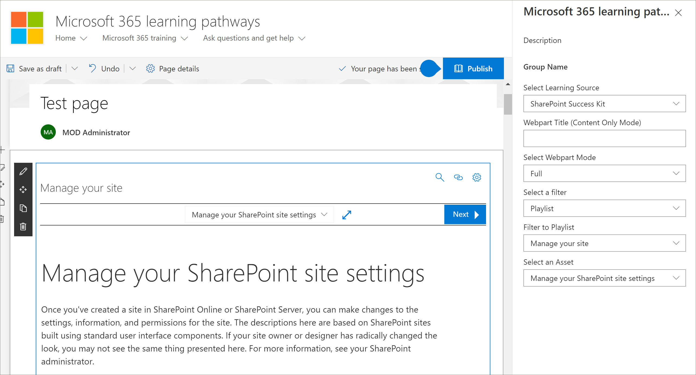

# 合作伙伴集成模型
尽管不能从 SharePoint Online 设置服务中直接补充 Microsoft 365 学习路径内容，但合作伙伴可以利用多个集成模型来创建调整值-添加服务扩大. 上面的合作伙伴集成模型按比较复杂程度和投资水平的顺序呈现。 因此，我们的指导旨在根据你的业务模型，构建你的专业技能并将其毕业到更高级别的层次。

 

## 我应如何开始？ 
若要开始，请执行下面的一些最佳实践。     

### 1. 以启用者的形式开始构建专业技能。 
您可以通过启用其学习路径培训门户并执行目标 Microsoft 内容 curation 来帮助您的客户群的百分比。 有关设置学习路径的说明，请https://docs.microsoft.com/en-us/office365/customlearning/custom_provision参阅。  

### 2. 然后，将服务扩展为集成商
根据你的内容和/或服务集成需求，执行自动化投资回报分析。 例如，如果您可以快速手动创建指向您的付费内容或引用您的服务的目标自定义播放列表，则对我们的内容集成准则采取开发和运营成本可能不是很有意义的。

### 3. 当投资回报有意义时–考虑再分发 
当投资回报有意义时，请考虑再分发（或使用相关的学习路径合作伙伴）来构建重新打包的解决方案。 这些基于 SharePoint 模式和实践框架，提供了用于提取自定义网站的解决方案，然后将其部署到客户环境中 

## 合作伙伴提供的内容集成准则
Microsoft 365 学习路径的内容由一组作为您的学习包的内容清单的 JSON 文件驱动。 有三个文件：元数据、json、和. json。 需要对这些文件进行结构化，使其与 web 部件识别的模型相匹配，然后从内容传递网络（CDN）中承载这些文件，以允许 web 部件加载这些文件。 Microsoft 将提供这些文件的起始模板，以使你入门。  

**免责声明：** JSON 文件结构根据即将推出的解决方案工作可能会发生变化。 Microsoft 365 学习路径合作伙伴前期采用计划（EAP）将会收到此性质的任何即将发生的更改。 以及任何客户向后兼容和/或转换指南。 

### 下载 Microsoft 365 学习路径解决方案
您可以从 GitHub 存储库中下载 Microsoft 365 学习路径解决方案以及 JSON 文件： https://github.com/pnp/custom-learning-office-365。 请注意，在这种情况下，Microsoft 不会在解决方案上占用 GitHub 拉取请求。 但您可以使用 GitHub 文件作为创建您自己的自定义内容包的起始点。 

## 元数据。 json 结构
您可以将此文件视为菜单和结构的 brains。 它包含所有导航结构以及其他两个文件中的数据的选取列表。 

|              名称        |                     说明                                                               | 
|:-----------------------------|-------------------------------------------------------------------------------------------|
|**技术**              |内容已标记，并可根据其分配的技术隐藏。                 |  
|&nbsp;&nbsp;号                |表示技术的 GUID                                                           |  
|&nbsp;&nbsp;别名              |技术的显示名称                                                             |
|&nbsp;&nbsp;*主题 []*     |作为技术子集的主题的数组                                   | 
|&nbsp;&nbsp;&nbsp;&nbsp;号    |表示主题的 GUID                                                              |
|&nbsp;&nbsp;&nbsp;&nbsp;别名  |主题的显示名称                                                                |
|**类别 []**             |类别通知 web 部件的导航。 每个类别都代表导航的顶层                                                                                                                 |
|&nbsp;&nbsp;号                |表示类别/子类别的 GUID                                                 |
|&nbsp;&nbsp;别名              |类别/子类别的显示名称                                                  |
|&nbsp;&nbsp;图像             |应在 UX 中显示的图像的 URL （相对于 CDN 基）            |
|&nbsp;&nbsp;TechnologyId      |与此内容相关的技术 GUID （可选–空字符串）            |
|&nbsp;&nbsp;SubjectId         |与此内容相关的主题的 GUID （可选–空字符串）               |
|&nbsp;&nbsp;源            |从源阵列中，除用户添加的自定义数据之外，不是特别使用的 UX，而 UX 管理员区域不允许编辑未标记为 "租户" 的任何内容。                           |
|&nbsp;&nbsp;*子类别 []*|子类别基本上是从级别2向下的导航级别。 结构与仅嵌套的类别相同。          |
|**访问群体 []**             |当与类别/子类别相关联的播放列表被标记了不同的访问群体时，将提供一个选择程序来显示可用的访问群体。 |         
|&nbsp;&nbsp;号                |访问群体的 GUID                                                                       |  
|&nbsp;&nbsp;别名              |显示访问群体的名称                                                               |       
|**源 []**               |根据用户添加的自定义数据将内容标记为 "租户"，而 UX 管理员区域不允许编辑未标记为 "租户" 的字符串数组，而不是专门在用户添加的自定义数据的 UX 中使用。                                                   |  
|**级别 []**               |当与类别/子类别关联的播放列表中标记了各种级别时，将显示一个选择器以显示可用的级别。             |  
|&nbsp;&nbsp;号                |级别的 GUID                                                                          |  
|&nbsp;&nbsp;别名              |级别的显示名称                                                                  | 
|**StatusTag [ ]**           |状态标记是指使用用户体验中公开的各种状态标识内容。 其中一些标志将向使用者显示，而有些仅用于管理员。                                                   |  
|&nbsp;&nbsp;号                |StatugTag 的 GUID                                                                      |  
|&nbsp;&nbsp;别名              |StatusTag 的显示名称                                                              | 
|**遥测 []**            |                                                                                           |  
|&nbsp;&nbsp;AppInsightsKey    |已设置的 application insights 密钥的 GUID，用于跟踪查看者 web 部件的加载。 可以由整个租户的管理员关闭跟踪，但发送的信息是使用租户 id 的匿名用户。有关详细信息，请参阅本节内容https://github.com/pnp/custom-learning-office-365#disabling-telemetry-collection               |  
|**版本**                   |解决方案使用版本信息向管理员指明 web 部件已更新，还允许 web 部件将自定义内容自我更新到最新版本的清单（如果已进行重大更改）。         | 
|&nbsp;&nbsp;体现          |清单的版本                                               |
|&nbsp;&nbsp;ManifestMinWebPart|适用于清单版本的 web 部件的最低版本             |
|&nbsp;&nbsp;CurrentWebPart    |应在 UX 中显示的图像的 URL （相对于 CDN 基）            |
|&nbsp;&nbsp;RepoURL           |更新 web 部件说明所在的存储库的 url。                    |
|**内容包**             |目前，不支持其他 CDN 的内容包。 内容包使 Microsoft 能够建议其他 Microsoft 创建的解决方案，这些解决方案可通过使用 M365LP 的预配服务进行预配，以提供内容并处于自定义 Cdn。       | 
|&nbsp;&nbsp;号                |内容包/CDN 的 GUID                                                              |
|&nbsp;&nbsp;别名              |CDN 的显示名称                                                                   |
|&nbsp;&nbsp;产品介绍       |要在用于添加内容包的 UI 中显示的说明                               |
|&nbsp;&nbsp;图像             |用于添加内容包的 UI 中显示的图像                                     |
|&nbsp;&nbsp;ProvisionURL      |用于创建内容包的网站集的预配服务包的 URL  |
|&nbsp;&nbsp;CDNbase           |内容包的清单的基 URL                                       |
|AssetOrigins                  |后面所述的资产 json 文件中使用的 URL 来源的数组。 如果源 URL 支持，则会将 post 消息发送到 help_getClientHeight。 的 data 属性中的响应为： "help_getClientHeight = {content 的 height}" （例如，"help_getClientHeight = 5769"）将允许将 iFrame 调整到所图文框内容的相应高度。         |

## 播放列表。 json 结构
播放列表。 json –播放列表清单是一组对象，这些对象描述有关播放列表的元数据以及播放列表中包含的资产。

|              名称        |                     说明                                                               | 
|:-----------------------------|-------------------------------------------------------------------------------------------|
|Id                            |表示播放列表的 GUID                                                             |  
|标题                         |播放列表的显示名称                                                               |
|图像                         |从 CDN 到图像的相对 URL，以可视化播放列表                              |                      
|LevelId                       |关联的级别                                                                           |
|AudienceId                   |相关访问群体                                                                        |
|TechnologyId                 |相关技术                                                                      |
|SubjectId                    |类别/子类别的显示名称                                                  |
|源                        |从源阵列中，除了用户添加的自定义数据之外，不一定会将其标记为 "租户"，并且 UX 管理员区域不允许对未标记为 "租户" 的任何内容进行编辑。                                              |
|CatId                         |表示播放列表应显示的容器的类别或子类别 ID。 目前，如果类别或子类别也具有子类别，则清单不支持选择该类别或子类别作为容器。        |
|说明                   |在 UX 中显示每个播放列表的说明                                           |
|StatusTagId                   |关联的状态标记                                                                      |
|StatusNote                    |有关向管理员显示的内容的说明                                            |
|*资产 []*                        |作为此播放列表的一部分的资产的 GUID 数组（按显示顺序排列）。        |         

## 资产 json 结构
播放列表。 json –播放列表清单是一组对象，这些对象描述有关播放列表的元数据以及播放列表中包含的资产。

|              名称        |                     说明                                                               | 
|:-----------------------------|-------------------------------------------------------------------------------------------|
|Id                            |表示播放列表的 GUID                                                             |  
|标题                         |播放列表的显示名称                                                               |
|说明                   |---                                                                                           |                      
|URL                           |要应用于 iFrame 的资产的源 url                                  |
|TechnologyId                  |相关技术                                                                      |
|SubjectId                     |关联主题                                                                         |
|源                        |类别/子类别的显示名称                                                  |
|StatusTagId                   |关联的状态标记                                                                      |
|StatusNote                    |有关向管理员显示的内容的说明。                                           |

## 缓存
当前版本的查看器 web 部件将清单文件的缓存版本利用24小时。 24小时后，web 部件的第一个用户通过从源 CDN 下载清单来刷新缓存，并将该信息与隐藏的技术和播放列表合并，并在自定义子类别中进行合并，从而达到性能下降。播放列表和资产。 此外，管理员 web 部件始终从清单中下载内容并将其合并并更新缓存。  换言之，管理员可以通过加载管理 web 部件（亦称为 "管理" 页）随时强制进行缓存更新。

## 内容包指南
内容包功能将取消锁定以下方案：
- 合作伙伴能够重新发布增值的自定义学习内容根据客户的环境进行量身定制
- 具有强大培训团队和 IT 支持的组织能够在自己的内部系统和公司治理中构建自定义的学习内容
- 使 Microsoft 能够在将来提供其他客户可以选择加入的学习途径

由于功能复杂，本当前文档集特意面向合作伙伴。 服务团队积极致力于更好地支持和启用方案 #2 在将来。 

## 内容包的工作原理
Microsoft 利用 GitHub 页面作为其清单文件和图像的内容传递网络（CDN）源。 我们在 GitHub 存储库的根目录中有一个文档文件夹，其中包含每个版本的清单文件的子文件夹。 每个文件夹中都有三个清单文件，以及用于存储所有类别、子类别和播放列表图像的 images 文件夹。 

务必维护与您自己的内容包一起扩展学习路径解决方案的相同版本化结构，这一点非常重要。 CDN 终结点不应包含版本文件夹，因为 web 部件支持的清单版本将 baked 到其中，并将自动追加到 CDN url 中。 我们会明显为你提供时间，在我们每次修订清单文件时创建新的清单文件实例。

 

有关将 GitHub 页面用作 CDN 源的详细信息，请参阅以下帮助文档： [https://help.github.com/en/articles/configuring-a-publishing-source-for-github-pages](https://help.github.com/en/articles/configuring-a-publishing-source-for-github-pages)。

Microsoft 的解决方案可将有关资产的信息提供给公共资产，因为在访问这些文件方面没有任何安全性。 我们认为，使用者应该有一层免费的内容，这就是，如果您需要对部分或全部内容使用支付墙，则需要在解决方案的技术限制内以不同的方式实现这一点，而使用 GitHub 页面并不意味着s 要求。 如果您维护我们所述的版本编号结构，那么您想要使用的任何 CDN 提供程序都是好的。 如前所述，web 部件支持的清单结构版本 baked 到代码中，并自动追加到 CDN URL 中。 

## 内容包集成指南 
管理和查看器 web 部件已扩展为允许使用者在其租户中配置其他 CDN 终结点，然后允许查看器 web 部件选择这些 CDN 应将显示的数据与其源相关。 

要记住此功能的关键帧： 
- 这主要适用于合作伙伴再分发方案–其中手动播放列表配置太麻烦 
- 自定义内容包是一项高级功能，应仅供有经验的 web 内容管理的合作伙伴使用。 不可信内容源可能会将不安全的内容引入您的网站。 您只应添加您信任的源。

> **重要说明**在添加自定义内容包之前，您必须已设置 Microsoft 365 学习路径3.0 或更高版本。 有关设置 Microsoft 365 学习路径的 informataion，请参阅[预配 microsoft 365 学习路径](https://docs.microsoft.com/en-us/office365/customlearning/custom_provision)。

## 内容白名单
作为合作伙伴，你有责任帮助你的消费者确保你的内容在其环境中列入白名单。 我们建议您在其环境中创建一个测试方案，以验证您的内容是否可以成为其防火墙内的 SharePoint 页面中的 "iFrame"。 按照[创建 SharePoint 页面中的自定义播放列表](https://docs.microsoft.com/en-us/office365/customlearning/custom_createnewpage)说明进行操作，确认是否属于这种情况。

## 将内容包添加到学习路径
在创建了 JSON 并定义了 CDN 后，可以将联系人包添加到学习路径中。 

1. 从 "学习路径" 网站**主页**，指向 "**主页**"，然后单击 "**学习路径管理**"。 
2. 在 "**管理**" 页上，单击 " **..."** 在页面的右上角添加内容包。
3. 单击 "自定义内容包"，然后输入内容包的名称，然后指定 JSON 文件所在的 CDN。

4. 单击“**保存**”。 自定义内容包中的内容现在应显示在管理页中。 下面是一个示例。 

## 在 web 部件中筛选到内容包
通过学习路径，您可以将 "学习路径" web 部件添加到页面，筛选 web 部件以指向自定义内容包源，然后将 web 部件筛选为所需的类别、子类别、播放列表和资产。 

1. 在 "学习路径" 网站中，依次单击 "**新建**" 和 "**页面**"。
2. 单击 "**空白**"，然后单击 "**创建页面**"。
3. 为页面指定名称。 
4. 单击页面左侧的 " **+ 添加新内容**"。
5. 单击**+** "新建" 部分的顶部，然后添加 " **Microsoft 365 学习路径**" web 部件。
6. 单击 "Web 部件"，然后单击 "**编辑**" 图标。
7. 在 "**选择学习源**" 框中，选择您的自定义内容包，然后将 web 部件筛选到所需的内容。 下面提供了一个从自定义内容包筛选为播放列表的 Web 部件的示例。

  

