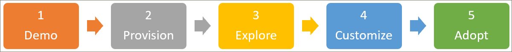

# 了解解决方案Get familiar with the solution 
按照下面概述的三个步骤开始学习路径。Get started with learning pathways by following the three steps outlined below. 在三个步骤中，你可以构建一个引人注目的演示，可用于向客户吸引演示文稿。With the three steps, you can build a compelling demo that you can use for engaging presentations with customers. 

## 1. 创建 Microsoft 365 演示环境1. Create a Microsoft 365 demonstration environment
您可以使用 demos.microsoft.com 创建演示环境，在其中您可以预配服务，对其进行验证，并使用它向客户演示学习途径。You can use demos.microsoft.com to create a demo environment where you can provision the service, validate it, and use it for presenting learning pathways to customers. 所有合作伙伴都有权https://demos.microsoft.com访问这些用途。All partners have access to https://demos.microsoft.com for these purposes. 如果您不熟悉演示环境，则可以使用 demos.microsoft.com 入门**指南**。You can use the demos.microsoft.com **Getting Started Guide** if you are new to tthe demo environment.

## 2. 预配 Microsoft 365 学习路径2. Provision Microsoft 365 learning pathways
您可以使用 SharePoint Online 设置服务设置学习路径。You can provision learning pathways with the SharePoint Online Provisioning Service.
- 若要设置学习路径，请转到[Microsoft 365 学习路径](https://provisioning.sharepointpnp.com/details/3df8bd55-b872-4c9d-88e3-6b2f05344239)解决方案页。To provision learning pathways, go to the [Microsoft 365 learning pathways](https://provisioning.sharepointpnp.com/details/3df8bd55-b872-4c9d-88e3-6b2f05344239) solution page. --查看 "[学习路径" 安装选项](https://docs.microsoft.com/en-us/office365/customlearning/custom_setupoptions)。- - Review the [Learning pathways setup options](https://docs.microsoft.com/en-us/office365/customlearning/custom_setupoptions). 
- 查看[解决方案先决条件](https://docs.microsoft.com/en-us/office365/customlearning/custom_provision)-由于这些是客户新的 SharePoint 相关障碍，他们可能没有适当的权限或必要的环境配置，如租户应用程序目录。Review the [Solution Prerequisites](https://docs.microsoft.com/en-us/office365/customlearning/custom_provision) – as these are common impediments for customer new to SharePoint who may not have all the correct permissions or necessary environment configuration in place, such as a tenant app catalog.
- 尝试通过非管理员角色部署解决方案–以熟悉预配服务错误处理和电子邮件服务。Try to deploy the solution via a non-Administrator role – to familiarize yourself with the provisioning service error-handling and email service.

## 3. 浏览新设置的学习路径网站，了解其功能3. Explore your newly provisioned learning pathways site to get familiar with its capabilities
- 转到 "[管理员成功案例中心](https://docs.microsoft.com/en-us/office365/customlearning/custom_successcenter)-在解决方案中" 或 "联机"。Go to the [Admin Success Center](https://docs.microsoft.com/en-us/office365/customlearning/custom_successcenter) - either in the solution or online. 除了了解内容和功能更新之外，您还可以了解规划、自定义、采用和评定影响指南。In addition to learning about content and feature updates, you'll find planning, customization, adoption, and measuring impact guidance.
- 使用 "管理员成功中心" 中的[自定义学习路径](https://docs.microsoft.com/en-us/office365/customlearning/custom_overview)指南来自定义网站。Use the [Customizing learning pathways](https://docs.microsoft.com/en-us/office365/customlearning/custom_overview) guidance in the Admin Success Center to customize the site. 你将需要了解自定义功能，以便可以为客户演示这些功能。You'll want to understand the customization capabilities so you can demo them for customers. 例如，隐藏子类别和播放列表。For example, hide subcategories and playlists. 创建自定义播放列表，或使用已筛选的学习路径 web 部件创建登录页，以推动学习活动。Create custom playlists, or create landing pages with a filtered learning pathways web part to drive a learning campaigns. 
- 创建基于[可下载的采用套件](https://teamworktools.azurewebsites.net/m365lp/m365lpadoptionkit.zip)的示例学习通道通信宣传活动。Create a sample learning pathways communication campaign based on the [downloadable Adoption Kit](https://teamworktools.azurewebsites.net/m365lp/m365lpadoptionkit.zip). 您可以突出显示您创建的自定义内容，并演示它如何与促进采用的学习活动进行联系。You can highlight the custom content you've created and demostrate how it ties into a learning campaign that drives adoption. 

