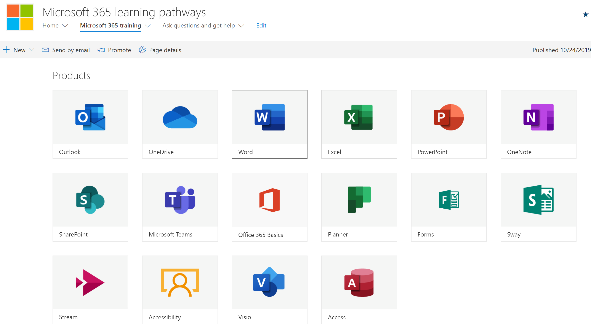
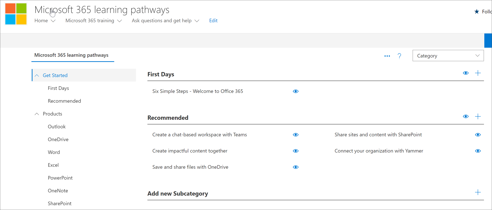

# 规划你的学习路径内容
在深入了解 Microsoft 365 学习途径之前，最好花些时间来调查可供您使用的学习内容、工具和功能。 我们的目标是帮助您尽可能快速高效地为组织的用户提供更快、更高效的工作效率。 在规划学习路径时，我们建议采用三个步骤的过程：

1. **查看可用资源**–通过学习路径和组织中提供的资源提供的资源。 最好的学习计划将组织中的 Microsoft 资源和资源组合在一起。
2. **了解学习路径工具的功能**-我们将为你提供快速教程。 
3. **创建内容计划**–查看可用的采用指南，以帮助你构建整体计划。

## 查看可用资源
在为 Microsoft 365 学习路径创建内容计划之前，请花一些时间来发现可供您使用的所有资源。  

### 查看 SharePoint 网站的学习路径
Microsoft 365 学习路径解决方案为 SharePoint 通信网站提供了与联机目录连接的 web 部件。 SharePoint 网站可完全自定义，包括网站名称、徽标、页面、菜单项、主题和磁贴。 请花些时间单击磁贴和菜单项，以发现学习路径网站中的可用内容。

### 使用 Web 部件查看联机目录中的内容
默认情况下，Web 部件将添加到 SharePoint 通信网站中的一系列页面。 Microsoft 365 培训页面上提供了完整的内容集。 Microsoft 365 培训页面承载配置为显示可用于学习路径的所有培训的 "学习路径" Web 部件。 

**查看 Microsoft 365 培训页面**
1. 单击 "Microsoft 365 培训" 菜单项。 
1. 向下滚动页面以查看所有类别和子类别。
2. 一位启动橡胶轮。 单击几个子类别，然后单击几个播放列表，了解如何组织学习通道内容。 

### 查看管理页
"管理" 页面提供了可供您使用的内容的列表。 您可以在此处隐藏内容、创建新的播放列表以及添加、编辑和删除播放列表。 依次单击各个类别和播放列表，查看可用内容的完整 breath。 

**查看管理页。**
1. 在 "学习路径" 网站中，指向 "主页菜单" 下拉箭头，然后单击 "学习路径管理"。  
2. 然后，依次单击各个类别、子类别和播放列表，以了解 breath 的内容。 

### 了解 Microsoft 365 学习路径的功能
使用 Microsoft 365 学习路径，您可以将 Microsoft 提供的内容与您创建的内容结合在一起，以针对组织特有的特定策略和过程。 作为一种最佳做法，尽量尽可能充分利用 Microsoft 提供的内容。 Microsoft 定期更新各个资产，并以季度为单位更新完整的内容清单。 通常，组织将创建10-20% 的独特内容，然后将其余的80% 保留为 Microsoft，以保持最新状态。 以下列表介绍了如何组织学习通道内容，以及可以修改或创建的内容的指南。 有关自定义内容的指南，请在管理员成功中心的 "自定义学习路径" 一节中提供。

- **类别**-是子类别的容器。 类别由 Microsoft 提供，无法创建或修改。
- **子类别**-是用于播放列表的容器。 Microsoft 提供了您无法修改的子类别，但您可以创建自己的子类别。 
- **播放列表**-是资产的容器。 Microsoft 提供了您无法修改的播放列表，但您可以创建自己的播放列表。  
- **资源**-播放列表中的学习页面。 Microsoft 在不能修改的播放列表中提供资产，但你可以创建自己的资产并将其添加到播放列表。 est

### 查看来自 Microsoft 的其他资源
Microsoft 提供了在规划学习路径内容时可以利用的帮助和培训资源。  

-  [Office 帮助和培训](https://support.office.com)
-  [Office 365 培训中心](https://support.office.com/office-training-center)

### 查看组织中的学习资源
让你的组织中已有的学习内容成为你的股票。
例如，您的组织可能已经有自定义的快速入门指南、便笺或 SharePoint 页面专用于 Microsoft 365 的准备情况、支持人员、加入或培训。 可以将现有 SharePoint 资产合并到 Microsoft 365 门户播放列表中，也可以将其与播放列表中的 Microsoft 内容混合在一起，以生成组织的目标播放列表。 有关将组织的内容与 Microsoft 的内容混合的详细信息，请参阅[自定义学习路径](custom_overview.md)。自定义 "管理员成功中心" 的 "学习路径" 部分。

### 利用采用资源
请注意，您可以在几天内开始使用学习路径，但最好先做一些前期规划，然后再执行学习活动策略以集成新的一项技术或一组服务。 在规划整体变更管理策略时，开发内容计划和使用学习路径确实是一项更广泛的工作，因此我们提供了可用于规划总体策略的采用材料。 作为规划工作的一部分，请查看[采用资源](https://resources.techcommunity.microsoft.com/adoption/)。

### 构建学习计划并循环访问 
许多已成功推出学习途径的公司都采用了侧重于特定方案或技术的学习活动。 例如，"更具协作性的团队" 或 "更多使用 Outlook mobile 的移动"。 您可以使用[可下载的采用工具包](https://teamworktools.azurewebsites.net/m365lp/m365lpadoptionkit.zip)查看潜在学习活动的示例。

 
