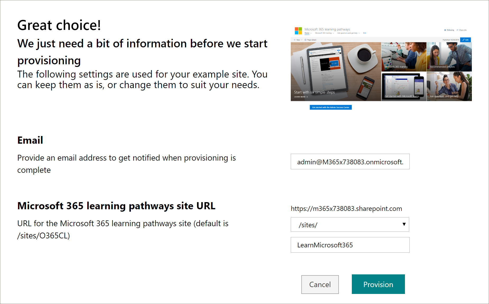
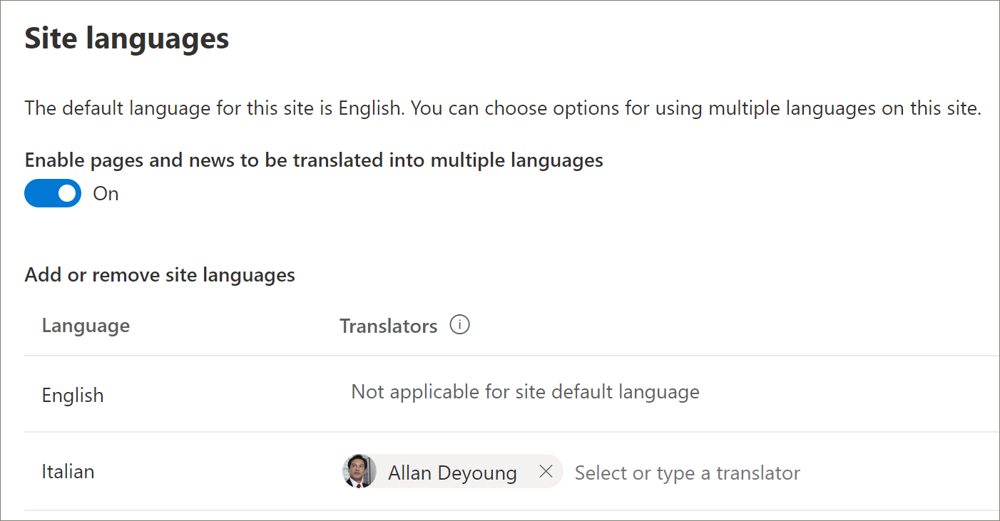

# 设置新的学习路径解决方案 
如果组织没有在其租户中预配的学习路径，则可以使用 SharePoint 的 "查看书籍" 服务来添加多语言学习路径解决方案。 使用此选项，可将 "学习路径" SharePoint 模板转换为九种语言，并且可以使用至少修改。

> [!IMPORTANT]
> 如果你已在租户中预配了学习路径，则建议您[更新](custom_update.md)学习路径。 如果您安装了新的学习路径实例，则需要手动将任何自定义项从现有网站转移到新网站。 

## 多语言支持的先决条件
 
若要成功设置与 "外观簿" 服务的 Microsoft 365 学习路径，执行预配的人员必须满足以下先决条件： 
 
- 人员预配学习路径必须是租户的租户管理员，其中将预配学习路径。  
- 租户应用程序目录必须在 SharePoint 管理中心的 "应用程序" 选项中可用。 如果您的组织没有 SharePoint 租户应用程序目录，请参阅[SharePoint Online 文档](https://docs.microsoft.com/sharepoint/use-app-catalog)以创建一个。 在设置学习路径之前，创建应用程序目录后，必须等待至少两小时。  
- 人员预配学习路径必须是租户应用程序目录的网站集所有者。 如果人员设置学习路径不是应用程序目录的网站集所有者，请[完成这些说明](addappadmin.md)并继续。 

## 确保租户管理员帐户未选择所需的语言
在设置学习路径之前，请确保租户的管理员帐户没有选定的语言。 下面介绍如何验证管理员帐户是否未选择所需的语言。 
1.  在边缘管理配置文件中，转到 "office.com"。
2.  输入用户凭据（如有必要）。
3.  在 Microsoft 365 中，单击 "**所有应用**" > Delve。 
4.  单击 **"**  >  **更新配置文件**"。
5.  向下滚动页面并单击**如何更改语言和区域设置**。
6.  单击**此处**，然后单击省略号 **...**。
7.  在 **"我的显示语言**" 下，您应该会看到**未选中任何语言**。 如果选择了语言，请取消选择该语言。

### 设置学习路径

1. 转到 " [Microsoft 365 学习路径解决方案" 页面](https://lookbook.microsoft.com/details/3df8bd55-b872-4c9d-88e3-6b2f05344239)。
2. 单击 "**添加到你的租户**"。 如果你未登录到你的租户，设置服务将要求你提供租户管理员凭据。 
3. 从 "请求的权限" 对话框中，选择**代表你的组织同意**的，然后选择 "**接受**"。

"书籍" 服务需要这些权限才能创建租户应用程序目录，将应用程序安装到租户应用程序目录中并预配网站模板。 对租户没有整体影响。 这些权限将显式用于解决方案安装的目的。 您必须接受这些权限才能继续安装。

4. 根据您的安装需要填写 "设置信息" 页上的字段。 请至少输入你希望获取有关设置过程的通知的电子邮件地址和要设置为的网站的目标 URL。  
> [!NOTE]
> 将网站的目标 URL 设置为友好的内容，如 "/sites/MyTraining" 或 "/teams/LearnMicrosoft365"。

6. 准备好将学习路径安装到你的租户环境中时，请单击 "**设置**"。  预配过程最长可能需要15分钟。 当网站准备就绪时，将通过电子邮件通知你。 

> [!IMPORTANT]
> 预配学习路径网站的租户管理员必须转到网站，然后打开**CustomLearningAdmin**以初始化 "学习路径管理" 属性。 目前，租户管理员还应将所有者分配给网站。 

## 验证设置是否成功并初始化 CustomConfig 列表

设置完成后，预配网站的租户管理员将收到来自 "查看" 的书籍服务的电子邮件。 电子邮件包含指向该网站的链接。 在这种情况下，租户管理员应使用电子邮件中提供的链接转到网站，并将网站设置为首次使用：

- 转到 `<YOUR-SITE-COLLECTION-URL>sites/<YOUR-SITE-NAME>/SitePages/CustomLearningAdmin.aspx`。 打开**CustomLearningAdmin**可初始化**CustomConfig**列表项，该列表项设置首次使用的学习路径。 您应该会看到如下所示的页面：

## 将所有者添加到网站
作为租户管理员，您不太可能是自定义网站的人员，因此您需要向网站分配一些所有者。 所有者具有对网站的管理权限，以便他们可以修改网站页面并 rebrand 网站。 他们还能够隐藏和显示内容，并生成自定义的播放列表和子类别。  

1. 从 "SharePoint**设置**" 菜单中，单击 "**网站权限**"。
2. 单击 "**高级权限设置**"。
3. 单击 " **Microsoft 365 学习路径所有者**"。
4. 单击 "**新建**向  >  **此组添加用户**"，然后添加您希望成为所有者的人员。 
5. 添加链接以在共享邮件中[浏览网站](custom_exploresite.md)，然后单击 "**共享**"。

## 将翻译者添加到网站
如果要使用网站的翻译人员，可以为其分配权限。 翻译人员需要成员权限或更高版本。 

## 选择用于在网站上使用多种语言的选项
SharePoint 的 "查找簿" 服务创建了九种语言的学习路径网站。 以下建议适用：
- 关闭不希望支持的语言
- 如果不支持多语言网站，请关闭多语言功能。 请参阅本主题后面的 "关闭多语言支持" 部分。

### 删除不希望支持的语言
对于选择仅支持一种语言的组织，除了默认的英语语言外，我们建议删除不受支持的语言。 
1. 从 "学习路径" 网站中，从页面的右上方选择 "**设置**"，然后选择 "**网站信息**"。
2. 在 "网站信息" 窗格的底部，选择 "**查看所有网站设置**"。
3. 在 "**网站管理**" 下，选择 "**语言设置**"。
4. 在 "**允许将页面和新闻转换为多种语言**" 下，将切换滑到 **"打开**"。 默认情况下，它应处于打开状态。
5. 在 "添加或删除网站语言" 下，单击 "**删除**" 以删除网站不需要的语言。 下面显示了 "语言设置" 页的一个示例，用于显示网站支持的意大利语，以及默认的英语语言。

> [!NOTE]
> 删除语言时，不能删除默认的英语语言。 

### 分配翻译人员
如果要翻译页面，可以选择为每种语言分配一个或多个翻译人员（网站默认语言除外）。 
- 在 "**转换器**" 列中，开始键入要成为翻译人员的人员的姓名，然后从列表中选择名称。 

> [!NOTE]
> 您组织的 Active Directory 中的任何人都可以作为翻译者进行分配。 被分配为翻译者的人员不会被自动授予适当的权限。 如果没有网站的 "编辑" 权限的用户尝试访问该网站，则会将其定向到可请求访问的网页。

## 关闭多语言支持
例如，如果您不希望使用多语言网站，则建议您关闭多语言的网站。 

1. 从 "学习路径" 网站中，从页面的右上方选择 "**设置**"，然后选择 "**网站信息**"。
2. 在 "网站信息" 窗格的底部，选择 "**查看所有网站设置**"。
3. 在 "**网站管理**" 下，选择 "**语言设置**"。
4. 在 "**允许将页面和新闻转换为多种语言**" 下，将切换滑到 **"打开**"。 默认情况下，它应处于打开状态。
- 在 "**启用要翻译的页面和新闻**" 下，选择 "**关闭**"。 

### 添加语言
学习路径支持9种语言，但建议您仅添加支持学习路径网站所需的语言。 您可以随时添加语言。 
- 在 "**添加或删除网站语言**" 下，开始在 "**选择" 或 "键入语言**" 中键入语言名称，或从下拉列表中选择一种语言。 您可以重复此步骤以添加多种语言。 您可以通过返回到此页随时在网站中添加或删除语言。