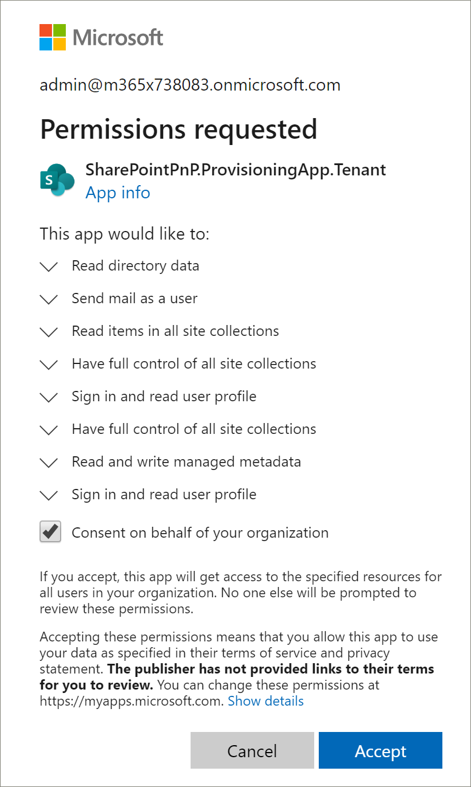
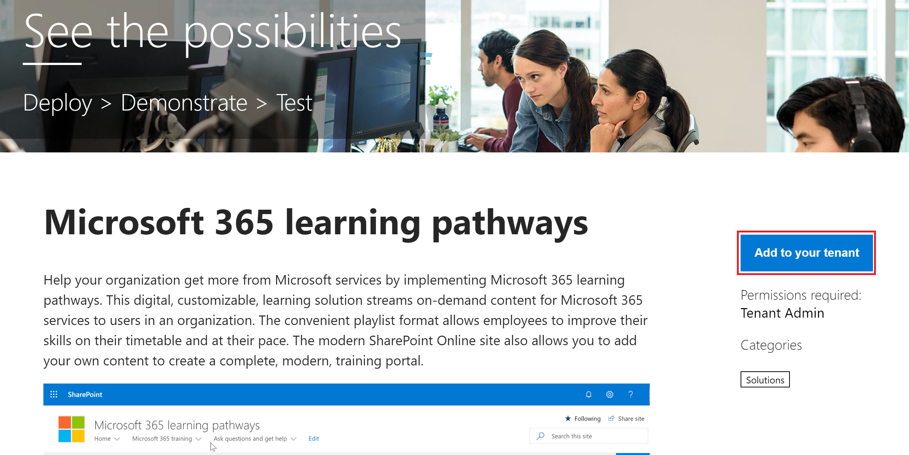
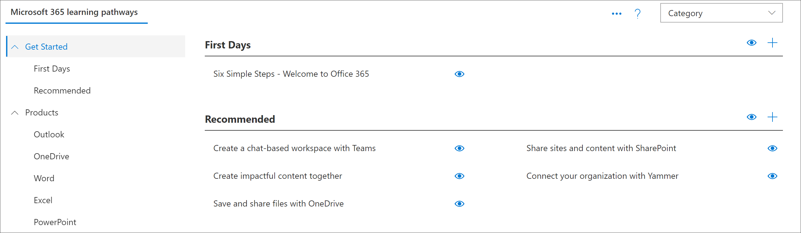

# 预配 Microsoft 365 学习路径

借助 SharePoint Online 设置服务, Office 365 租户管理员可以通过几次简单的单击操作来启动预配过程。 预配服务是设置学习路径的推荐方法。 快速而简单, 只需几分钟即可启动该过程。 但是, 在开始使用预配服务之前, 请确保已满足预配的先决条件。

> [!IMPORTANT]
> 从5/21/2019 到, Microsoft 365 学习途径是以前称为 "Office 365 自定义学习" 的解决方案的新名称。 如果已为组织中的 Office 365 设置了自定义学习, 并且想要更新解决方案, 请按照[Microsoft 365 学习途径自述文件](https://github.com/pnp/custom-learning-office-365)中的 "更新解决方案" 说明操作。 如果您是首次预配 Microsoft 365 学习路径, 请参阅 Microsoft 365 学习通道文档中的[预配 microsoft 365 学习通道说明]( https://docs.microsoft.com/en-us/office365/customlearning/custom_provision)。  

## 先决条件
 
若要成功设置与预配服务的 Microsoft 365 学习路径, 执行预配的人员必须满足以下先决条件: 
 
- 人员预配学习路径必须是租户的租户管理员, 其中将预配学习路径。  
- 租户应用程序目录必须在 SharePoint 管理中心的 "应用程序" 选项中可用。 如果您的组织没有 SharePoint 租户应用程序目录, 请参阅[SharePoint Online 文档](https://docs.microsoft.com/en-us/sharepoint/use-app-catalog)以创建一个。  
- 人员预配学习路径必须是租户应用程序目录的网站集所有者。 如果人员设置学习路径不是应用程序目录的网站集所有者, 请[完成这些说明](addappadmin.md)并继续。 

### 设置学习路径

1. 从主页http://provisioning.sharepointpnp.com的右上角转到并**登录**。  使用您计划安装网站模板的目标租户的凭据登录。

2. 清除**代表您的组织的同意**并选择 "**接受**"。

预配服务需要这些权限才能创建租户应用程序目录, 请将应用程序安装到租户应用目录中并预配网站模板。 对租户没有整体影响, 并且这些权限将显式用于解决方案安装的目的。 您必须接受这些权限才能继续安装。

3. 向下滚动页面, 选择 "**解决方案**" 选项卡, 然后选择 " **Office 365 的学习路径**"。 

4. 选择 "**添加到你的租户**"

5. 根据您的安装需要填写 "设置信息" 页上的字段。 至少应输入你希望获取有关设置过程的通知的电子邮件地址和要设置为的网站的目标 URL。  
> [!NOTE]
> 将网站的目标 URL 设置为友好的内容, 如 "/sites/MyTraining" 或 "/teams/LearnMicrosoft365"。

6. 准备好将学习路径安装到你的租户环境中时, 请选择 "**设置**"。  预配过程最长需要15分钟。 当网站准备好访问时, 将通过电子邮件通知你 (到您在 "设置" 页上输入的通知电子邮件地址)。 

> [!IMPORTANT]
> 预配学习路径网站的租户管理员必须转到网站, 然后打开**CustomLearningAdmin**以初始化 "学习路径管理" 属性。 目前, 租户管理员还应将所有者分配给网站。 

## 验证设置是否成功并初始化 CustomConfig 列表

设置完成后, 预配网站的租户管理员会收到来自 PnP 预配服务的电子邮件。 电子邮件包含指向该网站的链接。 在这种情况下, 租户管理员应使用电子邮件中提供的链接转到网站, 并将网站设置为首次使用:

- 转到 `<YOUR-SITE-COLLECTION-URL>sites/<YOUR-SITE-NAME>/SitePages/CustomLearningAdmin.aspx`。 打开**CustomLearningAdmin**可初始化**CustomConfig**列表项, 该列表项设置首次使用的学习路径。 您应该会看到如下所示的页面:

## 将所有者添加到网站
作为租户管理员, 您不太可能是自定义网站的人员, 因此您需要向网站分配一些所有者。 所有者具有对网站的管理权限, 以便他们可以修改网站页面并 rebrand 网站。 他们还能够隐藏和显示通过 "学习路径" Web 部件传递的内容。 此外, 他们还能够构建自定义播放列表并将其分配给自定义子类别。  

1. 从 "SharePoint**设置**" 菜单中, 单击 "**网站权限**"。
2. 单击 "**高级权限设置**"。
3. 单击 " **Microsoft 365 学习路径所有者**"。
4. 单击 "**新建** > 向**此组添加用户**", 然后添加您希望成为所有者的人员。 
5. 添加链接以在共享邮件中[浏览网站](custom_exploresite.md), 然后单击 "**共享**"。

### 后续步骤
- 浏览网站和 web 部件中提供的[默认内容](custom_exploresite.md)。
