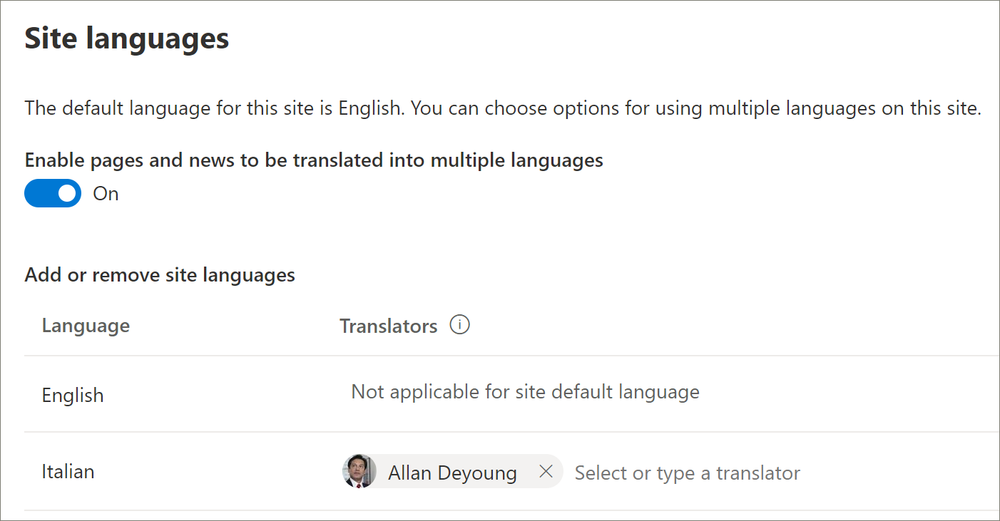

# 预配新的学习路径多语言解决方案
没有在租户中设置学习路径的组织可以使用 SharePoint 预配服务添加多语言学习路径解决方案。 使用此选项，SharePoint 模板的学习路径将翻译为 9 种语言，并且可通过最少的修改来使用。 

> [!IMPORTANT]
> 如果你已在租户中预配了学习路径，建议你遵循更新 [路径学习路径](custom_update_ml.md) 。 如果通过租户中的现有实例安装学习路径，则对学习路径网站模板或播放列表进行的任何更改都可能会丢失。

## 多语言支持的先决条件
 
若要使用预配服务成功设置 Microsoft 365 学习路径，执行预配的人必须满足以下先决条件： 
 
- 预配学习路径的人必须是将预配学习路径的租户的租户管理员。  
- 租户应用程序目录必须在 SharePoint 管理中心的"应用程序"选项中提供。 如果您的组织没有 SharePoint 租户应用程序目录，请参阅 [SharePoint Online 文档以](/sharepoint/use-app-catalog) 创建一个。 在创建应用程序目录后，你必须等待至少两个小时，然后才能预配学习路径。  
- 预配学习路径的人必须是租户应用程序目录的网站集所有者。 如果预配学习路径的人不是应用程序目录的网站集所有者，请 [完成这些](addappadmin.md) 说明并继续操作。 

## 确保租户管理员帐户未选择语言
预配学习路径之前，请确保租户的管理员帐户未选择语言。 下面将了解如何验证管理员帐户是否未选择语言。 
1.  使用边缘管理员配置文件，转到 office.com。
2.  如有必要，请 (用户凭据) 。
3.  在 Microsoft 365 中，单击 **"Delve >** 应用"。 
4.  单击 **"我**  >  **""更新配置文件"。**
5.  向下滚动页面，然后单击 **如何更改语言和区域设置**。
6.  单击此处 **，** 然后单击省略号 **...。**
7.  在 **"我的显示语言**"下，应看到"**未选择任何语言"。** 如果选择了语言，则取消选择该语言。

### 设置学习路径

1. 转到 [Microsoft 365 学习路径解决方案页面](https://provisioning.sharepointpnp.com/details/3df8bd55-b872-4c9d-88e3-6b2f05344239)。
2. 单击 **"添加到你的租户"。** 如果你未登录到租户，预配服务会要求你提供租户管理员凭据。 
3. 在"请求的权限"对话框中，选择"代表你的组织同意 **"，** 然后选择"接受 **"。**

预配服务需要这些权限才能创建租户应用程序目录、将应用程序安装到租户应用程序目录并预配网站模板。 对租户没有整体影响。 这些权限明确用于安装解决方案。 必须接受这些权限才能继续安装。

4. 根据需要填写预配信息页面上的字段。 至少输入你希望接收预配流程相关通知的电子邮件地址，以及你要预配的网站的目标 URL。  
> [!NOTE]
> 为你的员工提供合适的网站目标 URL，例如“/sites/MyTraining”或“/teams/LearnMicrosoft365”。

6. 准备好 **将** 学习路径安装到租户环境中时，单击预配。  预配流程最多可能需要 15 分钟。 网站准备就绪时，将通过电子邮件通知你。 

> [!IMPORTANT]
> 设置学习路径网站的租户管理员必须转到该网站，然后打开 **CustomLearningAdmin.aspx** 以初始化学习路径管理员属性。 目前，租户管理员还应将所有者分配给网站。 

## 验证预配成功并初始化 CustomConfig 列表

预配完成后，预配网站的租户管理员将收到来自 PnP 预配服务的电子邮件。 电子邮件包含指向网站的链接。 此时，租户管理员应该使用电子邮件中提供的链接转到网站，并设置网站以首次使用：

- 转到 `<YOUR-SITE-COLLECTION-URL>sites/<YOUR-SITE-NAME>/SitePages/CustomLearningAdmin.aspx`。 打开 **CustomLearningAdmin.aspx** 会初始化 **CustomConfig** 列表项，以设置首次使用的学习路径。 应看到如下页面：

## 将所有者添加到网站
作为租户管理员，你不太可能是自定义网站的人，因此你需要为网站分配几个所有者。 所有者对网站拥有管理权限，因此可以修改网站页面和重新品牌。 他们还能够隐藏和显示内容，并生成自定义播放列表和子类别。  

1. 从"SharePoint **设置"菜单中**，单击"**网站权限"。**
2. 单击 **"高级权限设置"。**
3. 单击 **"Microsoft 365 学习路径所有者"。**
4. 单击 **"**  >  **新建向此组添加用户"，** 然后添加希望成为所有者的用户。 
5. 在"共享 ["消息中添加"浏览](custom_exploresite.md)网站"的链接，然后单击"共享 **"。**

## 将翻译人员添加到网站
如果要对网站使用翻译程序，可以为其分配权限。 翻译人员需要成员权限或更高权限。 

## 选择用于网站上多种语言的选项
SharePoint 设置服务使用九种语言创建学习路径网站。 以下建议适用：
- 关闭不希望支持的语言
- 如果您不支持多语言网站，请关闭多语言功能。 请参阅本主题稍后的"关闭多语言支持"部分。

### 删除不希望支持的语言
对于选择仅支持一种语言（除了默认英语语言）的组织，我们建议删除不支持的语言。 
1. 从"学习路径"网站中，从页面的右上方选择"设置"，然后选择"网站 **信息"。**
2. 在网站信息窗格底部，选择"**查看所有网站设置"。**
3. 在 **"网站管理"下**，选择"**语言设置"。**
4. 在 **"启用要翻译为多种语言的页面** 和新闻"下，将开关滑动到 **"打开"。** 默认情况下应为"打开"。
5. 在"添加或删除网站语言"下，单击"删除"以删除网站不需要的语言。 下面显示了"语言设置"页的示例，除了显示默认英语语言之外，还显示网站支持的意大利语。

> [!NOTE]
> 删除语言时，不能删除默认的英语语言。 

### 分配翻译人员
如果要翻译页面，可选择为每个语言分配一个或多个翻译 (网站默认语言除外) 。 
- 在 **"转换器** "列中，开始键入要成为翻译人员的人的名称，然后从列表中选择该姓名。 

> [!NOTE]
> 可以将您组织的 Active Directory 中的任何人分配为翻译人员。 不会自动为被分配为翻译人员的用户授予适当的权限。 当没有网站编辑权限的用户尝试访问该网站时，他们将被定向到可以请求访问的网页。

## 关闭多语言支持
例如，如果您不需要多语言网站，您需要一个仅英文网站，建议您关闭多语言功能。 

1. 从"学习路径"网站中，从页面的右上方选择"设置"，然后选择"网站 **信息"。**
2. 在网站信息窗格底部，选择"**查看所有网站设置"。**
3. 在 **"网站管理"下**，选择"**语言设置"。**
4. 在 **"启用要翻译为多种语言的页面** 和新闻"下，将开关滑动到 **"打开"。** 默认情况下应为"打开"。
- 在 **"启用要翻译的页面和新闻"下，** 选择"**关闭"。** 

### 添加语言
学习路径支持 9 种语言，但建议仅添加学习路径网站所需的语言。 你随时都可以添加语言。 
- 在 **"添加或删除网站语言"下**，开始在"选择或键入语言"中键入语言名称，或者从下拉列表中选择语言。 可以重复此步骤以添加多种语言。 通过返回到此页面，您随时都可以在网站中添加或删除语言。