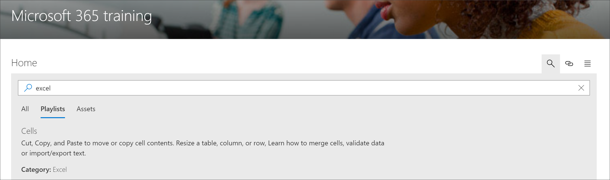

# 搜索 Microsoft 365 学习路径内容

Microsoft 365 学习途径提供按子类别、播放列表或资产搜索内容的功能。 

> [!TIP]
> Microsoft 365 学习路径的作用范围为学习路径内容, 包括 Microsoft 提供的内容以及添加到自定义播放列表或子类别的任何内容。 不在学习路径播放列表中的 SharePoint 页面不包含在搜索结果中。     

- 单击 "**搜索**" 图标并键入搜索短语。 

