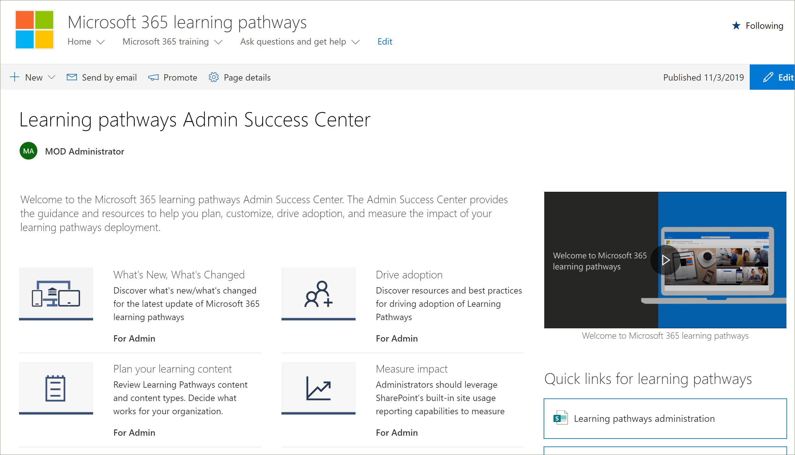

# 学习路径管理成功中心

欢迎使用 Microsoft 365 学习路径管理成功中心。 管理员成功中心提供了指导和资源，可帮助您规划、自定义、推动采用和衡量您的学习路径部署的影响。

## 登录 Office 365 

1.  打开你的网络浏览器，然后导航至 office.com 或你组织的登录位置。 
2.  使用你的用户名和密码登录。
3.  使用租户管理员提供的 URL 导航到网站的位置，或从 Office 365 主页中选择 "SharePoint"，然后选择 "网站"。 

### 管理员成功中心入门

管理员成功中心提供了指导和资源，可帮助您规划、自定义、推动采用和衡量您的学习路径部署的影响。 

- 从 "Microsoft 365 学习路径" **主页** 中，单击 **"管理员成功中心" 开始**。

学习途径在解决方案中的管理员成功中心内提供指导。 本文档集中也提供了管理员成功中心的文档： 

- [规划学习内容](custom_plancontent.md)
- [自定义学习路径](custom_overview.md)
- [推动采用](driveadoption.md)
- [衡量影响](custom_measureimpact.md)

