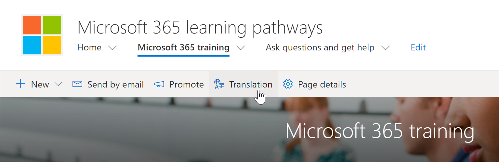
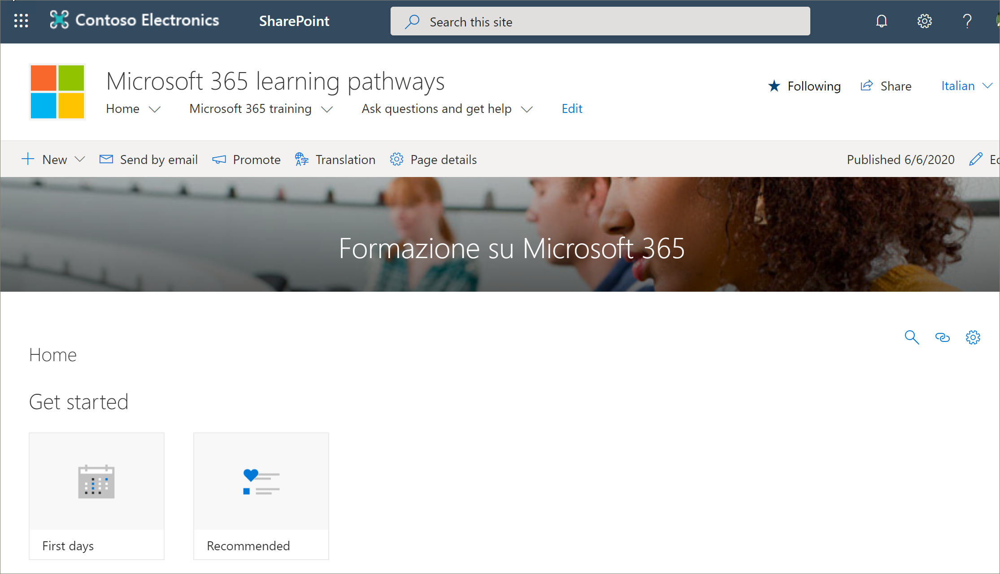

# 翻译网站页面
无论您是否已将现有版本的学习路径更新到版本4.0 或您已设置新网站，转换网站页面的过程都是相同的。 但是，有几个事项需要注意。 
- 在设置新的学习路径多语言4.0 版本时，网站页面将转换为9种语言。 
- 将学习路径解决方案更新为多语言4.0 版本时，SharePoint 网站页面的学习路径保持不变。 必须手动完成翻译。 

默认情况下，"学习路径" 网站提供以下页面：

- 主页 .aspx
- Start-with-Six-Simple-Steps
- Get-started-with-Microsoft-365
- Get-started-with-Microsoft-Teams
- Get-started-with-SharePoint
- Get-started-with-OneDriive
- Ask-questions-and-get-help
- 培训活动的日历 .aspx
- Become-a-Champion
- Recommended-Playlists
- 学习路径管理成功中心

## 创建所需语言的页面
一旦为您的网站启用了多语言功能，并选择了要使其可用的语言后，就可以创建所需的翻译页面。 为了帮助演示一些重要概念，我们将使用 Microsoft 365 培训页面作为示例。 若要执行此操作：

1.  从 "学习路径"**主页**中，单击 " **Microsoft 365 培训**"。  
2.  在顶部栏上，选择 "**翻译**"。

3. 如果要创建可用于网站的所有语言翻译的页面，请选择 "**为所有语言创建**"。 否则，请为所需的语言选择 "仅**创建**"。 在此示例中，我们将选择 "意大利语"。
4.  单击 "**查看**"。 现在，页面已准备好进行翻译。 

### 要了解的重要概念
请注意，在下面的示例中，页面已转换为意大利语。 但网站标题、导航和 web 部件仍以英语显示。 

 在使用英文设置网站后，使用西班牙语的用户作为其首选的个人语言，手动编辑标题、导航和页脚内容并将其转换为西班牙语。 以德语作为首选个人语言的用户对德语而言是一样的。 翻译完内容后，它将显示这些首选语言的所有用户。 Web 部件将选取用户的首选语言，并显示用该语言翻译的内容。 

> [!IMPORTANT]
> 重要说明：创建翻译页面后，必须发布（或重新发布）默认的英语语言页面，以确保：
- 翻译页面显示在相应的语言网站中
- 在新闻 web 部件和突出显示的内容 web 部件中正确显示翻译页面
- 网站顶部的语言下拉列表包含已启用的所有语言
- 翻译者将收到有关翻译请求的通知。

## 翻译工具有什么用途？
翻译人员将默认语言页面的副本手动转换为指定的语言。 在创建页面副本时，会在电子邮件中通知翻译人员。 该电子邮件包含指向默认语言页面和新创建的翻译页面的链接。 转换器将：
1. 选择电子邮件中的 "**开始翻译**" 按钮。
2. 在页面右上部选择 "**编辑**"，然后翻译内容。
3. 完成后，选择 "**保存为草稿**" （如果您未准备好使其对读者可见），或者，如果页面已准备好供在网站上使用该语言的所有用户查看，请选择 "**发布**或**发布新闻**"。

有关转换过程的详细信息，请参阅[创建多语言通信网站、页面和新闻](https://support.office.com/en-us/article/2bb7d610-5453-41c6-a0e8-6f40b3ed750c)。 

## 更新默认语言页面
更新 "默认语言" 页面后，必须重新发布页面。 然后，在电子邮件中通知翻译页面的转换器，以电子邮件的形式通知您已进行更新，以便可以对各个翻译页面进行更新。

## 后续步骤
- [翻译自定义播放列表](custom_translate_pl_ml.md)
- [隐藏和显示 multiligual 内容](custom_translate_pl_ml.md)
