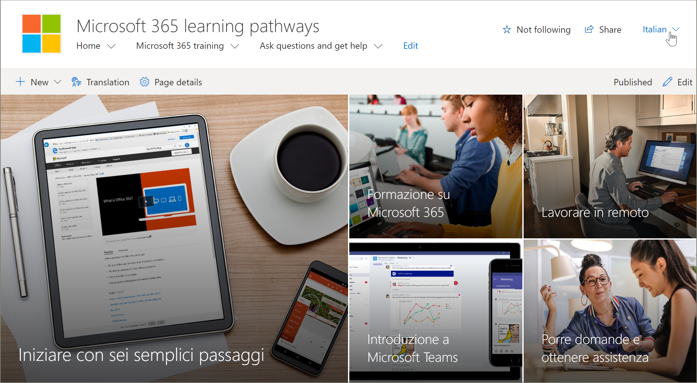
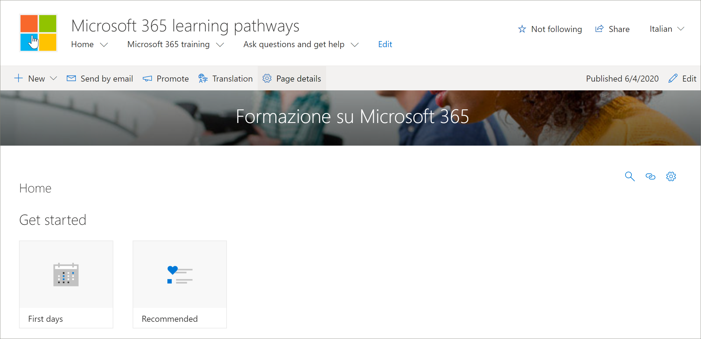

# 翻译网站页面
在开始翻译学习路径网站之前，了解多语言功能如何与学习路径一起工作的一些关键概念非常重要。 
- 网站信息 - 导航、徽标和网站名称翻译要求在用户的语言配置文件中查看和翻译网站。  
- 必须使用用户的语言配置文件查看学习路径 Web 部件，以便以非英语语言显示该部件。 已针对你翻译 Web 部件和 Microsoft 提供的内容。 有关语言配置文件详细信息，请参阅更改 [你的个人语言和区域设置](https://support.microsoft.com/office/change-your-personal-language-and-region-settings-caa1fccc-bcdb-42f3-9e5b-45957647ffd7)。
- 设置学习路径的方式决定了你是否具有可用的翻译页面。 使用 Microsoft 365 外观书籍服务预配的新网站将具有 9 种可用语言的翻译页面。 创建的更新网站或网站需要手动翻译。 请参阅 [多语言学习路径的安装程序选项](custom_setupoptions_ml.md)。
- 对学习路径的多语言支持由适用于通信网站的 SharePoint Online 多语言功能启用。 若要了解 SharePoint Online 多语言功能，请参阅 [创建多语言通信网站、页面和新闻](https://support.office.com/article/2bb7d610-5453-41c6-a0e8-6f40b3ed750c)。 

## 使用新设置的网站
如果你从 Microsoft 365 书籍服务预配了新的学习路径网站，则已翻译的页面可供你使用。 默认情况下，网站提供以下页面：

- Home.aspx
- Start-with-Six-Simple-Steps.aspx
- Get-started-with-Microsoft-365.aspx
- Get-started-with-Microsoft-Teams.aspx
- Get-started-with-SharePoint.aspx
- Get-started-with-OneDriive.aspx
- Ask-questions-and-get-help.aspx
- Training events calendar.aspx
- 成为 A-Champion.aspx
- Recommended-Playlists.aspx
- 学习路径 管理员成功中心

## 查看新设置的网站中的已翻译页面
若要熟悉翻译的学习路径网站，让我们看一下一些翻译的页面。

### 查看翻译的主页
从"学习路径"主页中，从"语言"下拉列表中选择一种语言，如以下示例所示。 在示例中，你会看到在右上角选择意大利语，并且所有页面元素都已被翻译。

### 查看翻译的 Microsoft 365 培训页面
现在我们来看一下 Microsoft 365 培训页面。 

1. 从学习路径网站 **主页中，** 单击 **"Microsoft 365 培训"。**
2. 在页面的右上角，选择一种语言。 本示例中，选择意大利语。

选择语言后，哪些翻译可见？
- 将翻译 SharePoint 页面，如上图所示。 请注意，页面横幅的文本现在使用意大利语。

哪些翻译不可见？
- 网站名称为英语
- 网站导航为英语
- 学习路径 Web 部件使用英语

## 查看完全翻译的网站 
若要以特定语言（包括网站页面、导航和 Web 部件）查看完全翻译的网站，必须为该语言设置用户的个人语言和区域设置。 有关设置语言和区域设置的信息，请参阅更改 [你的个人语言和区域设置](https://support.microsoft.com/office/change-your-personal-language-and-region-settings-caa1fccc-bcdb-42f3-9e5b-45957647ffd7)。 建议使用单独的帐户，或让用户使用不同的语言设置查看翻译的页面。  

## 使用更新或手动安装的学习路径网站
如果更新了现有学习路径网站或手动将 Web 部件安装到现有网站，则需要手动翻译网站页面。 学习路径 Web 部件和内容已翻译，并且以用户的首选语言显示。 若要翻译页面，请参阅以下说明"为想要的语言创建页面"。 

## 为需要的语言创建页面
为网站启用多语言功能并选择了想要提供的语言后，可以创建您需要的翻译页面。 

1. 转到要以其他语言提供的默认语言页面。
2. 在顶栏上，选择"翻译 **"。**
3. 为 **需要** 的语言选择"创建"。

> [!IMPORTANT]
> 创建翻译页面后，您必须发布 (或重新发布) 语言页面，以确保：
>- 翻译页面显示在相应的语言网站中。
>- 翻译页面在新闻 Web 部件和突出显示的内容 Web 部件中正确显示。
>- 网站顶部的"语言"下拉列表包含您启用的所有语言。
>- 翻译人员将收到翻译请求的通知。

创建页面 ()  (，每种语言旁的翻译窗格中) 显示保存、发布草稿等) 页面的状态。 此外， () 的翻译人员也会通过电子邮件收到请求翻译的通知。

### 以特定语言查看完全翻译的网站
若要以特定语言（包括网站页面、导航和 Web 部件）查看完全翻译的网站，必须为该语言设置用户的个人语言和区域设置。 有关设置语言和区域设置的信息，请参阅更改 [你的个人语言和区域设置](https://support.microsoft.com/office/change-your-personal-language-and-region-settings-caa1fccc-bcdb-42f3-9e5b-45957647ffd7)。 请注意，最好使用单独的帐户，或让另一个语言设置不同的用户查看翻译的页面。

## 翻译工具有什么用途？
 以英语设置网站后，用户将西班牙语作为首选的个人语言，例如，手动编辑标题、导航和页脚内容并将其翻译为西班牙语。 以德语作为首选个人语言的用户按照相同的步骤将内容转换为德语。 内容翻译完成后，将针对将这些语言作为首选语言的用户显示。 Web 部件选取用户的首选语言，然后显示用该语言翻译的内容。 

翻译人员将默认语言页面的副本手动翻译为 (的语言) 翻译。 创建页面副本 () ，如果已指定翻译人员，则通过电子邮件通知翻译人员。 该电子邮件包含指向默认语言页面和新创建的翻译页面的链接。 转换器将：
1. 选择电子邮件 **中的"** 开始翻译"按钮。
2. 选择 **页面** 右上方的"编辑"，然后翻译内容。
3. 完成后，如果尚未准备好使页面对 **读者可见**) 或者该页面已准备好对网站上使用该语言的每个人可见，请选择"另存为草稿 ("，选择"发布"或"发布新闻 **"。** 

有关翻译过程详细信息，请参阅创建 [多语言通信网站、页面和新闻](https://support.office.com/article/2bb7d610-5453-41c6-a0e8-6f40b3ed750c)。 

## 更新默认语言页面
更新默认语言页面时，必须重新发布该页面。 然后，翻译 (翻译) 的电子邮件中通知翻译页面已进行更新，以便对各个翻译页面进行更新。

## 设置多语言网站名称、导航和页脚
若要使用不同语言显示网站的网站名称、导航和页脚，必须人工翻译每一项。

例如，假设你以英语为默认语言创建了一个通讯网站，并且已为该网站启用了西班牙语和德语。 创建网站时，以默认语言（在本例中为英语）设置网站名称和说明。 也可以在创建网站后更新网站名称和说明。 然后，用英语创建导航节点和页脚内容。

以英语设置网站后，以西班牙语作为其首选个人语言的用户可以手动编辑并将标题、说明、导航和页脚内容转换为西班牙语。 以德语作为首选个人语言的用户按照相同的步骤将内容转换为德语。 内容翻译完成后，将针对将这些语言作为首选语言的用户显示。 

> [!注释]
>- 为首选语言翻译网站内容的用户应是网站的 Owners 组的成员或具有同等的网站权限。
>- 如果对默认语言的网站名称、导航或页脚进行了更改，则除非您选择覆盖现有网站翻译，否则不会自动更新另一种语言的相应翻译项目。 如果这样做，翻译的项目将替换为默认语言的更新，并且必须再次手动翻译。 若要覆盖翻译，请转到默认语言的"网站语言"页，然后选择"显示高级设置"。 然后，将"覆盖翻译"切换切换到"打开"。 此选项不适用于页面或新闻内容。

### 以特定语言查看完全翻译的网站
若要以特定语言（包括网站页面、导航和 Web 部件）查看完全翻译的网站，必须为该语言设置用户的个人语言和区域设置。 有关设置语言和区域设置的信息，请参阅更改 [你的个人语言和区域设置](https://support.microsoft.com/office/change-your-personal-language-and-region-settings-caa1fccc-bcdb-42f3-9e5b-45957647ffd7)。 建议使用单独的帐户，或让用户使用不同的语言设置查看翻译的页面。

## 更多信息
- 有关翻译 SharePoint 通信网站页面的信息，请参阅创建 [多语言通信网站、页面和新闻](https://support.office.com/article/2bb7d610-5453-41c6-a0e8-6f40b3ed750c)。
- 有关自定义学习路径的信息，请参阅 [自定义学习路径](custom_overview.md)。  
