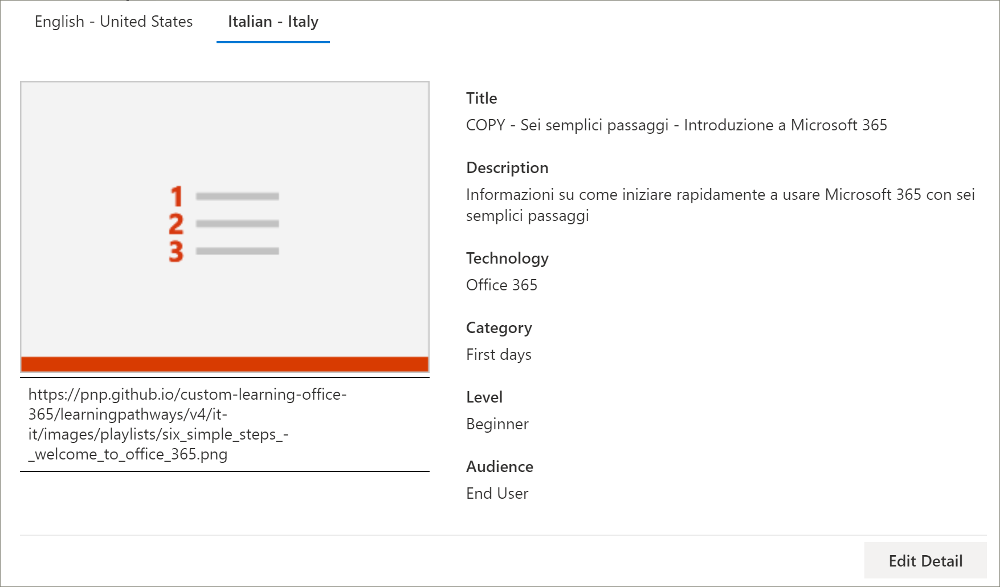
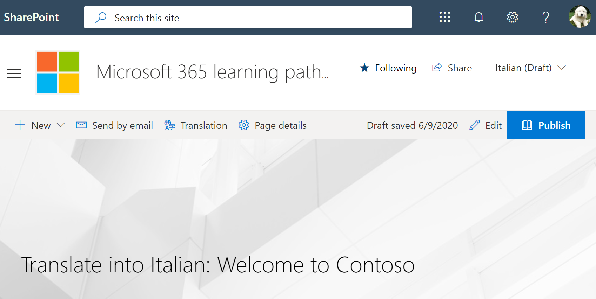
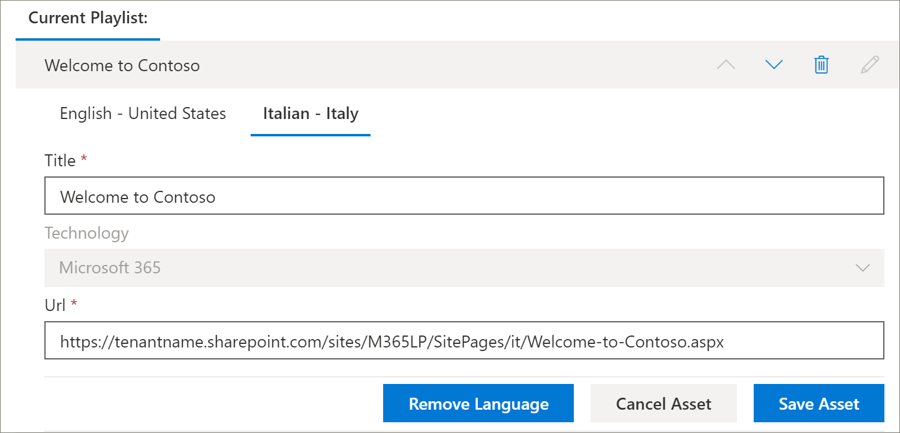

# 翻译学习路径自定义播放列表Translate a learning pathways custom playlist
如果您已为您的网站创建了学习路径自定义播放列表，则可以将这些播放列表转换为此网站启用的语言。If you've created learning pathways custom playlists for your site, you can translate the playlists into the languages enabled for this site.

1.  从 "学习路径"**主页**菜单中，单击 "**学习路径管理**"。From the learning pathways **Home** menu, click **Learning pathways administration**. 
2.  单击 "自定义播放列表"。Click the custom playlist. 在此示例中，我们将使用**5 个简单的步骤-欢迎访问 Contoso**。In this example, we'll use **Five Simple Steps - Welcome to Contoso**. 
3.  单击 "**编辑详细信息**"，然后在 "**添加语言**" 框中选择一种语言。Click **Edit Detail**, then in the **Add language** box, select a language. 在此示例中，我们将使用**意大利语–意大利**。In this example, we'll use **Italian – Italy**. 
5.  单击 "**保存详细信息**"。Click **Save Detail**. 

> [!IMPORTANT]
> 转换器通知不内置在自定义播放列表中。Translator notifications are not built into custom playlists. 将需要手动通知翻译人员。Translators will need to be notified manually. 

## 翻译工具有什么用途？What does a translator do?
翻译人员将默认语言页面的副本手动转换为指定的语言。Translators manually translate the copies of the default language page into the language(s) specified. 您需要将播放列表详细信息所需的翻译通知翻译人员。You will need to notify the translator of the translations required for playlist details. 建议您完成所有的播放列表更改，包括添加、编辑或删除播放列表资源，然后通知翻译人员所需的翻译。It's recommended that you finish all playlist changes,including adding, editing, or deleting playlist assets, then notify the translator of the required translations.

## 翻译自定义播放列表中的资产Translate the assets in the custom playlist
由 Microsoft 提供的播放列表中的任何资产都不可编辑且无需翻译。Any assets in a playlist that are supplied by Microsoft are not editable and do not require translation. 如果您已从租户的 SharePoint 网站添加了自定义资产，这些资产将需要翻译。If you’ve added custom assets from your tenant's SharePoint site, those assets will require translation. 我们来看看如何翻译播放列表中的自定义资源。Let's take a look at how to translate a custom asset in a playlist.

### 为现有资产添加语言Add a language for an existing asset
1. 在 "**资源**" 下，选择 "自定义资产" 旁边的 "**编辑**" 图标。Under **Assets**, select the **Edit** icon next to the custom asset. 
2. 从 "**添加语言**" 框中选择一种语言，然后选择 "**保存资产**"。Select a language from the **Add language** box, and then select **Save Asset**.

### 为现有资产添加语言页面Add a language page for an existing asset
1. 在 "资产" 列表中，单击英语资产，然后单击 "**打开**"。In the asset list, click the English asset, and then click **Open**.
2. 在顶部栏上，选择 "**翻译**"。On the top bar, select **Translation**.
3. 从 "语言" 下拉列表中，选择资产的语言，选择 "**创建**"，然后单击 "**查看**"。From the language dropdown, select the language for the asset, select **Create**, and then **View**. 您的页面现在应类似于下面的内容。Your page should now look something like this. 

4. 单击 "**发布**"，然后复制页面的 URL。Click **Publish**, and then copy the URL for the page. 它的外观应与 URL 中的语言代码类似。It should look something like this, with the language code in the URL.
https://tenantname.sharepoint.com/sites/M365LP/SitePages/it/Welcome-to-Contoso.aspx.https://tenantname.sharepoint.com/sites/M365LP/SitePages/it/Welcome-to-Contoso.aspx.
5. 返回到 "SharePoint 管理" 页，添加资产的语言 URL，然后单击 "**保存**"。Return to the SharePoint Administration page, add the URL for the language for the asset, and then click **Save**. 

6.  向上滚动页面，然后单击 "**关闭播放列表**"。Scroll up the page and click **Close Playlist**.

## 翻译工具的用途是什么？What the translator does?
转换器将：The translator will:
- 转换播放列表详细信息。Translate playlist details.
- 转换资产详细信息。Translate asset details.
- 翻译为资产添加的语言页面。Translate added language pages for asset.
- 通知请求者翻译已准备好审阅Notify the requestor of the translations that the translations are ready for review

### 转换播放列表详细信息Translate playlist details
从 "学习路径"**主页**菜单中，单击 "**学习路径管理**"。From the Learning Pathways **Home** menu, click **Learning pathways administration**. 
1. 单击需要翻译的自定义播放列表，然后单击相应的语言。Click the custom playlist that requires translation, then click the languages. 
2. 单击 "**编辑详细信息**"，为播放列表进行翻译，然后单击Click **Edit Detail**, make the translations for the playlist, then click 
3. 单击 "**保存详细信息**"。Click **Save Detail**. 
4. 通知翻译请求程序转换已完成。Notify the translation requestor that the translation is complete. 

### 转换资产详细信息Translate asset details
从 "学习路径"**主页**菜单中，单击 "**学习路径管理**"。From the Learning Pathways **Home** menu, click **Learning pathways administration**. 
1. 单击需要翻译的自定义播放列表。Click the custom playlist that requires translation. 
2. 向下滚动页面，然后在 "资源" 下，为要编辑的资产选择 "编辑"，然后选择语言。Scroll down the page, then under Assets, select edit for the asset you want to edit, then select the language. 
3. 为该资产进行翻译，然后单击 "**保存资产**"。Make the translations for the asset, and then click **Save Asset**.  

## 翻译资产的 "添加的语言" 页面Translate the added language page for the asset
从 "学习路径"**主页**菜单中，单击 "**学习路径管理**"。From the Learning Pathways **Home** menu, click **Learning pathways administration**. 
1. 单击需要翻译的自定义播放列表。Click the custom playlist that requires translation. 
2. 向下滚动页面，然后在 "资源" 下，选择 "资产"，选择 "语言"，然后单击 "打开"。Scroll down the page, then under Assets, select the asset, select the language, and then click Open. 
3. 创建页面的翻译，然后单击 "**发布**"。Make the translations for the page, and then click **Publish**.  

## 创建新的 multilangual 播放列表Create a new multilangual playlist
有关如何为网站创建新的播放列表的说明，请参阅[创建自定义播放列表](custom_createnewplaylist.md)。For instructions on how to create a new playlist for a site, see [Create a Custom Playlist](custom_createnewplaylist.md). 在创建了播放列表和资产之后，请参阅本文档以了解有关如何翻译播放列表和资产的说明。After you've created the playlist and assets, refer back to this documentation for instruction on how to translate the playlist and assets. 