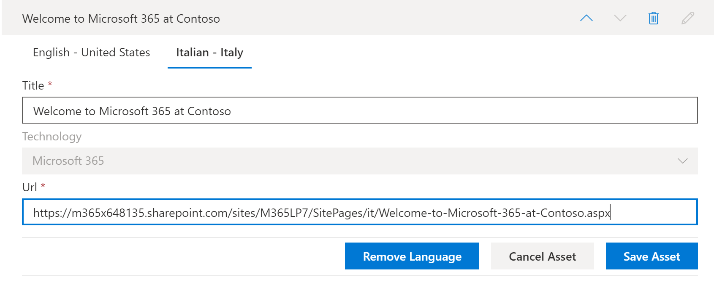

# 翻译学习路径自定义播放列表Translate learning pathways custom playlists
借助学习途径，使用自定义播放列表的方式取决于您设置学习路径的方式。With Learning Pathways, the way you work with custom playlists depends on how you set up learning pathways.  

- 如果您设置了新的学习路径多语言网站，则可以复制或创建新的播放列表，并将播放列表转换为网站支持的语言。If you provisioned a new learning pathways multilingual site, you can copy or create a new playlist and translate the playlist into the languages that the site supports.
- 如果您已升级现有的学习路径网站（具有预先存在的自定义播放列表），则可以将现有播放列表转换为您的网站支持的语言。If you upgraded an existing learning pathways site that has pre-existing custom playlists, you can translate the existing playlists into the languages that your site supports. 您还可以复制并创建新的播放列表。You can also copy and create new playlists. 

> [!IMPORTANT]
> - Microsoft 提供的播放列表已翻译，不能修改，除非您创建播放列表的副本。Microsoft-supplied playlists are already translated and can't be modified unless you create a copy of the playlist. 

## 创建或复制播放列表并将其翻译Create or copy a playlist and have it translated
如果您已设置新的学习路径多语言网站或已使用多语言 web 部件升级网站，则可以复制或创建自定义播放列表，并将播放列表和播放列表资源转换为网站支持的语言。If you've provisioned a new learning pathways multilingual site or upgraded the site with the multilingual web part, you can copy or a create custom playlist and translate the playlist and playlist assets into the languages supported by your site. 

### 复制播放列表并将其翻译Copy a playlist and have it translated
若要演示如何创建新的自定义播放列表并将其翻译，我们将使用学习路径的复制播放列表功能。To demonstrate how to create a new custom playlist and have it translated, we'll use the Copy playlist feature of learning pathways.

1.  从 "学习路径" **主页** 菜单中，单击 " **学习路径管理**"。From the learning pathways **Home** menu, click **Learning pathways administration**. 
2.  在 " **Microsoft 365 学习途径**" 下，选择 " **第一天**"，然后选择 **六个简单步骤-欢迎使用 Microsoft 365**。Under **Microsoft 365 learning pathways**, select **First Days**, then select **Six Simple Steps - Welcome to Microsoft 365**. 
3. 单击 " **复制播放列表**"，向下滚动页面，然后单击 " **编辑详细信息**"。Click **Copy Playlist**, scroll down the page and click **Edit Detail**.   
4. 更改播放列表的标题。Change the title of the playlist. 在此示例中，我们将把播放列表标题更改为 **五个简单步骤**。In this example, we'll change the playlist title to to **Five Simple Steps**. 可用的语言将取决于为网站选择的受支持语言。The languages available will depend on the supported languages selected for the site. 若要添加其他语言，您需要向网站中添加其他支持的语言。To add additional languages, you need to add additional supported languages to the site.   
5. 单击 " **保存详细信息**"。Click **Save Detail**. 
6. 单击默认语言右侧的语言 " (在本例中为英语) 查看复制的播放列表详细信息。Click a language to the right of the default language (in this case English) to view the copied playlist details. 新语言的详细信息反映了原始复制的播放列表并需要翻译。The details for the new language reflect the original copied playlist and require translation.
7. 记下要翻译的播放列表详细信息的提示。Make a note to notify the translator of the playlist details to be translated.  

> [!IMPORTANT]
> 转换器通知不内置在自定义播放列表中。Translator notifications are not built into custom playlists. 将需要手动通知翻译人员。Translators will need to be notified manually. 翻译人员将默认语言详细信息的副本手动翻译为 (s) 指定的语言。Translators manually translate the copies of the default language details into the language(s) specified. 你需要将播放列表详细信息所需的翻译通知翻译人员。You'll need to notify the translator of the translations required for playlist details. 建议您完成所有的播放列表更改，包括添加、编辑或删除播放列表资源，然后将所需翻译的翻译人员通知给播放列表的详细信息和资产。It's recommended that you finish all playlist changes,including adding, editing, or deleting playlist assets, then notify the translator of the required translations for playlist details and assets.

## 在自定义播放列表中创建多语言资源Create multilingual assets in a custom playlist
由 Microsoft 提供的播放列表中的任何资产都不可编辑且无需翻译。Any assets in a playlist that are supplied by Microsoft are not editable and do not require translation. Microsoft 提供的资产将以网站支持的语言提供。Microsoft-supplied assets will be available in the languages supported by the site. 对于您创建的自定义资产或现有的自定义资产，您可以添加该网站支持的语言。For custom assets that you create, or existing custom assets, you can add the languages supported by the site.  我们来看看如何为播放列表中的新的和现有的自定义资源添加语言。Let's take a look at how to add languages for new and existing custom assets in a playlist. 

### 为播放列表创建新的多语言资产Create a new multilingual asset for a playlist
这些说明假定您正在使用本主题的示例中的五个简单步骤播放列表。These instructions assume you're using the Five Simple Steps playlist in the example in this topic. 

**创建资产****To create the asset**
1. 对于五个简单的步骤播放列表，在 " **资产**" 下，选择 " **+ 新资源** "，然后填写资产的详细信息。For the Five Simple Steps playlist, under **Assets**, select **+ New Asset** and then fill out the details for the asset. 
- 对于 " **标题**"，输入 "欢迎使用 Microsoft 365 at Contoso"。For **Title**, enter "Welcome to Microsoft 365 at Contoso". 
- 对于 " **技术**"，选择 " **Microsoft 365**"。For **Technology**, select **Microsoft 365**.

2. 选择 " **创建资产**"，然后选择 " **保存资产**"。Select **Create Asset**, and then select **Save Asset**.

**打开资产****To open the asset**
1. 选择您创建的资产，然后单击 " **打开**"。Select the asset you created, and then click **Open**.  
2. 根据需要对页面进行更改。Make the changes to the page as desired. 现在，您可以更改页面的标题并向页面添加一些文本，如以下示例中所示，然后单击 " **发布**"。For now, you can change the title of the page and add some text to the page as shown in the following example, and then click **Publish**. 
3. 单击 " **翻译**"。Click **Translation**.
4. 为所需) 语言 (s 选择 " **创建** "。Select **Create** for the language(s) you want. 在此示例中，我们将选择 "意大利语"。For this example, we'll select Italian.
5. 选择 " **查看**"。Select **View**. 您现在应该会看到类似于以下示例的页面，具体取决于所支持的语言。You should now see a page similar to the following example depending on your supported languages.

6. 单击“**发布**”。Click **Publish**.
7. 对于创建的翻译页面，从浏览器复制 URL 并返回到 "学习路径管理" 页面。For the translation page you created, copy the URL from the browser and return to the learning pathways Administration page.

**为您创建的翻译资产添加语言****To add a language for the translation asset you created** 
1. 返回到 "学习路径管理" 页，然后为您打开的 "五个简单步骤" 资源 (铅笔) 中选择 "编辑" 图标。Return to the learning pathways Administration page and select the Edit icon (pencil) for the "Five Simple Steps" asset you opened. 
2. 单击 " **添加语言**"，然后选择一种语言。Click **Add language**, and then select a language. 在此示例中，我们选择了 "意大利语"。In this example, we've selected Italian. 
3. 输入您创建的已翻译页面的 URL。Enter the URL of the translated page you created. 您应该会看到类似于以下示例的页面。You should see a page similar to the following example. 

4. 单击 " **保存资产**"。Click **Save Asset**.

## 为现有的自定义播放列表和资产添加语言Add languages for existing custom playlists and assets
如果您已升级多语言支持的学习路径，并且具有现有的自定义播放列表和资产，则可以为播放列表和资产添加支持的语言。If you have upgraded learning pathways for multilingual support and have existing custom playlists and assets, you can add supported languages for the playlists and assets. 这些说明假定您有一个可向其添加语言的自定义播放列表。These instructions assume you have a custom playlist to which you can add languages. 如果没有自定义播放列表，请参阅本主题前面的 "创建或复制播放列表"。If you don't have a custom playlist, see "Create or Copy a Playlist" earlier in this topic. 

> [!IMPORTANT]
> - Microsoft 提供的播放列表已翻译，不能修改，除非您创建播放列表的副本。Microsoft-supplied playlists are already translated and can't be modified unless you create a copy of the playlist. 只能为自定义播放列表添加语言。You can only add languages for custom playlists. 
> - 若要添加自定义播放列表和资产的语言，必须启用多语言支持和语言。To add languages for custom playlists and assets, multilingual support and languages must be enabled. 有关详细信息，请参阅 [设置语言设置](https://docs.microsoft.com/office365/customlearning/custom_update_ml#set-language-settings)。For more information, see [Set Language Settings](https://docs.microsoft.com/office365/customlearning/custom_update_ml#set-language-settings). 

### 为现有播放列表添加语言To add languages for an existing playlist
1.  从 "学习路径" **主页** 菜单中，单击 " **学习路径管理**"。From the learning pathways **Home** menu, click **Learning pathways administration**. 
2.  选择自定义播放列表。Select a custom playlist. 自定义播放列表由人员图标和复选标记标识，如下面的示例所示。A custom playlist is identified by the people icon with the checkmark, as shown in the following example.
 
3. 选择 " **编辑详细信息**"。Select **Edit Detail**. 您可能需要向下滚动才能找到 " **编辑详细信息** " 按钮。You may need to scroll down to find the **Edit Detail** button.   
4. 选择 " **添加语言** "，然后选择一种语言。Select **Add language** and then select a language.  
5. 选择 " **保存详细信息**"。Select **Save Detail**.
 可用的语言将取决于为网站选择的受支持语言。The languages available will depend on the supported languages selected for the site. 若要添加其他语言，您需要向网站中添加其他支持的语言。To add additional languages, you need to add additional supported languages to the site.   
5. 单击默认语言右侧的语言 " (在本例中为英语) 查看复制的播放列表详细信息。Click a language to the right of the default language (in this case English) to view the copied playlist details. 新语言的详细信息反映了原始复制的播放列表并需要翻译。The details for the new language reflect the original copied playlist and require translation.
 
7. 记下要翻译的播放列表详细信息的提示。Make a note to notify the translator of the playlist details to be translated.  

**打开资产****To open the asset**
1. 选择您创建的资产，然后单击 " **打开**"。Select the asset you created, and then click **Open**.  
2. 根据需要对页面进行更改。Make the changes to the page as desired. 现在，您可以更改页面的标题并向页面添加一些文本，如以下示例中所示，然后单击 " **发布**"。For now, you can change the title of the page and add some text to the page as shown in the following example, and then click **Publish**. 
3. 单击 " **翻译**"。Click **Translation**.
4. 为所需) 语言 (s 选择 " **创建** "。Select **Create** for the language(s) you want. 在此示例中，我们将选择 "意大利语"。For this example, we'll select Italian.
5. 选择 " **查看**"。Select **View**. 您现在应该会看到类似于以下示例的页面，具体取决于所支持的语言。You should now see a page similar to the following example depending on your supported languages.

6. 单击“**发布**”。Click **Publish**.
7. 对于创建的翻译页面，从浏览器复制 URL 并返回到 "学习路径管理" 页面。For the translation page you created, copy the URL from the browser and return to the learning pathways Administration page.

## 通知转换器Notify the translator
完成翻译资产的创建后，请通知翻译人员所需的翻译。When you've finished creating translation assets, notify the translator of the required translations. 转换器将：The translator will:
- 转换播放列表详细信息。Translate playlist details.
- 转换资产详细信息。Translate asset details.
- 翻译资产的已添加语言页面。Translate added language pages for an asset.
- 通知请求者翻译已准备好审阅Notify the requestor of the translations that the translations are ready for review

## 为现有自定义播放列表添加语言Add languages for an existing custom playlist
如果您已升级多语言支持的学习路径，并且具有现有的自定义播放列表和资产，则可以为播放列表和资产添加支持的语言。If you have upgraded learning pathways for multilingual support and have existing custom playlists and assets, you can add supported languages for the playlists and assets. 

> [!IMPORTANT]
> - Microsoft 提供的播放列表已翻译，不能修改，除非您创建播放列表的副本。Microsoft-supplied playlists are already translated and can't be modified unless you create a copy of the playlist. 只能为自定义播放列表添加语言。You can only add languages for custom playlists. 
> - 若要添加自定义播放列表和资产的语言，必须启用多语言支持和语言。To add languages for custom playlists and assets, multilingual support and languages must be enabled. 有关启用多语言支持和选项的更多详细信息，请参阅 [设置语言设置](https://docs.microsoft.com/office365/customlearning/custom_update_ml#set-language-settings)。For more details on enabling multilingual support and options, see [Set Language Settings](https://docs.microsoft.com/office365/customlearning/custom_update_ml#set-language-settings). 

## 翻译说明Instructions for the translator
向播放列表添加语言时，需要将更改通知给翻译人员。When you add languages to playlists, you need to notify the translator of the changes. 您可以将转换器指向以下You can point the translator to the following 

### 转换播放列表详细信息Translate playlist details
从 "学习路径" **主页** 菜单中，单击 " **学习路径管理**"。From the Learning Pathways **Home** menu, click **Learning pathways administration**. 
1. 单击需要翻译的自定义播放列表，然后单击相应的语言。Click the custom playlist that requires translation, then click the languages. 
2. 单击 " **编辑详细信息**"，为播放列表进行翻译，然后单击Click **Edit Detail**, make the translations for the playlist, then click 
3. 单击 " **保存详细信息**"。Click **Save Detail**. 
4. 通知翻译请求程序转换已完成。Notify the translation requestor that the translation is complete. 

### 转换资产详细信息Translate asset details
从 "学习路径" **主页** 菜单中，单击 " **学习路径管理**"。From the Learning Pathways **Home** menu, click **Learning pathways administration**. 
1. 单击需要翻译的自定义播放列表。Click the custom playlist that requires translation. 
2. 向下滚动页面，然后在 "资源" 下，为要编辑的资产选择 "编辑"，然后选择语言。Scroll down the page, then under Assets, select edit for the asset you want to edit, then select the language. 
3. 为该资产进行翻译，然后单击 " **保存资产**"。Make the translations for the asset, and then click **Save Asset**.  

### 翻译资产的 "添加的语言" 页面Translate the added language page for the asset
从 "学习路径" **主页** 菜单中，单击 " **学习路径管理**"。From the Learning Pathways **Home** menu, click **Learning pathways administration**. 
1. 单击需要翻译的自定义播放列表。Click the custom playlist that requires translation. 
2. 向下滚动页面，然后在 "资源" 下，选择 "资产"，选择 "语言"，然后单击 "打开"。Scroll down the page, then under Assets, select the asset, select the language, and then click Open. 
3. 创建页面的翻译，然后单击 " **发布**"。Make the translations for the page, and then click **Publish**.   

## 详细信息For more information
- 有关自定义学习路径的详细信息，请参阅 [自定义学习路径](custom_overview.md)。For more information about customizing learning pathways, see [Customize Learning Pathways](custom_overview.md). 

