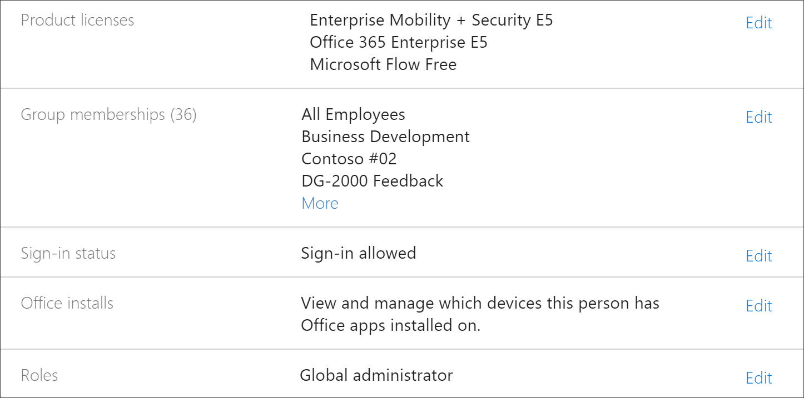
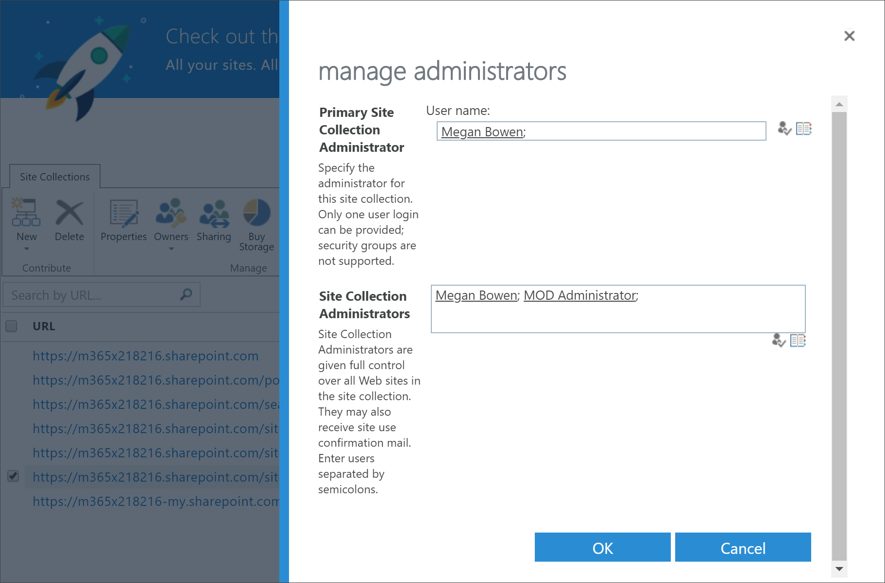
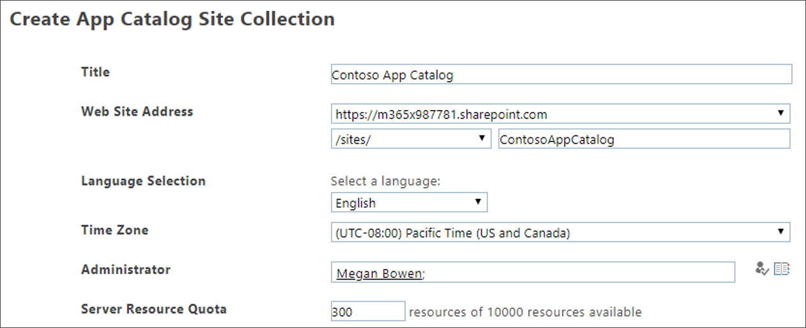

# 学习Microsoft 365疑难解答

以下是有关学习路径或 Microsoft 365 Online Provisioning Service SharePoint问题的疑难解答提示。

## 如何知道您是否具有租户管理员权限

登录 SharePoint Online Provisioning Service 并预配自定义Learning需要租户管理员权限。 如果你遇到登录问题，SharePoint联机预配服务，请确保你已分配有全局管理员角色。 自定义Learning解决方案需要租户管理员权限，也称为Office 365全局管理员角色。 下面是如何确定是否分配了全局管理员角色。

1.  登录到 Office.com。
2.  单击 **"管理员"**
3.  在 **"用户"** 下，选择 **"活动用户"**
4.  搜索你的姓名
5.  在搜索结果中单击你的姓名。 应看到角色的全局管理员。

### 如果你没有全局管理员角色
- 在组织中查找全局管理员，让此人登录该服务或让他们分配全局管理员角色。

## 租户应用程序目录疑难解答
自定义Learning需要在目标租户中预配应用程序目录。 创建应用程序目录需要全局管理员权限。 以下是常见应用程序目录问题的疑难解答步骤：

### 如何知道您是否具有租户应用程序目录 
对于初学者，请确保你拥有全局管理员权限。 请参阅上述租户管理员权限的步骤。

1. From Office 365， click **Admin**， click the expand arrow >， click **Show all**  >  **Admin centers**  >  **SharePoint**.
2. 单击 **"经典管理SharePoint**  >  **中心应用**  >  **目录"。**
3. 在 **"应用**"下，应看到标题为"分配适用于 **SharePoint"磁贴**。 如果你看到此磁贴，则你有一个租户应用程序目录。 请参阅 **下面的如何确保你是网站集合...** 部分。 如果看不到磁贴，则需要为租户创建租户应用目录。 请参阅 **下面的如何创建租户应用程序目录** 部分。

### 如何确保你是租户应用程序目录中的网站集所有者 
若要Microsoft 365路径，你需要是租户应用程序目录中的网站集所有者。 下面将了解如何确定您是否为所有者。

1. From Office 365， click **Admin**， click the expand arrow >， click **Show all**  >  **Admin centers**  >  **SharePoint**.
2. 单击 **"经典SharePoint** 中心"，然后选择 **应用程序目录**。
3. 选择 **"** 所有者"，然后确保您是网站集所有者。 它应如下所示。
 

### 如何创建租户应用程序目录（如果不存在） 
1. Sign in to Office 365 with your SharePoint Online admin account.
2. 单击“**管理员**”。
3. 在"**管理中心"** 下，单击 **"SharePoint"。** 
4. 单击 **应用程序**  >  **应用程序目录**。
5. 单击 **"新建应用程序目录网站"，** 然后单击"确定 **"。** 
6.  输入应用程序目录的信息。 您可能需要包括多个管理员。 下面显示了一个示例。  

7.  就是这样。 你已完成。 但在开始预配自定义目录Learning，你需要等待至少 30 分钟，以确保应用程序目录创建完成。 

> [!IMPORTANT]
> 在创建租户应用程序目录后至少等待 30 分钟，然后再预配自定义Learning。 这可确保应用程序目录预配过程在SharePoint。 