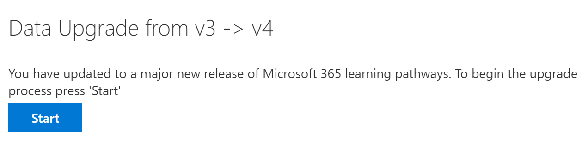

# 更新学习路径
如果您有现有的学习路径网站，则可以更新它以实现多语言支持。 若要更新到多语言4.0 版本的学习路径，请将 web 部件包 customlearning （.sppkg）上传到 SharePoint 租户应用程序目录。 更新学习路径时：  

- 任何以前创建的自定义播放列表和资产都将保留
- 保留隐藏或显示内容的设置
- "学习路径" SharePoint 模板保持不变
- 不翻译学习路径网站页面。 此工作必须手动完成

## 阅读学习路径多语言概述
若要了解多语言支持对学习路径的工作方式，请阅读[学习路径多语言概述](custom_overview.md)。 

## 要更新的先决条件
在更新学习路径之前，必须满足以下先决条件：
- 更新学习路径的人员必须是租户应用程序目录的网站集所有者。 如果人员设置学习路径不是应用程序目录的网站集所有者，请[完成这些说明](addappadmin.md)并继续。 

## 设置语言设置 
在更新学习路径之前，请设置 "网站语言设置"。 若要对学习路径网站启用多语言支持，您可以将 "**启用页面和新闻**" 设置为 "转换为多种语言 **"，然后**添加要为网站支持的语言。
1.  从 "学习路径" 网站中，从右上部选择 "**设置**"，然后选择 "**网站信息**"。
2.  在 "网站信息" 窗格的底部，选择 "**查看所有网站设置**"。
3.  在 "**网站管理**" 下，选择 "**语言设置**"。
4.  在 "**允许将页面和新闻转换为多种语言**" 下，设置切换开关。 
- 对于 multiligual 网站，将切换滑到 **"开**"，然后继续转到 "添加语言" 部分。 
- 对于仅英语的网站，将开关滑到 "**关闭**"。

### 添加语言
学习路径支持九种语言，您应该只添加所需的语言。 在本文档中使用的示例中，将添加意大利语。 
- 在 "**添加或删除网站语言**" 下，开始在 "**选择" 或 "键入语言**" 中键入语言名称，或从下拉列表中选择一种语言。 您可以重复此步骤以添加多种语言。 您可以通过返回到此页随时在网站中添加或删除语言。
 
### 分配翻译人员
在为学习路径定义语言设置时，您可以分配翻译者。 翻译人员应设置外部语言配置文件。 有关外部语言配置文件的详细信息，请参阅[创建多语言通信网站、页面和新闻](https://support.office.com/article/2bb7d610-5453-41c6-a0e8-6f40b3ed750c)。  
- 对于受支持的语言，请单击 "**选择或键入翻译人员**"，然后选择一个转换器。 

## 更新 "学习路径" web 部件包
在此步骤中，将 "学习路径 4.0" web 部件上传到 SharePoint 应用程序目录，然后导航到 "学习路径管理" 页以启动更新过程。

### 上载 web 部件包
1.  转到 "团队中的多语言共享位置"，并将**customlearning**下载到电脑上的本地驱动器。 
2.  如果您尚未登录，请使用租户管理员或网站集管理员帐户登录到你的租户。 
3.  单击 "**管理**  >  **显示所有**  >  **SharePoint**  >  **更多功能**"。 
4.  在 "**应用**" 下，单击 "**打开**"。 
5.  单击 "**应用程序目录**  >  **分发 SharePoint 相关应用**程序"。 
6.  单击 "**上载**  >  **选择文件**"。 
7.  选择您下载的**customlearning**文件，然后单击 **"确定**  >  **部署**"。 

### 完成更新
1.  从 "学习路径" 网站中，从 "**主页**" 菜单中选择 "**学习路径管理**"。 
2.  你将看到一条提示，询问你是否要更新。 

3.  单击“**开始**”。 
4. 更新完成后，单击 "**关闭**"。 

### 后续步骤
- 浏览网站和 web 部件中提供的[默认内容](custom_exploresite.md)。
- 有关转换网站页面的详细信息，请参阅[翻译网站页面](custom_translate_page_ml.md)。 

