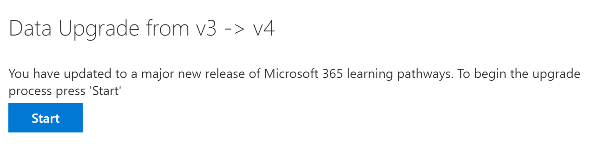

# 更新多语言支持的学习路径Update learning pathways for multilingual support
如果你有一个现有的学习路径网站，你可以更新它，实现多语言支持。If you have an existing Learning Pathways site, you can update it for multilingual support. 若要更新多语言 4.0 版本的学习路径，需要将 Web 部件包 customlearning.sppkg 上载到 SharePoint 租户应用程序目录。To update learning pathways to the multilingual 4.0 version, you upload the web part package, customlearning.sppkg, to the SharePoint tenant App Catalog. 更新学习路径时：When you update learning pathways:  

- 保留以前创建的任何自定义播放列表和资产Any previously created custom playlists and assets are maintained
- 用于隐藏或显示内容的设置将保留Settings to hide or show content are maintained
- SharePoint 模板的学习路径保持不变The learning pathways SharePoint template is left unchanged
- 不会翻译学习路径网站页面。The learning pathways site pages aren't translated. 必须手动完成此工作This work must be done manually

## 阅读学习路径多语言概述Read the learning pathways multilingual overview
若要了解多语言支持如何用于学习路径，请阅读学习路径 [多语言概述](custom_overview_ml.md)) 。To learn about how multilingual support works for learning pathways, read the [Learning pathways multilingual overview](custom_overview_ml.md)). 

## 更新的先决条件Prerequisites to update
在更新学习路径之前，必须满足以下先决条件：Before updating learning pathways, the following prerequisite must be met:
- 更新学习路径的人必须是租户应用程序目录的网站集所有者。The person updating learning pathways must be a site collection owner of the tenant App Catalog. 如果预配学习路径的人不是应用程序目录的网站集所有者，请 [完成这些](addappadmin.md) 说明并继续操作。If the person provisioning learning pathways isn't a site collection owner of the App Catalog, [complete these instructions](addappadmin.md) and continue. 

## 设置语言设置Set language settings 
在更新学习路径之前，请设置网站语言设置。Before updating learning pathways, set the site language settings. 若要启用对学习路径网站的多语言支持，可以将"允许将页面和新闻翻译为多种语言"设置为 **"** 打开"，然后添加要支持该网站的语言。To enable multilingual support for the learning pathways site, you can set the **Enable pages and news to be translated into multiple languages** to **On**, and then add the languages you want to support for the site.
1.  从"学习路径"网站中，**从右** 上方选择"设置"，然后选择"网站 **信息"。**From the Learning Pathways site, select **Settings** from the top right, and then select **Site information**.
2.  在网站信息窗格底部，选择"**查看所有网站设置"。**At the bottom of the site information pane, select **View all site settings**.
3.  在 **"网站管理"下**，选择"**语言设置"。**Under **Site Administration**, select **Language settings**.
4.  在 **"启用要翻译为多种语言的页面** 和新闻"下，设置切换开关。Under **Enable pages and news to be translated into multiple languages**, set the toggle switch. 
- 对于多语言网站，将开关滑动到 **"打开**"，然后继续"添加语言"部分。For a multiligual site, slide the toggle to **On**, and then proceed to the Add Languages section. 
- 对于仅英文网站，将切换开关滑动到 **"关"。**For an English-only site, slide the toggle to **Off**.

### 添加语言Add languages
学习路径支持九种语言，应仅添加所需的语言。Learning pathways supports nine languages, you should add only the languages you need. 在本文档中使用的示例中，将添加意大利语。In the examples used in this documentation, Italian will be added. 
- 在 **"添加或删除网站语言"下**，开始在"选择或键入语言"中键入语言名称，或者从下拉列表中选择语言。Under **Add or remove site languages**, start typing a language name in **Select or type a language**, or choose a language from the dropdown. 可以重复此步骤以添加多种语言。You can repeat this step to add multiple languages. 通过返回到此页面，您随时都可以在网站中添加或删除语言。You can add or remove languages from your site at any time by going back to this page.
 
### 分配翻译人员Assign translators
定义学习路径的语言设置时，可以分配翻译人员。When defining Language settings for learning pathways, you can assign translators. 翻译人员应设置外语配置文件。Translators should have a foreign language profile set up. 有关外语配置文件的信息，请参阅创建 [多语言通信网站、页面和新闻](https://support.office.com/article/2bb7d610-5453-41c6-a0e8-6f40b3ed750c)。For more information about foreign language profiles, see [Create multilingual communication sites, pages, and news](https://support.office.com/article/2bb7d610-5453-41c6-a0e8-6f40b3ed750c).  
- 对于受支持的语言，请单击 **"选择或键入转换器** "，然后选择一个转换器。For a supported language, click **Select or type a translator** and then select a translator. 

## 更新学习路径 Web 部件包Update the learning pathways web part package
在此步骤中，您将学习路径 4.0 Web 部件上载到 SharePoint 应用程序目录，然后导航到学习路径管理页以开始更新过程。In this step, you upload the learning pathways 4.0 web part to the SharePoint App Catalog, and then navigate to the learning pathways Administration page to start the update process.

### 上传 Web 部件包Upload the web part package
1.  转到 [GitHub 自定义学习存储库](https://github.com/pnp/custom-learning-office-365/tree/master/webpart)，选择 **customlearning.sppkg，** 然后将它下载到电脑上的本地驱动器。Go to the [GitHub custom learning repository](https://github.com/pnp/custom-learning-office-365/tree/master/webpart), select **customlearning.sppkg** and then download it to a local drive on your PC. 
2.  如果你尚未登录，请使用租户管理员或网站集管理员帐户登录租户。If you’re not already signed in, sign into your tenant with a Tenant Admin or Site Collection Admin account. 
3.  单击 **"管理员**  >  **显示**  >  **所有 SharePoint**  >  **更多功能"。**Click **Admin** > **Show All** > **SharePoint** > **More Features**. 
4.  在"**应用"** 下，单击"**打开"。**Under **Apps**, click **Open**. 
5.  单击 **"应用程序目录**  >  **分发 SharePoint 应用程序"。**Click **App Catalog** > **Distribute Apps for SharePoint**. 
6.  单击 **上传**  >  **选择文件**。Click **Upload** > **Choose Files**. 
7.  选择已 **下载的 customlearning.sppkg** 文件，**单击"确定**""部署  >  **"。**Select the **customlearning.sppkg** file you downloaded, click **OK** > **Deploy**. 

### 完成更新Complete the update
1.  从"学习路径"网站，从"开始" **菜单中选择** "学习路径 **管理** "。From the Learning Pathways site, select **Learning pathways administration** from the **Home** menu. 
2.  你将看到一条提示，询问是否要更新。You’ll see a prompt asking if you want to update. 

3.  单击“**开始**”。Click **Start**. 
4. 更新完成后，单击 **关闭。**When the update is complete, click **Close**. 

### 后续步骤Next Steps
- 浏览 [网站和](custom_exploresite.md) Web 部件中提供的默认内容。Explore the [default content](custom_exploresite.md) provided in the site and web part.
- 有关翻译网站页面的信息，请参阅翻译 [网站页面](custom_translate_page_ml.md)。For more information about translating site pages, see [Translate site pages](custom_translate_page_ml.md). 

