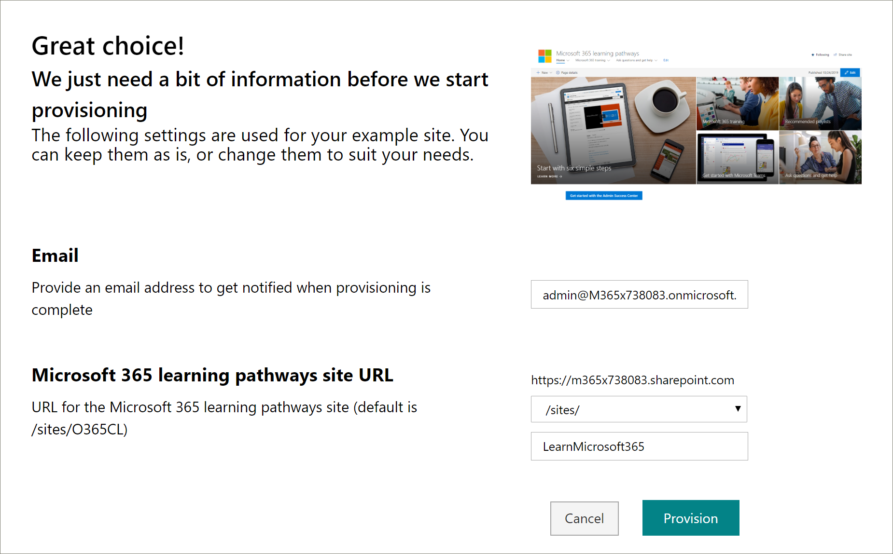

# 预配自定义学习Provision Custom Learning

借助 SharePoint Online 设置服务，Office 365 租户管理员可以通过几次简单的单击操作来启动预配过程。With the SharePoint Online Provisioning Service, an Office 365 Tenant Administrator can start the provisioning process with a few simple clicks. 预配服务是设置自定义学习的推荐方法。The Provisioning Service is the recommended way to provision Custom Learning. 快速而简单，只需几分钟即可启动该过程。It's fast, easy, and takes only a few minutes to start the process. 但是，在开始使用预配服务之前，请确保已满足预配的先决条件。Before getting started with the Provisioning Service, however, make sure you've met the prerequisites for provisioning.

## 先决条件Prerequisites
 
若要使用预配服务 [SharePoint Online 设置服务](https://provisioning.sharepointpnp.com)成功设置自定义学习，进行预配的人员必须满足以下先决条件：To successfully set up Custom Learning with the Provisioning Service [SharePoint Online Provisioning Service](https://provisioning.sharepointpnp.com), the person doing the provisioning must meet the following pre-requisites: 
 
- 人员预配自定义学习必须是租户 Administratorof 租户，在此租户中将预配自定义学习。The person provisioning Custom Learning must be a Tenant Administratorof the tenant where Custom Learning will be provisioned.  
- 租户应用程序目录必须在 SharePoint 管理中心的 "应用程序" 选项中可用。A tenant App Catalog must be available within the Apps option of the SharePoint Admin Center. 如果您的组织没有 SharePoint 租户应用程序目录，请参阅 [SharePoint Online 文档](https://docs.microsoft.com/sharepoint/use-app-catalog) 以创建一个。If your organization does not have an SharePoint tenant App catalog, refer to the [SharePoint Online documentation](https://docs.microsoft.com/sharepoint/use-app-catalog) to create one.  
- 人员预配自定义学习必须是租户应用程序目录的网站集所有者。The person provisioning Custom Learning must be a Site Collection Owner of the Tenant App Catalog. 如果人员预配自定义学习不是应用程序目录的网站集所有者，请 [完成这些说明](addappadmin.md) 并继续。If the person provisioning Custom Learning is not a Site Collection Owner of the App Catalog [complete these instructions](addappadmin.md) and continue. 

### 预配自定义学习To provision Custom Learning

1. http://provisioning.sharepointpnp.com从主页的右上角转到并**登录**。Go to http://provisioning.sharepointpnp.com and **sign in** from the upper right hand corner of the home page.  使用您计划安装网站模板的目标租户的凭据登录。Sign in with the  credentials for the targeted tenant where you plan to install the site template.

2. 清除 **代表您的组织的同意** 并选择 " **接受**"。Clear the **Consent on behalf of your organization** and select **Accept**.

3. 从解决方案库中选择 **适用于 Office 365 的自定义学习** 。Select **Custom Learning for Office 365** from the solution gallery.

4. 从解决方案主页中选择 "**添加到你的租户**"From the solution home page select **Add to your Tenant**

5. 根据需要填写预配信息页面上的字段。Complete the fields on the provisioning information page as appropriate for your installation. 至少应输入你希望获取有关设置过程的通知的电子邮件地址和要设置为的网站的目标 URL。At a minimum enter the email address where you wish to get notifications about the provisioning process and the destination URL for your site to be provisioned to.  
> [!NOTE]
> 将网站的目标 URL 设置为友好的内容，如 "/sites/MyTraining" 或 "/teams/LearnOffice365"。Make the destination URL for your site something friendly to your employees such as "/sites/MyTraining" or "/teams/LearnOffice365".

6. 准备好将自定义学习安装到租户环境中时，请选择 " **设置** "。Select **Provision** when ready to install Custom Learning into your tenant environment.  预配流程最多需要 15 分钟。The provisioning process will take up to 15 minutes. 网站可供访问时，系统将通过电子邮件（你在“预配”页面上输入的通知电子邮件地址）通知你。You will be notified via email (to the notification email address you entered on the Provisioning page) when the site is ready for access.

> [!IMPORTANT]
> 设置自定义学习网站的租户管理员必须转到网站，然后打开 CustomLearningAdmin 以初始化自定义学习管理属性。The Tenant Admin who provisions the Custom Learning site must go to the site, and then open CustomLearningAdmin.aspx to initialize Custom Learning Admin properties. 目前，租户管理员还应将所有者分配给网站。At this time, the Tenant Admin should also assign Owners to the site. 

## 验证设置是否成功Validate Provisioning Success

设置完成后，租户管理员将从 PnP 预配服务收到电子邮件。When provisioning is complete, the Tenant Admin receives an email from the PnP Provisioning Service. 管理员可以将链接复制到电子邮件中提供的网站，然后按照说明转到网站。The admin can copy the link to the site provided in the email, and then follow the instructions to go to the site. 此外，租户管理员还可以导航到 <您的网站集 URL>/SitePages/CustomLearningAdmin.aspx。Alternately, the tenant admin can navigate to <YOUR-SITE-COLLECTION-URL>/SitePages/CustomLearningAdmin.aspx. 这将初始化为其首次使用设置自定义学习的 CustomConfig 列表项。This initializes the CustomConfig list item that sets up Custom Learning for its first use. 首次打开此页面的人员必须是网站的租户管理员、网站集管理员或所有者。The person who first opens this page must be a Tenant Admin,Site Collection Admin, or Owner of the site. 您应该会看到如下所示的页面：You should see a page that looks like this: 

## 将所有者添加到网站Add Owners to Site
作为租户管理员，您不太可能是自定义网站的人，因此您需要将所有者分配到网站。As the Tenant Admin, it's unlikely you'll be the person customizing the site, so you'll need to assign Owners to the site. 所有者具有对网站的管理权限，以便他们可以修改网站页面并 rebrand 网站。Owners have administrative privileges on the site so they can modify site pages and rebrand the site. 他们还能够隐藏和显示通过自定义学习 Web 部件传递的内容。They also have the ability to hide and show content delivered through the Custom Learning Web part. 他们还能够构建自定义播放列表并将其分配给自定义子类别。They'll also have the ability to build custom playlist and assign them to custom subcategories.  

1. 从 "SharePoint **设置** " 菜单中，单击 " **网站权限**"。From the SharePoint **Settings** menu, click **Site Permissions**.
2. 单击 " **高级权限设置**"。Click **Advanced Permission Settings**.
3. 单击 " **自定义学习 For Office 365 所有者**"。Click **Custom learning for Office 365 Owners**.
4. 单击 "**新建**向  >  **此组添加用户**"，添加您希望成为所有者的人员，然后单击 "**共享**"。Click **New** > **Add Users to this group**, add the people you want to be Owners, and then click **Share**.

8. 单击页面右上角的 **以下** 选项以关注网站。Click the **Following** option in the upper right hand corner of the page to follow the site.  

### 后续步骤Next Steps
- 浏览 web 部件中包含的 [默认内容](sitecontent.md) 。Explore the [default content](sitecontent.md) included in the webpart.
