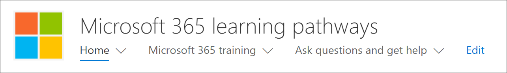
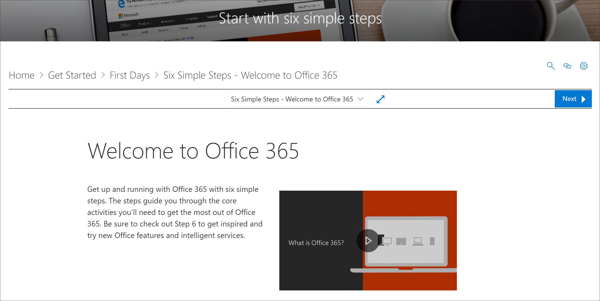
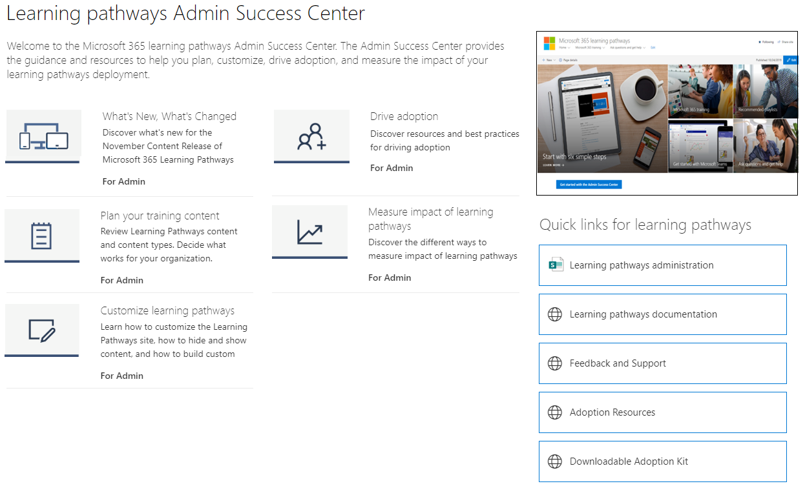

# Microsoft 365 学习路径 Web 部件位置 

在组织中设置学习路径时，学习路径网站和 Web 部件将添加到组织的 SharePoint 租户。 作为预配的一部分，Microsoft 365学习 Web 部件将添加到"学习路径"网站的Microsoft 365页面中：

- Start-with-Six-Simple-Steps.aspx 
- Recommended-Playlists.aspx
- Office 365.aspx 入门
- Get-started-with-Microsoft-Teams.aspx
- Get-started-with-OneDrive.aspx
- Get-started-with-SharePoint.aspx
- Learning管理员成功中心.aspx 的路径

对于每个页面，Web 部件配置方式不同，以显示旨在支持页面意图的类别、子类别、播放列表或资产。 学习路径 Web 部件（我们将在稍后部分中介绍）可添加到任何 SharePoint 页面，并经过筛选以显示特定类别、子类别、播放列表或仅资产。 让我们看一看。 

## 查看Microsoft Teams播放列表

下面是一个包含 入门Microsoft Teams 页面的示例，其中 Web 部件经过筛选，以显示 Teams。 

- 从学习路径主页中，选择"开始 **Microsoft Teams"。**

- 单击 **学习路径** 网站菜单上的"主页"菜单以返回到网站主页。

## 查看六个简单的步骤播放列表

The web part on the **Start-with-Six-Simple-Steps.aspx** page is configured to show the first asset in the Six Simple Steps playlist. 

- 从学习路径主页中，单击"**从六个简单的步骤开始"。** 

## 查看所有Microsoft 365培训

"学习Microsoft 365页面上的Web 部件配置为显示学习路径目录中提供的所有类别和子类别。 这包括 Microsoft 的子类别以及您为组织创建的任何子类别。

- 从学习路径主页中，单击 **"Microsoft 365培训"。** 将显示页面，其中 Web 部件配置为显示"自定义类别"目录提供的所有Learning类别。

- 单击 **学习路径** 网站菜单上的"主页"菜单以返回到网站主页。

## 在"管理员成功中心"页上查看 Web 部件

"管理员成功中心"页面上 **的** Web 部件配置为筛选可用于管理员成功中心的所有播放列表。 如以下示例所示，Web 部件将添加到也包含"管理员资源快速链接"的页面。 

- 从学习路径主页中，单击管理员 **成功中心入门**。 按钮。 

- 单击 **学习路径** 网站菜单上的"主页"菜单以返回到网站主页。

