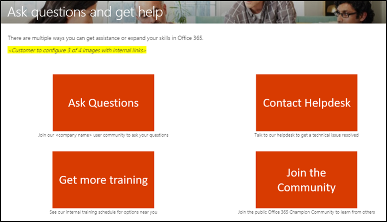
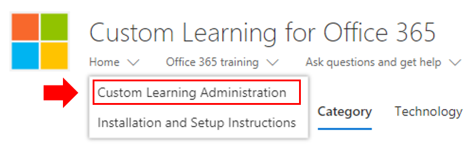
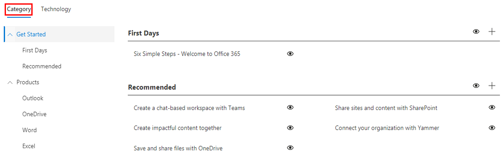

# 自定义培训体验

这是测试 4。 默认情况下，网站体验和 Web 部件都包括所有 Office 365 和 Windows 10 服务的内容。  如果公司中仅提供所有这些或部分服务，可以调整哪些内容可供用户使用。  

此网站的所有者可以使用多种自定义项。 

- [自定义网页](#customizing-web-pages)
- [自定义可用服务](#customize-available-services)
- [自定义和共享播放列表](customplaylist.md)

在将网站启动到用户社区之前，可以完成这些自定义的一部分或全部。  

> [!TIP]
> 收集员工的反馈并定期完成其他自定义。  在启动新服务时，添加播放列表、将网页定向到特定角色或打开新的培训内容。 

## 自定义网页

您可以完全自定义自定义学习网站。 如果您不熟悉在新式 SharePoint Online 网站内创建页面，我们建议您查看自定义 [SharePoint 网站](https://support.office.com/article/customize-your-sharepoint-site-320b43e5-b047-4fda-8381-f61e8ac7f59b) 文章，support.office.com。 

### 自定义 **"提出问题并获取帮助"** 页

作为自定义网站的起点，选择"提问并获取菜单栏中的帮助"，然后单击"SharePoint 编辑"按钮并更改图像和链接。 

## 自定义可用服务

1.  导航到网站中的"自定义学习管理"页 选择 
1. 选择 **"** 技术"以查看解决方案中包含的服务的完整列表
1. 选择一种技术 **，然后单击目视符号** 隐藏此内容。  再次单击眼睛符号以显示体验中的内容。 

对于体验中的播放列表类别，可以重复相同的过程。  只需选择"类别"选项以显示/隐藏播放列表。 

### 后续步骤

- [自定义和共享播放列表](customplaylist.md)
- [推动采纳](driveadoption.md) 
