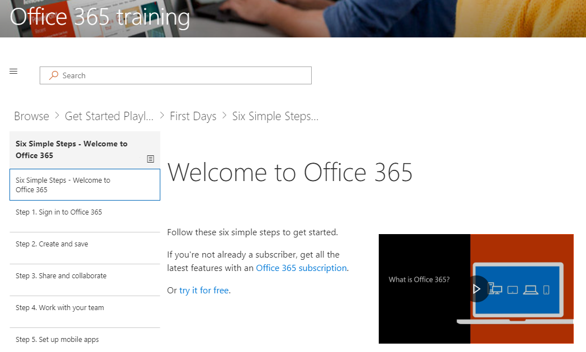

# 自定义培训体验Customize the Training Experience

默认情况下的网站体验和 web 部件包含的所有 Office 365 服务的内容。 如果只全部或部分这些服务可在贵公司可以调整内容可供您的用户。By default both the site experience and the webpart include content for all Office 365 services.  If only all or some of these services are available in your company you can adjust what content is available to your users.  

首先，我们将自定义 web 部件本身中可用的内容。 适用于独立单独的 web 部件安装或使用 web 部件的自定义学习网站体验内部此信息。First we will customize the content available in the webpart itself.  This information is applicable to a stand alone webpart installation or using the webpart inside of the Custom Learning site experience. 

## 自定义的培训内容Customizing the training content

转首先六个简单的步骤Go to Start with six simple steps
- 从主页页上，与六个简单步骤中单击开始。From the Home page, click Start with six simple steps. 
- 对路由到六个简单步骤播放列表开始学习自定义 web 部件，您看到的 Office 培训页面。You see the Office Training page with the Custom Learning web part routed to the Start with six simple steps playlist.  

