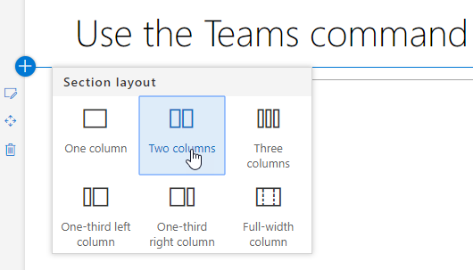
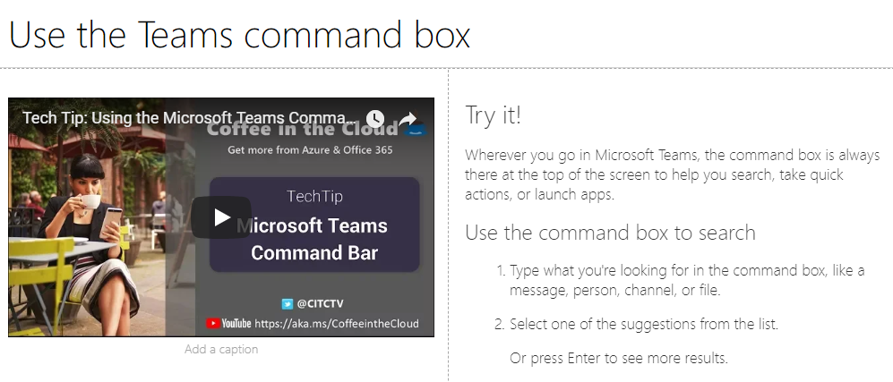
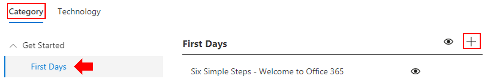
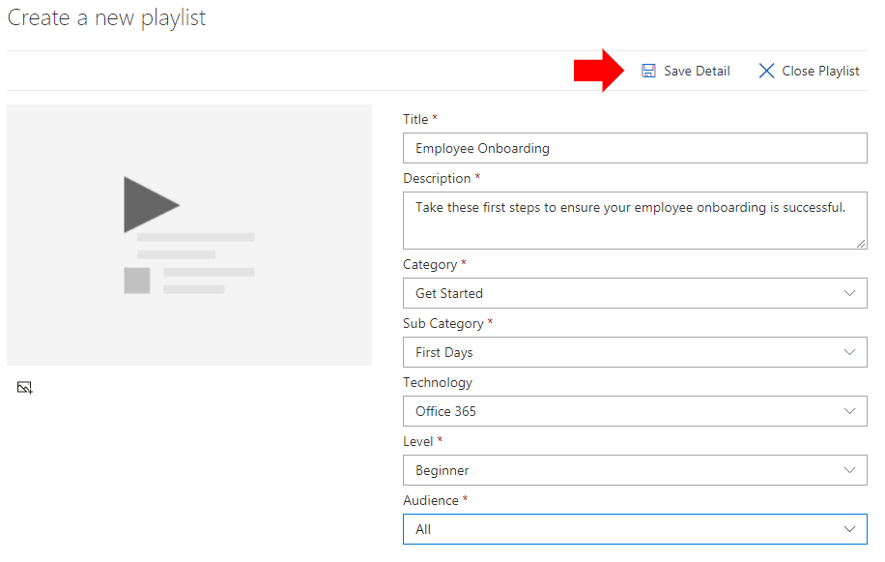
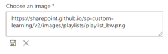
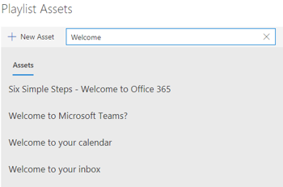
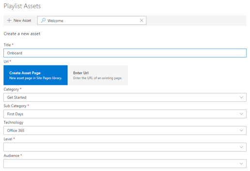

# 自定义和共享播放列表

## 创建播放列表

播放列表是 "资产" 的 compliation。"资源" 是 SharePoint 页面或 Microsoft 培训内容的现有项目。创建播放列表时, 选择的资产将一起为您的用户创建学习路径。  

添加 sharepoint 页面的好处在于, 您可以使用组织中托管的 YouTube 视频或视频创建 sharepoint 页面。您还可以使用表单或其他 Office 365 内容创建页面。  

#### 步骤 1: 为播放列表创建 SharePoint 页面
在此示例中, 我们将首先创建一个要添加到播放列表中的 SharePoint 页面。我们将创建一个包含 YouTube 视频 web 部件和文本 web 部件的页面。 这些说明假定您使用的是 SharePoint Online 服务。 

#### 创建新页面
1.  选择 "设置" 菜单 > 网站内容 > 网站页面 > 新建 > 网站页面。
2.  在 "标题" 区域中, 键入 "使用团队" 命令框
3.  选择 "添加新内容" 部分, 然后选择 "两列"。

4.  在左侧框中, 选择 "添加新 web 部件", 然后选择 "嵌入"。 
5.  在 Web 浏览器中, 转到此https://youtu.be/wYrRCRphrp0 URL 并获取视频的嵌入代码。 
6.  在 SharePoint Web 部件中, 选择 "添加嵌入代码", 然后将其粘贴到 "嵌入" 框中。 
7.  在右侧的框中, 选择 "添加新 web 部件", 然后选择 "文本"。 
8.  在 Web 浏览器中, 转到此 URL https://support.office.com/en-us/article/13c4e429-7324-4886-b377-5dbed539193b : 并复制 Try!页面中的说明, 并将其粘贴到文本 Web 部件中。页面应如下所示。 

9.  单击 "**发布**", 然后复制页面的 URL 并将其粘贴到记事本中

#### 步骤 2: 创建播放列表

1. 导航到网站体验中的 "**自定义学习管理**" 页。
1. 确保选择了 "**类别**" 
1. 单击要在其上显示新播放列表的类别
1. 在类别名称旁边, 单击加号符号

1. 填写以下示例中所示的值, 然后选择 "**创建**"。
- 播放列表的**标题**-显示名称
- **Description** -有关将学习的内容的信息
- **类别**-根据初始选择预先选择
- **子类别**-根据您的初始选择预选
- **技术**-选择 "适用"
- **Level** -初级、Intermidate 或 Advanced
- **受众**-这使您可以根据 Microsoft 提供的预定义角色的列表来设定内容目标。

6. 单击 "**保存详细信息**"

> [!TIP]
> 您可以自定义播放列表图标图像。 单击图像图标并插入之前上载的图像的 URL。 请确保该图像位于自定义学习网站集内, 或者位于其他所有用户都有权访问该文件的位置。  

#### 步骤 3: 将资产添加到播放列表
在此步骤中, 您将向播放列表中添加来自 Microsoft 和您创建的 SharePoint 页面的现有资产。 

1. 保存了播放列表的详细信息后, 便可使用搜索现有资产。
1. **在任何搜索词中输入**, 以查看其他播放列表中提供的预定义资产的列表。**单击**资产的名称以将其包含在新的播放列表中。

您还可以添加之前创建的 SharePoint 页面, 也可以在体验中从头开始创建它。

1. 单击 "播放列表资产" 对话框中的 "**新建资产**" 选项
1. 为您的资产提供**标题**。输入后, 其他选项将显示
1. 您现在可以在 SharePoint Online 中创建新的资产页面, 也可以在现有页面的 URL 中输入以将其添加到自定义播放列表中。 
1. "**类别**"、"**子类别**" 和 "**技术**" 字段将根据您以前的选择, 为此播放列表预先填充。
1. 为此单个资产的级别和受众做出适当的选择。  
1. 单击 "**保存资产**" 以将其添加到自定义播放列表
1. 重复这些步骤, 可以搜索或添加单个页面, 直到完成播放列表。 
1. 单击 "**关闭播放列表**" 以保存

包含此内容的播放列表现在将在你已安装/嵌入自定义学习 web 部件的任何位置可用。 

> [!NOTE]
> 如果您在关闭播放列表后出错了, 可以通过单击播放列表名称旁边的 X 将其从类别中删除。  

#### 要考虑的事项

自定义播放列表可用于帮助最终用户完成各种任务。 您是否有时间请求窗体？ 请求硬件设备的表单？ 可以将任何现有的培训资产编程到体验中。  

## 共享播放列表

1. 导航到 web 部件或网站体验中的任何播放列表
1. 在左上角, 将看到三个图标
1. 单击代表链接的图标
1. 将 URL 复制到播放列表

 " 此 URL 现在可以在网站导航中插入或在其他通信中使用, 以将员工直接带到该播放列表。 

### 后续步骤-[驱动器采用](driveadoption.md)
