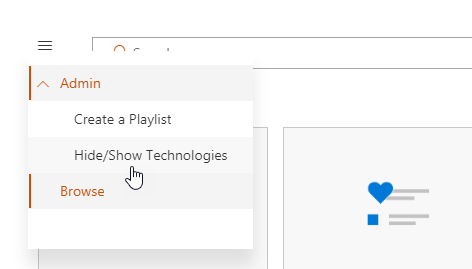
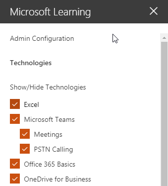
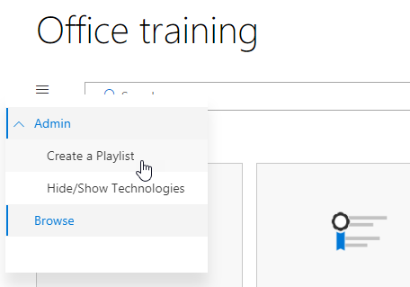
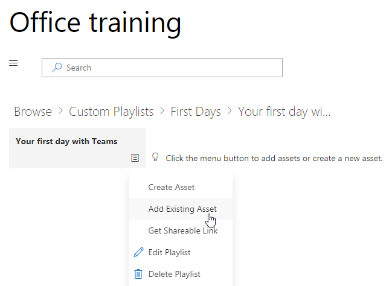
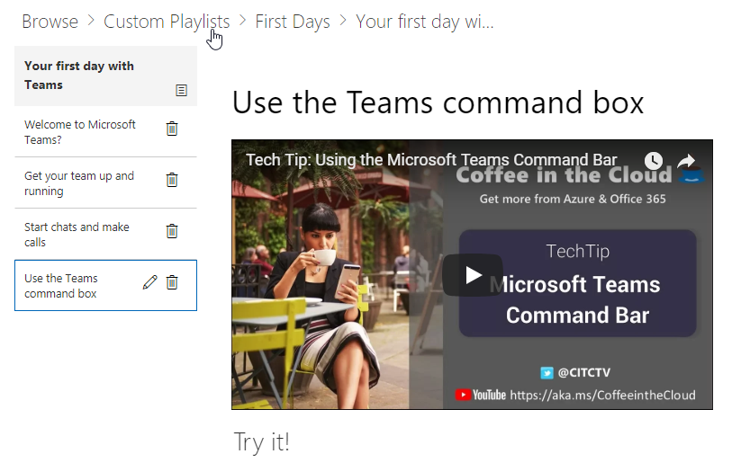

# 自定义的服务和播放列表Customize the Services and Playlists

默认情况下的网站体验和 web 部件包含的所有 Office 365 服务的内容。 如果只全部或部分这些服务可在贵公司可以调整内容可供您的用户。 在本文中，我们将自定义 web 部件内容。By default both the site experience and the webpart include content for all Office 365 services.  If only all or some of these services are available in your company you can adjust what content is available to your users.  In this article we will customize the webpart content.  

## 自定义 web 部件内容Customizing the webpart content

自定义学习 web 部件提供了两个主要功能：The Custom Learning webpart provides two key features:
- 隐藏/显示技术Hide/Show Technologies
- 创建播放列表Create a Playlist

### 隐藏或显示技术类别Hide or Show Technology Categories

若要隐藏和显示 Web 部件的内容：To hide and show content in the Web part: 
1.  单击下拉菜单上 web 部件，然后单击隐藏/显示技术Click the dropdown menu on the webpart, then click Hide/Show Technologies

2. 选择 checkox 为隐藏或显示技术并选择**应用**。Select a checkox to hide or show a technology and select **Apply**.

### 创建播放列表Create a Playlist

播放列表是"资产"compliation。"资源"是一个 SharePoint 页面或现有的 Microsoft 培训内容项。创建播放列表时您选择在一起的资产创建用户学习路径。A playlist is a compliation of "assets". An "asset" is a SharePoint page or existing item of Microsoft training content. When you create a playlist you select assets that go together to create a learning path for your user.  

添加 SharePoint 页的好处是，您可以创建 SharePoint 页面与 YouTube 视频或承载您的组织中的视频。您还可以使用窗体或其他 Office 365 内容创建页面。The benefit of adding SharePoint pages is that you can create SharePoint pages with a YouTube videos or videos hosted in your organization. You can also create pages with Forms or other Office 365 content.  

#### 步骤 1： 创建用于播放列表的 SharePoint 页面Step 1: Create a SharePoint page for your playlist
本示例中，我们将首先创建 SharePoint 页添加到播放列表。我们将创建具有 YouTube 视频的 web 部件和文本 web 部件的页面。 这些说明假定您使用 SharePoint Online 服务。In this example, we’ll first create a SharePoint page to add to the playlist. We’ll create a page with a YouTube video web part and Text web part.  These instructions assume you are using the SharePoint Online service. 

#### 创建新的页面Create a new page
1.  选择设置菜单 > 网站内容 > 网站页面 > 新 > 网页。Select the Settings menu > Site Contents > Site Pages > New > Site Page.
2.  在标题区域中，键入使用团队命令框In the title area, type Use the Teams command box
3.  选择添加新的部分，然后选择两列。Select the Add a new section, and then select Two Columns.

4.  在左侧的框中，选择添加新的 web 部件，然后选择嵌入。In the left-hand box, select Add a new web part, and then select Embed. 
5.  在 Web 浏览器中，转到此 URLhttps://youtu.be/wYrRCRphrp0和获取视频嵌入代码。In a Web browser, go to this URL https://youtu.be/wYrRCRphrp0 and get the embed code for the video. 
6.  在 SharePoint Web 部件中，选择添加嵌入代码，然后将其粘贴到嵌入框中。In the SharePoint Web part, select Add Embed code and then paste it into the Embed box. 
7.  在右侧的框中，选择添加新的 web 部件，然后选择文本。In the right-hand box, select Add a new web part, and then select Text. 
8.  在 Web 浏览器中，转到此 URL: https://support.office.com/en-us/article/13c4e429-7324-4886-b377-5dbed539193b ，并将复制 Try 它 ！从页上的说明并将它们粘贴到文本 Web 部件。网页应如下所示。In a Web browser, go to this URL: https://support.office.com/en-us/article/13c4e429-7324-4886-b377-5dbed539193b and copy the Try it! Instructions from the page and paste them into the Text Web part. Your page should look like the following. 

9.  单击发布，然后将复制的页面的 URL 并将其粘贴到记事本中Click Publish, and then copy the URL of the page and paste it in Notepad

#### 步骤 2： 创建播放列表Step 2: Create the Playlist
1.  导航到您安装自定义学习 web 部件。网站的完整体验它位于上的 Office 365 培训页面。Navigate to where you have installed the Custom Learning webpart. In the full site experience it is hosted on the Office 365 training page. 
2.  从下拉菜单中选择创建新的播放列表。From the dropdown menu select Create New Playlist. 

3.  下面的示例中所示填充的值，然后选择**创建**。Fill in the values as shown in the example below and select **Create**. 

#### 步骤 3： 将资源添加到播放列表Step 3: Add assets to the playlist
此步骤中，将从 Microsoft 和创建的 SharePoint 页中将现有资源添加到播放列表中。In this step, you’ll add existing assets from Microsoft and the SharePoint page you created to the playlist. 

1.  单击菜单按钮，然后单击添加现有资产。Click the menu button, then click Add Existing Asset.

2.  筛选上的 Office 365 应用程序 > Microsoft 团队培训Filter on Office 365 Apps > Microsoft Teams Training
3.  欢迎使用添加 Microsoft 团队、 启动并正在运行，获取您的团队和启动聊天和发起呼叫。Add Welcome to Microsoft Teams, Get your team up and running, and Start chats and make calls.
4.  选择菜单按钮 > 创建资产。Select the menu button > Create Asset.
5.  资产标题框中，使用团队命令框类型。Type Use the Teams command box in the Asset title box. 
6.  粘贴 SharePoint 使用的资产的内容字段中复制的团队命令框页面 URL。Paste the SharePoint Use the Teams command box page URL you copied in the Asset content field. 
7.  现在导航回主页 > 自定义播放列表 > 您第一天团队 > 与使用团队命令框。网页应如下所示。Now navigate back to the Home Page > Custom Playlists > Your first days with Teams > Use the Teams command box. Your page should look like the following. 

与此内容播放列表现在将可用无处不在已安装 / 嵌入自定义学习 web 部件。Your playlist with this content will now be available anywhere you have installed / embedded the Custom Learning webpart. 

#### 要考虑的事项Things to Think About

自定义播放列表可用于帮助您的最终用户任务 vareity。 您必须关闭请求表单的时间？ 表单请求硬件设备？ 任何现有的培训资产可以编入体验。Custom playlists can be used to assist your end users in a vareity of tasks.  Do you have a time off request form?  A form to request hardware equipment?  Any existing training assets can be programmed into the experience.  
