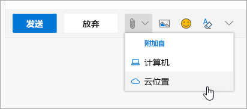

# 与同事协作

与同事协作的 2:00 PM 和时间。 Office 365 提供了同类最佳的协作机会, 使团队能够以多种方式协同工作。 

## 工具
- Microsoft Teams
- Office Online
- OneNote
- SharePoint & OneDrive
- 
## 与同事协作的清单
- 创建或加入 Microsoft 团队以进行协作
- 在 OneDrive 中创建和共享文件 
- 在 Office 365 中共同创建 
- 使用云附件

## 创建或加入 Microsoft 团队进行协作

Microsoft 团队和频道是人们可以通过共享文件、跟踪团队交办事项等内容进行协作的地方。 每个 Microsoft 团队都有一个集成到 SharePoint 网站、一个 OneNote 笔记本和其他资产。 此 Office 365 服务最适用于经常在共享项目或结果中共同工作的人员。 

## 从你的 OneDrive 共享文件
在 OneDrive for business 上保存的文件可与任何人共享, 从浏览器或 Office 365 桌面应用程序 (如 Word 或 Excel) 共享。 可以使用个人的姓名、别名或公司电子邮件地址与个人共享。 

## 在 Office 365 中共同创建
共同创建是当我们同时与同一文件上的同事一起工作时。 在基于 web 的核心 Office 365 应用版本和 office 2016 前向这些应用程序的桌面版本中可以这样做。  在同一文档上节省时间和工作, Office 将为你同步这些更改, 即使你的一个处于脱机状态也是如此。 

## 使用云附件-停止向电子表格发送电子邮件!
您在将文档附加到电子邮件时, 您必须对文档的正确版本进行多次查找？ 现在, 在 Office 365 中, 可以共享指向文件的链接 (称为云附件), 以便所有人都在编辑同一版本。  您可以选择发送链接, 以及用户是否可以查看或编辑该文件。 

