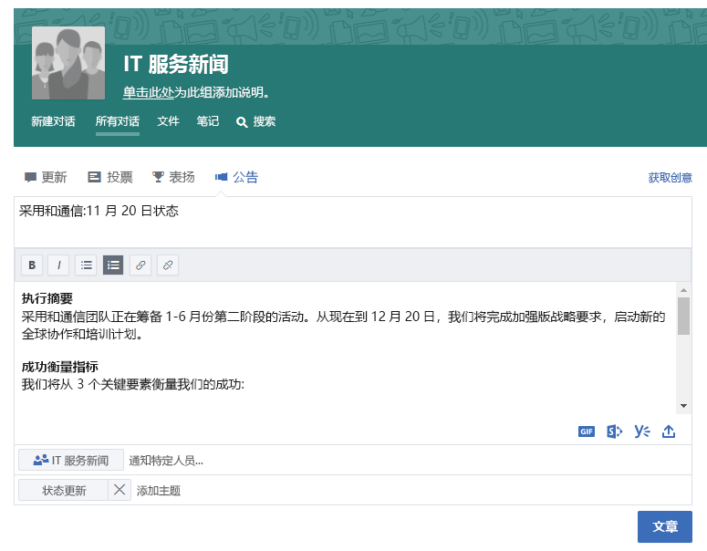

# 公司内部联系

忙碌的一天结束了，但在离开办公室之前，你要确保与你工作相关的所有人都已收到工作动态通知。 确保团队内外的所有利益干系人了解你的目标、进度和结果，这是你工作的重要组成部分。  

## 工具
- SharePoint
- Yammer
- Outlook
- Microsoft Teams 

## “公司内部通信”清单
- 了解你的受众及其现有通信方法
- 按角色（如项目利益干系人、团队成员或员工）定位关键消息
- 选择相辅相成的通信工具（例如，在 Yammer 社区中创作帖子，并通过电子邮件方式发送提醒） 
- 与团队中其他人共同合著你的信息
- 发布信息，并向所有相关方发送通知 
 
## 选择通信方法
请参考下面的信息，以确定与团队通信的最佳方式。 在过渡到新通信方法的同时，平衡使用新技术与传统电子邮件公告。 保持一致的通信方法是推动认知和组织变革的有效方法。 

**Yammer**：可以使用 Yammer 来共享最新动态，从而推动一大群人对话。 发布标准的最新动态或使用“公告”功能，可以确保将最新动态的副本发送到每个成员的邮箱。 

**SharePoint**：若要联系工作组以外的人，不妨编写关于章程和进度的简短新闻文章，可供在项目生命周期内从 SharePoint Online 中随时获取和保存。 在 SharePoint 团队网站中使用新式页面，或对于较大的程序，请考虑创建 SharePoint 通信网站。 

SharePoint 通信网站提供了直观、灵活的新闻文章，可便于同时嵌入图像、仪表板和文本。 然后，可通过任意浏览器或 SharePoint 移动应用获取信息。 下面的视频快速概览了这些功能强大的网站的用途。 为了确保最佳视觉效果，请为 Microsoft Teams 中的工作组将通信网站固定为标签页。

**Microsoft Teams**：如果 Microsoft Teams 中的工作组已包含这一大群人，为何不在常规频道中发布注释，其中包含关键事实和长期提供最新动态的 Wiki 网页链接？  Wiki 网页可以由多个人员共同授权，并保留该团队的生命周期。 

## 实现新式通信的提示与技巧

**对于以电子邮件为中心的同事**：订阅来自 Yammer 组或 SharePoint 新闻源的警报。  这样，他们会在电子邮件中收到你已发布新信息的通知，然后可以单击进入源信息，你无需创建单独的电子邮件。  想新潮一点吗？  请使用 Microsoft Flow 或 PowerApps 自定义通知。 请考虑让一个包向这些用户展示如何在移动设备上使用 Microsoft Teams、SharePoint 或 Yammer。 

**让成员参与对话！** 通过为 SharePoint 通信网站页面启用评论功能，鼓励成员参与。  如果使用的是 Yammer，请务必定期监视你的社区中是否有你可回答的问题，从而确保成员参与社区。 

**外部共享**：Microsoft Teams、SharePoint 和 Yammer 都支持外部共享，但前提是管理员允许在 Office 365 实例中进行外部共享。  使用外部共享，可以与合作伙伴、供应商和（当然也包括）客户的员工共享你的最新动态。
