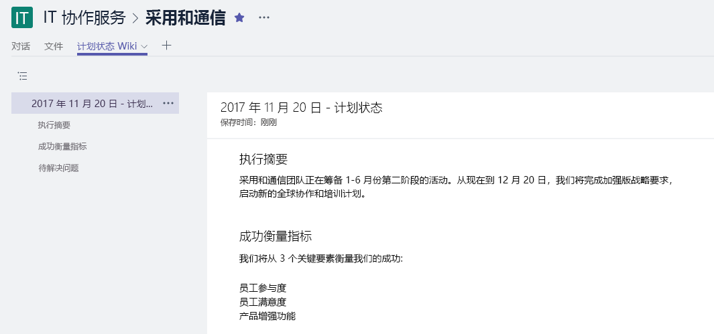

# 公司内部联系Connecting Across the Company

忙碌的一天结束了，但在离开办公室之前，你要确保与你工作相关的所有人都已收到工作动态通知。It's been a busy day, but before you leave the office you want to ensure that all the people interested in your work are informed about what is happening. 确保团队内外的所有利益干系人都了解你的目标、进度和结果是你工作的重要组成部分。Making sure that all your stakeholders -- inside and outside of your team -- understand your goals, progress, and results is an important part of what you do.  

## 工具Tools
- SharePointSharePoint
- YammerYammer
- OutlookOutlook
- Microsoft TeamsMicrosoft Teams 

## “公司内部通信”清单Checklist for communicating across the company
- 了解你的受众及其现有通信方法Understand your audience and their existing communication methods
- 按角色（如项目利益干系人、团队成员或员工）定位关键消息Target your key messages by persona, for example, project stakeholder, team member, or employee
- 选择相辅相成的通信工具（例如，在 Yammer 社区中创作帖子，并通过电子邮件方式发送提醒）Select communication tools that compliment each other, for example, author a post on your Yammer community and send an alert via e-mail 
- 与团队中的其他人共同创作信息Co-author your information with others on your team
- 发布信息，并向所有相关方发送通知Publish your information and send a notification to all of your interested parties 
 
## 选择通信方法Select your communication method
请参考下面的信息，以确定与团队通信的最佳方式。Use the information below to decide the best way to communicate with your team. 在过渡到新通信方法的同时，平衡使用新技术与传统电子邮件公告。Balance using new technology with traditional email announcements while people transition to new communications methods. 保持一致的通信方法是推动认知和组织变革的有效方法。Having a consistent communication approach is an effective way to drive awareness and organizational change. 

**Yammer**：可以使用 Yammer 来共享最新动态，从而推动一大群人对话。**Yammer**: You can drive conversation across a broad group of people by using Yammer to share your updates. 发布标准的最新动态或使用“公告”功能，可以确保将最新动态的副本发送到每个成员的邮箱。Post a standard update or use the Announcement feature to ensure a copy of your update goes to each member's mailbox. 

**SharePoint**：若要联系工作组以外的人，不妨编写关于章程和进度的简短新闻文章，可供在项目生命周期内从 SharePoint Online 中随时获取和保存。**SharePoint**: If you want to reach people outside of your  working group, consider writing a brief news article on your charter and progress that is readily available and kept for the life of your project in SharePoint online. 使用 SharePoint 团队网站中的新式页面；或对于更大型的计划，不妨创建 SharePoint 通信网站。Use a modern page in a SharePoint team site, or for a larger programs, consider creating a SharePoint communication site. 

SharePoint 通信网站提供了直观、灵活的新闻文章，可便于同时嵌入图像、仪表板和文本。SharePoint communication sites provide visual and flexible news articles that allow you to embed images, dashboards, and text together. 然后，可通过任意浏览器或 SharePoint 移动应用获取信息。Information is then available via any browser or through the SharePoint mobile app. 下面的视频快速概览了这些功能强大的网站的用途。This video provides a quick overview of what these powerful sites can do. 为了确保最佳视觉效果，请为 Microsoft Teams 中的工作组将通信网站固定为标签页。To ensure the best visibility pin the communication site as a tab for your working group in Microsoft Teams.

**Microsoft Teams**：如果 Microsoft Teams 中的工作组已包含这一大群人，为何不在常规频道中发布注释，其中包含关键事实和长期提供最新动态的 Wiki 网页链接？**Microsoft Teams**:  If this broad group of people is already a part of your working group in Microsoft Teams why not post a note in your General channel with key facts and a link to a Wiki page for your longer update.  Wiki 网页可以由多人共同创作，并在此团队的整个生命周期内暂留。Wiki pages can be co-authored by multiple people and persist over the life of that team. 

## 实现新式通信的提示与技巧Tip to Modernize Your Communication

**对于以电子邮件为中心的同事**：为他们订阅来自 Yammer 组或 SharePoint 新闻源的提醒。**For your email centric colleagues**: Subscribe them to alerts from either your Yammer group or your SharePoint news feed.  这样，他们会在电子邮件中收到你已发布新信息的通知，然后可以单击进入源信息，你无需创建单独的电子邮件。This way they will get a notification in their email that you've published new information and can then click through to your source information without you having to create a separate email.  想新潮一点吗？Want to get snazzy?  请使用 Microsoft Flow 或 PowerApps 自定义通知。Customize the notification with Microsoft Flow or PowerApps. 不妨通过午餐研讨会向这些用户演示如何在移动设备上使用 Microsoft Teams、SharePoint 或 Yammer。Consider having a brownbag to show these users how to use Microsoft Teams, SharePoint or Yammer on their mobile devices. 

**让成员参与对话！****Get people talking!** 通过为 SharePoint 通信网站页面启用评论功能，鼓励成员参与。Encourage engagement by turning on comments for your SharePoint communication site pages.  如果使用的是 Yammer，请务必定期监视你的社区中是否有你可回答的问题，从而确保成员参与社区。If you are using Yammer ensure that people participate in your community by monitoring it regularly for questions that you can answer. 

**外部共享**：Microsoft Teams、SharePoint 和 Yammer 都支持外部共享，但前提是管理员允许在 Office 365 实例中进行外部共享。**Share externally**:  Microsoft Teams, SharePoint and Yammer all support external sharing if your administrator allows that in your instance of Office 365.  使用外部共享，可以与合作伙伴、供应商和（当然也包括）客户的员工共享你的最新动态。By using external sharing you can share your updates with people who work for partners, suppliers and of course, your customers.